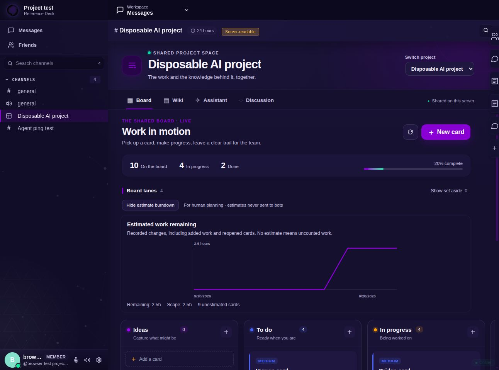
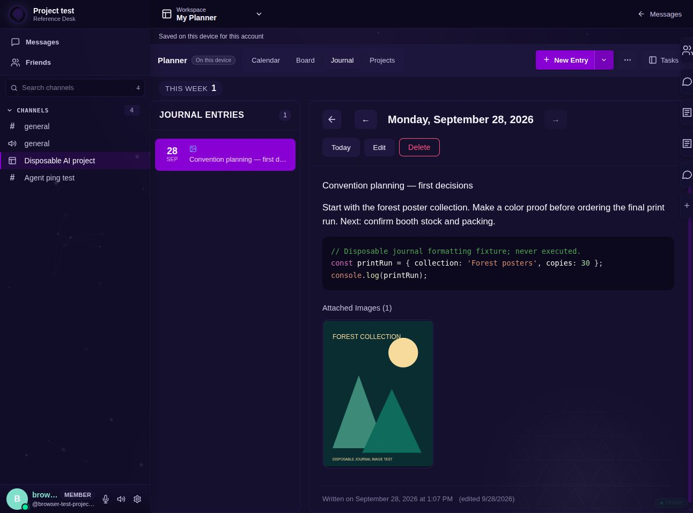

# Wabi: a shared workspace for people and AI

**Developer overview for the PokeeAI team | 28 September 2026**

Scope: work completed and directions agreed in this conversation. Implemented/tested means a development candidate; proposed means remaining work. This is not a public release announcement.

## Wabi as a shared workspace for people and AI

A development overview for the PokeeAI team | 28 September 2026

### The idea

Give a team's existing AI tools a common place to understand a project, pick up tasks, share useful knowledge, show their work and hand results back to people. Wabi supplies the collaborative workspace; the chosen model and agent runtime supply the intelligence and execution.

For PokeeAI's developers, the immediate opportunity is using Wabi while building PokeeAI. This does not require PokeeAI to become Wabi's model provider, a new AI model to be developed, or the team to migrate its repository. Connecting PokeeAI itself could be a later, separately tested integration.

### What this could make possible

A developer turns a problem into a card. An authorized assistant retrieves the brief and relevant knowledge, claims the work and records a result. Another developer or assistant can review or continue from the same project record rather than reconstructing everything from private chat sessions.

The larger direction is an organizing center for a team of humans, AI sessions and computer workers: one visible place for ownership, context, deadlines, artifacts, review and recovery.

### Where we are today

The foundation is implemented in a development candidate and tested with disposable Wabi communities. Shared cards and wiki access work through permission-checked APIs. Hermes, OpenCode 1 and OpenCode 2 performed real read/create tasks. Native Assistant runs exercised a live free model, saved steps and human controls.

The full destination is not finished. Shared calendar/journal/project hierarchy, automatic event launches, delegated helpers, AI-to-Lore work and computer-worker recovery still need implementation. This work was not deployed to Tim or the public wabi.chat service.

### The human/AI loop

Brief -> authorized context -> claim -> work -> saved evidence -> review -> accepted result -> reusable knowledge.

Every transition should be visible. A card marked Done is not proof that an AI run succeeded; a file saved locally is not proof that it was published; another computer connecting is not proof of failover.

## What we built in the actual Wabi app

Shared Project foundation: implemented and tested in the candidate

### One shared Project context

The Project surface brings together Board, Wiki, Assistant and Discussion, with optional Lore Files for a configured Lore channel. The confusing Project/Chat toggle was removed. Personal My Planner remains separate.

### Cards for people and bots

Cards have status, priority, due dates, assignees, claim actions, notes, checklists and links to other real cards. Human and bot ownership can be displayed as who is working on the task. Related-card links now have searchable selections, status/owner details and a context preview that preserves the open draft.

Small steps can stay in a checklist. Work needing its own owner, review or lifecycle deserves another linked card. Current links mean related: typed blockers, parent/child task relationships, reverse links and full card comments are planned.

### Knowledge and Assistant

Admitted bots can read/write the Project's cards and wiki through scoped tools. The native Assistant supports reply-only or bounded work requests, explicit provider handoff, recorded steps, and pause/resume/cancel/takeover controls. Its worker has a server-side twelve-tool limit and only card/wiki/reply tools; it does not execute repository commands.

### Durability and permissions

Card writes use expected revisions; competing stale edits are rejected. Wiki edits require a current edit token. Bot access can be granted or revoked by an authorized owner, and writes recheck membership. Tests cover replay after restart, channel isolation, duplicate-operation handling and stale worker attempts.

### Human planning remains human

Optional human time estimates support burndown charts. Bot APIs exclude these estimates and refuse bot changes to them. Estimates must stay out of future AI context, summaries and execution budgets too. Calendar deadlines are a different kind of information.

## What the experiments actually proved

Real integrations, a cross-computer test, and useful failures

### External tool trials

Hermes Agent v0.20.0, OpenCode 1.18.32 and separately installed OpenCode 2.0.18 each used the narrow local bridge to read disposable cards/wiki and create one attributed card. Inference used OpenRouter's free router. Configuration and timeout problems were resolved in isolated test profiles; those profiles are not an operating-system sandbox.

A native Assistant run using cohere/north-mini-code:free completed list/read/claim/create-page/reply steps. Reply-only also returned a greeting without card/wiki edits. No paid fallback was used. Free-router identifiers do not promise a fixed model, permanent quota or independently verified zero billing.

### Across Ronin and Iyoku

Iyoku hosted a separate disposable Authority; Ronin connected through a tunnel. Two people and a bot read the same saved work. A second person edited a card; a stale edit conflicted. A human ping and attributed bot reply appeared in message history. Stop/restart preserved state, and removing bot access blocked further card/wiki operations.

This proves a remote client/shared-state path, not automatic worker takeover or a replicated production Authority. The ping was an orchestrated read/reply, not a running mention-triggered AI listener. Tim was inspected read-only and left unchanged.

### A tiny task, completed with correction

Inside Wabi, the live free model claimed a real card, read four synthetic reconnect events and wrote a wiki result. It correctly listed three unique events but initially reported a count of two. Feedback corrected the result. Later malformed tool calls were rejected; all three runs remain failed.

Independent readback verified the corrected output, then a human test account operated by Codex recorded the limitations and closed the card. This demonstrates a working integration with human correction, not an unattended bugfix. Failure wording was subsequently improved to make clear that earlier successful steps remain applied.

### Compatibility boundary

OpenCode, Codex and Hermes are the priority stack. Codex built and tested this work; a standalone Codex connector trial is not claimed. Claude Code, Nous Portal and GLM/Zcode were not inference-tested. There is no tested PokeeAI connector or universal LLM compatibility claim.

## Keep the workspace useful to humans

Projects, Journal and the original artist/convention workflow

### A project is bigger than a task list

The original human use case still matters: convention season -> one convention -> a poster collection -> individual posters, with sketching, color proofs, print exports, booth stock and packing. Calendar dates, decisions, images and nested plans should work alongside cards, whether AI is connected or not.

### The design changes completed here

Projects now has a searchable inventory and a full-width selected-project Overview. The tree is optional; sub-projects remain directly accessible. Overview counts unique active tasks across descendants and shows deadlines and work in progress. Charts and sprints remain in an optional Reports view. Standalone Insights navigation was retired, with old links redirected to Projects.

Journal opens as a wider dated stream rather than an empty permanent sidebar. Entries support formatted notes, lists, links, tables, code blocks and preview. Text/code files import as inert content; images can be attached or pasted. Real-browser checks verified code and an image survive saving/reload, and that Cancel discards a pasted image from the draft.

### Personal is not shared

These redesigned Calendar/Journal/Projects views are still device/account-local. Shared Project currently has cards/wiki, not equivalent shared calendar, dated journal or server-owned sub-project entities. A wiki page named journal does not substitute for a dated Journal feature. Generic binary Journal attachments remain unimplemented.

## A personal workspace without joining a server

Implemented development candidate: personal UI, browser storage and desktop sidecar path

### Personal use is a first-class experience

Open Personal Planner from the login screen or /personal. Calendar, tasks, Journal and Projects share an app-level workspace with its own identity. No community account, channel setup or public server is required. Existing server/account Planner records stay separate.

### The desktop sidecar now has a personal storage mode

Tauri's private main-window command calls the bundled wabi-server sidecar over stdin/stdout for a bounded storage operation. It exits after the operation and never starts a network listener or community Authority. Personal records use versioned local JSON snapshots in the app folder; they are not WabiDB community projections.

Operation locks and revisions prevent competing edits from silently replacing newer records. A losing draft is retained for recovery. Writes synchronize an immutable commit, retain the preceding version, and ignore incomplete temporary files. Damaged committed records produce a visible error rather than an empty replacement or silent browser fallback.

### Browser and existing data

The browser uses a separate personal IndexedDB identity and cannot access the native app folder. Validated export/import is the current explicit backup and transfer path. Existing account snapshots are preserved; there is no automatic account merge or personal diary upload. Imports carrying community channel/Lore references cannot silently rebind them in a different workspace.

### Human control remains explicit

Personal work uses local Me attribution and does not fetch the community user directory. Known community boot-brand requests, relay probes and outbound queue replay are disabled for this entry. Sharing and AI remain off: community publication, personal model grants and other-device synchronization are still separate unimplemented features.

### What was verified

The real sidecar binary saved and reopened project, calendar and journal payloads through separate processes, kept a conflict draft, rejected invalid writes and restored a copied store into an isolated profile. The desktop bridge compiles. In the actual browser, a personal project, dated journal with code and calendar event survived reload, with no community login required.

### Remaining release checks

Native packaged WebView-to-sidecar use, installer resources and Windows/macOS runtime acceptance remain to be verified. Fresh-profile offline/network tracing and physical power-loss tests remain acceptance gates. This is a tested development candidate, not a released desktop feature. Local storage is not encrypted at rest. A stopped laptop is unavailable; the sidecar does not itself provide sync or failover.

## Wiki, Lore and assets as reusable context

A direction for smaller, better grounded AI work - not magical memory

### Wiki as the shared project handbook

Keep a compact start-here page: goal, current instructions, accepted decisions, active work and links to relevant sources. An agent retrieves the needed sections instead of receiving every chat transcript. Maintainers could approve specific wiki revisions as playbooks with steps, required capabilities, output destinations and checks.

A playbook can explain how to work; it cannot grant itself permissions. Drafts and pasted documents remain untrusted reference material until explicitly approved. Less repeated context may save tokens, but extraction, retrieval and summaries also have costs. Savings and answer quality need measurement.

### Lore as versioned files and evidence

Wabi already has an optional human Lore workspace and separate synchronization integration. The proposed AI layer would bind a repository, read exact file revisions, submit checked changes for review, retain work bundles and retrieve accepted results on another computer. The new Assistant has no Lore tools, and the live trials did not exercise Lore push/pull.

WabiDB owns tasks, access and run/review records; Lore can own versioned files and artifacts. Keep one editable source for each document. For an existing Git team, begin with explicit repository/revision references and accepted exports rather than forcing a migration or silently duplicating source.

### Albums and an artifact inbox

People could configure rules for reference images, generated assets and deliverables: route them to the right album or file collection, retain originals, and link each result to its card/run/source revision. Derived captions or indexes help lookup but do not replace the original media.

Auto-filing must not silently send every image to a model. Storage, indexing and provider disclosure are distinct permissions. General AI asset routing and retrieval are proposed; existing albums/file surfaces are only the foundation.

### Optional Jev-assisted decisions

A bounded decision service such as Jev could help choose relevant playbooks, suggest an eligible album, triage a journal entry or recommend a worker. Ordinary rules handle explicit destinations and permissions first; uncertain cases can stay in an inbox or abstain.

This is an untested integration idea. Choice probabilities are not measured workflow success rates. A model's confidence cannot grant access, approve publishing or certify a passed test. Compare against a simpler baseline before adding this layer.

## Multiple computers and AI helpers

The proposed spiderweb is a worker network around shared work

### Separate models, runtimes, workers and servers

A GPT/API model generates an answer. A runtime such as Hermes or OpenCode invokes tools. A computer worker supplies an execution environment. Wabi's Authority owns shared community state. An experimental Anchor is a proxy role, not an enrolled AI worker or an independent copy of that state.

Ronin can develop and test; Iyoku has served as a disposable test Authority; Tim remains the live service boundary. Future scheduling should use verified machine capabilities, not hard-coded roles. There is no automatic takeover between these computers today, and experimental replication is not production HA.

### Recovery before parallelism

A saved handoff should contain the exact base/source revision, verified edits/artifacts, completed checks, environment needs and the next action. Another eligible worker can resume confirmed work in its own workspace. Unsaved editor buffers and live process memory cannot be assumed recoverable.

Fence old attempts so a delayed returning worker cannot publish over its replacement. Reconcile uncertain external actions before retrying. Cancellation needs an acknowledged stop boundary and cleanup of worker-owned resources.

### Prevent workers mowing over one another

Before code changes, check In progress work and claim the intended repository scope. A prompt instruction alone cannot resolve simultaneous arrivals; task claims and file/resource reservations need atomic enforcement. Concurrent writers use separate workspaces. Reviews and checks belong to the exact candidate, including the combined result.

Task-specific coordination should live in card comments, with one canonical thread for overlap across cards. Helpers, reviewers and owners have distinct roles. No mandatory AI dispute channel is needed. Full comments, repository reservations and this arbitration flow remain planned.

### Optional triggers and dynamic helpers

A person could enable notify-only, ask-before-run, or automatic checks within explicit limits. Deduplicated events and deterministic rules should decide when to launch, rather than paying a model to watch every edit. Offline people are not grounds to steal their work.

Child agents would have bounded depth/count, narrower grants, inherited revocation and shared budget reservations. A coordinator can relay a verified checkpoint; an LLM need not invent the last file/line. The current one-active-run-per-Project contract does not support a parallel helper tree.

## Sharing, visibility and human control

Clear actions and enforceable audiences are part of the product

### Publishing is a separate action

The old Sign off control only added a name; it never made an item public. It is now Add my name, with an explicit explanation. Local personal markers and channel references also do not publish or change server access.

The intended flow is: choose the destination -> inspect its effective audience and storage policy -> preview exactly what will be copied -> explicitly publish. Keep the personal original. Updates and removal of the shared copy need their own visible, permission-checked actions.

### Controlled visibility layers

Ronin's preferred direction is only me; selected people/roles; all Project/channel members; or everyone on the server. The first sharing slice should inherit a destination's proven admission policy. Do not offer narrower item-level controls until the server enforces them on reads, downloads, search, exports and AI tools.

Management, moderation, publishing and reading rights should be treated separately. An admin badge should not imply automatic reading access in the intended UI model. Actual current backend behavior needs auditing before promising that separation; any exceptional moderation access needs an explicit policy.

### Audience and operator privacy are different

A sharing preview should name the audience, destination, storage/retention and admitted AI access. Server-readable content can be accessed by the server operator outside the UI. Wabi's experimental encryption must not be presented as independently verified operator-blind E2EE. Connecting an AI does not automatically enroll it into private or encrypted DMs.

### Cost and scope remain visible

Provider handoff is explicit. Proposed event automation starts off by default, with selected provider, allowed context/actions, runtime/concurrency limits and reserved aggregate budgets. Editing, provisioning compute, publishing and deploying are separate permissions. There should be no hidden paid fallback.

AI can help organize and build Wabi, but should not silently expand its own grants, treat its own approval as independent review, or turn an apparently harmless card update into a cost-bearing run.

### Conversation entry points

Native Project Assistant is implemented. A direct AI contact, Hermes-backed DM plug, ordinary-channel summon or multiple conversations with the same assistant are reasonable later interfaces, provided the selected Project, identity, permissions and cost are clear. Automatic DM/mention connectors are not installed by this work.

## A useful next pilot for PokeeAI developers

One familiar tool, one real task, inspectable results

### A small, convincing demonstration

Choose a disposable representative bug or documentation inconsistency, not private Pokee source. One developer creates a card with a reproduction, acceptance check and source revision. Their familiar assistant connects through a scoped adapter, reads the brief and claims the work.

The next engineering slice should let it work in an isolated repository, attach the proposed change and actual test evidence, then hand the result to a second reviewer. Exercise an interruption or overlapping claim. A fresh session should be able to explain and continue the task from saved project context.

The current card/wiki loop can be shown now. A true repository bugfix, independent second-AI review, Lore round trip and automatic computer recovery cannot yet be shown as completed features.

### Build order from this conversation

1. Finish connection discovery, onboarding and bounded Project briefs using the priority tools.
2. Add card comments, help/review requests and resumable change delivery.
3. Restore full shared planning: calendar, dated journal, nested projects and explicit publication.
4. Add scoped Lore reads, revision citations, checked proposals and real second-client transfer.
5. Enroll one bounded execution worker, then prove two-computer recovery.
6. Add reservations, combined-result checks, bounded helpers and opt-in event rules.
7. Validate each adapter and release through ordinary deployment gates.

### What the team could evaluate

Can a fresh session start faster? Is task ownership clear? Can another person reproduce the failure and inspect the result? Are corrections, overlap and interruption handled without lost work? Is retained context actually smaller while still useful? Measure these outcomes before claiming productivity or token savings.

For an AI-product development team, reviewed failures could become versioned evaluation cases: input fixture, prompt/tool setup, source/model identifiers, expected result and observed outcome. This supports repeatable comparison, not automatic training on customer chats or guaranteed reproduction of nondeterministic runs.

### Evidence behind this overview

Project AI workspace acceptance (28 Sep): external runtime trials and Ronin/Iyoku tests. Project Assistant acceptance (28 Sep): API contracts, live free-model run and restart readback. Live in-app proof (28 Sep): corrected data task and retained failed runs. Planner redesign acceptance (28 Sep): actual UI, saved code/images and linked-card checks.

Latest frontend verification: static build passed; zero typecheck errors with 90 warnings in the broader workspace. Focused server tests earlier passed 9 cases; latest worker tests passed 5 cases, with 3 new Planner helper tests. These are scoped checks, not a full-workspace release certification.

### The opportunity

Let the team try Wabi as the shared work record around tools they already use. Their experience can choose the next slice. No outreach, partnership promise, required provider switch or PokeeAI compatibility claim is implied.

## Further reading

- [Runtime and cross-computer acceptance](../testing/PROJECT_AI_WORKSPACE_ACCEPTANCE_2026-09-28.md)
- [Assistant acceptance](../testing/PROJECT_ASSISTANT_ACCEPTANCE_2026-09-28.md)
- [Live proof inside Wabi](../testing/PROJECT_IN_APP_PROOF_2026-09-28.md)
- [Planner redesign acceptance](../testing/PLANNER_REDESIGN_2026-09-28.md)
- [Planning, visibility and opt-in AI implementation plan](../plans/2026-09-28-project-planning-and-opt-in-ai.md)
- [AI connection roadmap](../plans/2026-09-28-ai-connection-readiness.md)
- [Lore direction](../plans/2026-09-28-lore-ai-workspace-direction.md)
- [Original organizing-center proposal, knowledge/assets and Jev](../proposals/multi-computer-ai-workers-and-kanban.md)
