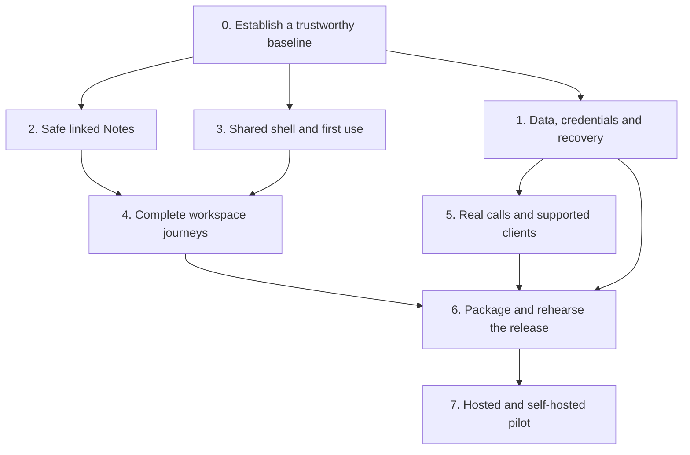

# Wabi — final production-pilot campaign

**Owner:** Ronin, with Codex coordinating implementation and verification

**Started:** 2026-09-15

**Purpose:** finish a coherent, dependable release for hosted testers and independent self-hosters

**Working branch:** `codex/production-finish-20260915`

**Starting commit:** `c11b128b5db0627fbdb15c980b18d0873d2b43cc`

## The finish line

Someone new can understand Wabi, join or install it, talk with their community, use its workspaces, and return tomorrow without losing their work. An operator can update and recover the instance using the documented procedure. The release accurately states which clients, integrations, and privacy properties have been verified.

The target is a strong **limited production pilot**, followed by a measured expansion. Wabi remains one Authority per community, with independent servers selectable by one client. Existing experimental and optional capabilities retain their boundaries. Completing this campaign does not by itself establish E2EE, federation, HA, or native-mobile certification.

### Required outcomes

1. Reproducible release checks and an identifiable deployed candidate.
2. Reliable persistence, account boundaries, authorization, and recovery.
3. Safe linked local Notes, including migration of existing writing.
4. Consistent, accessible core journeys and an acceptance record for every exposed workspace.
5. Real calling/device evidence for the supported pilot combinations.
6. A clean self-hosting setup, tested restore/upgrade, usable artifacts, and complete handoff documentation.
7. A short pilot with tracked feedback and explicit criteria for broader release.

## Baseline and authorization

The user authorized a large finishing plan, use of wabi.chat, and changes needed to clean up the project. The work takes place in an isolated worktree so the original checkout and presentation artifacts remain intact. Routine repairs and verification continue within that scope. Live data preservation, actual test outcomes, and product boundaries remain mandatory.

The [earlier readiness audit](2026-09-15-first-production-test-readiness.md) used `bbcb5b28`. This campaign starts from newer main `c11b128b`, including shared-media changes and the **complete `visual-polish` branch through `f13dc5f8`**. Branch ancestry was verified after the user's heads-up; no second application of that branch is needed. New upstream changes must be reviewed and integrated between batches, not pulled through an active test/deploy operation.

### Fresh observations

- wabi.chat login rendered in headful Chromium at 1440×1000 and 390×844, with no uncaught page errors or document-width overflow in those samples.
- Direct Privacy and Terms navigation rendered content beneath a persistent “Starting Wabi” overlay. This is a concrete public-route boot bug; its repair is in the opening batch.
- The mobile login's server-switch explanation was visibly truncated. Reproduce on the candidate before attributing it to current source, since live/source identity has not been established.
- Navigation in a disposable guest session showed the selected Notes workspace competing with a channel sidebar, an empty People panel, a separate scratchpad and an icon rail. On a 390px resize, People occupied the screen and Notes disappeared. The mobile takeover is under active diagnosis; the broader composition needs a deliberate U02/N03 redesign.
- The public entry leads with a very large brand image and a sign-in form, giving a new visitor little explanation of the product. The public-entry redesign is now part of this opening batch, following the user's explicit request for a firmer design standard.
- The live Authority reported `ready`; its running binary was fingerprinted privately. It was not changed by reconnaissance and is not yet certified as this branch's build.
- Plain programmatic public requests returned 403 from this client path while headful browsing worked. Treat this as a monitoring/ingress acceptance question, not evidence that the Authority is down.
- The prior pinned WabiDB suite passed 915 tests. That is useful baseline evidence, not a current-candidate restore certificate.

Anonymous public-page evidence is under `/tmp/wabi-finish-live-recon-20260915/`; navigation-only guest evidence is under `/tmp/wabi-finish-guest-recon-20260915/`. No messages or uploads were sent. These local snapshots are observations of the deployed build, whose source identity remains unverified. Exact candidate build/test logs are listed in the execution ledger below.

## Execution map

### How the work is run

- One coordinator owns integration, source/build identity, the campaign ledger, and deployment evidence.
- Up to three independent workers handle bounded, non-overlapping files: backend/trust, Notes/storage, and interface/release work as appropriate.
- Each batch contains 2–4 related changes. Read current source, reproduce the issue, implement, run relevant regression checks, review the diff, then validate the real interaction when UI/runtime behavior changed.
- Each card is **planned → implementing → checked → accepted**. “Checked” means its stated automated checks pass. “Accepted” also requires its named browser, device, operational, or human evidence. Deployment has a separate record.
- Do not mark an entire screen finished because its component compiles. Do not rerun expensive broad suites without a new change or unresolved concern. Final candidate checks are a separate required integration pass.
- Keep root runtime data, uploads, credentials, existing local writing, and operator configuration out of source changes. Build and test against disposable state; restoration experiments use copies.
- Use existing architecture and semantic theme tokens. When removing duplicate UI, migrate its data and preserve reachable capabilities first.

## Wave 0 — make the baseline trustworthy

**Exit gate:** one candidate can be built and tested from committed dependencies; the test results are meaningful; public pages boot correctly; new runtime state cannot be accidentally committed.

| Card | Implementation | Dependencies | Acceptance |
| --- | --- | --- | --- |
| B01 — Isolate test mocks | Move the E2EE message-store fixture's global module mocks into a subprocess, following existing payment fixtures. Preserve all assertions. | None | Offending suite and victim suites pass together, in isolation, and in the full pinned frontend run. |
| B02 — Align build/check contracts | Keep Node/Bun/Rust versions aligned across CI, Docker and docs; use committed lockfiles; replace CI's unsupported numeric check threshold; identify skipped coverage explicitly. | None | Clean source install, typecheck, static build with `index.html`, Cargo check/tests; no lockfile drift. Docker build validated separately. |
| B03 — Protect generated state | Ignore `data/wabi-server/`; verify the actual default key, secret, lock and database paths. Add a small repository-hygiene gate covering the supported defaults. | None | A disposable first boot leaves no community state or secret eligible for accidental staging; no existing user data removed. |
| B04 — Repair standalone boot | Keep root app bootstrap ownership; dismiss the boot overlay after public/standalone routes and errors have mounted. | None | Direct `/privacy`, `/terms`, error and root navigation work; delayed authenticated root startup retains its loading state until ready. Headful verification required. |
| B05 — Correct immediate setup/recovery instructions | Install frontend dependencies before bare-Cargo build; preserve addon instructions; require a stopped writer before stale-lock recovery; remove blanket advice to clear all browser data. | None | Documentation follows the actual build; local writing is explicitly preserved during session troubleshooting. |

## Wave 1 — earn trust in stored data and access

**Exit gate:** no known data-loss or access-boundary defect in the supported core flow; remaining privacy claims are explicit; real restore evidence exists before live cutover.

| Card | Implementation | Dependencies | Acceptance |
| --- | --- | --- | --- |
| T01 — Credential parity | Use the account-access allowlist and step-up exclusion in Socket.IO handshake/fallback; route node and standby admin gates through the shared account authenticator. Preserve helper-secret authentication. | B02 | Legitimate owner/admin credentials work; refresh, scoped-tool, step-up, revoked, malformed and unauthorized account cases fail as intended. Existing expiry/call-continuity rules remain intact. |
| T02 — Resource permission matrix | Extend existing channel, membership-revocation, Lore and call tests across REST, Socket.IO and raw WebSocket. Include guest/member/moderator/owner/removed member and two independent servers. | T01 | Discovery, content read/write, uploads under the accepted capability policy, and privileged mutations agree across transports; revocation clears access and sensitive displays. |
| T03 — Browser-document upgrade safety | Inspect Reader's delete/recreate upgrade callback; introduce additive/versioned migration and recovery handling before another schema bump. Keep old bytes through successful migration. | B02 | Existing Reader data survives upgrade; interrupted/blocked/malformed upgrades preserve recoverable content. Real IndexedDB tests, not helper-only tests. |
| T04 — Resolve encryption claims | Reconcile `api/privacy.rs`, E2EE paths, attachments, UI labels, PROJECT_STATUS and PRIVACY_STANCE. Preserve existing encrypted content. Prove the complete claimed path or retain an explicitly experimental status. | T02 | One truthful capability contract; no automatic downgrade; reachable encrypted attachment/download paths are tested, including issue #214 if still applicable. Existing source does not automatically establish E2EE certification. |
| T05 — Historical secret exposure | Inventory historical secret paths without printing values; assess whether deployed credentials were affected; prepare coordinated remediation and recovery evidence. | B03, T07 before key-related operations | Recorded exposure decision and necessary credential remediation; old database/key compatibility preserved. No casual root-key replacement or history rewrite. |
| T06 — Deletion and retention truth | Trace messages, projections, uploads, local stores, logs and backups using canary data. Distinguish logical deletion, expiry, retained event records and secure erasure in docs/UI. | T02 | Documented retention matches observed behavior; deletion does not leave misleading UI guarantees or silently destroy referenced files. |
| T07 — Restore and upgrade rehearsal | Build a disposable-state drill, then rehearse on an isolated hosted-data copy: stop, backup keys/state/uploads/config, restore elsewhere, verify old and new writes, restart again. | B02, T01 | Clean-host result, timings, exact versions, artifact identity, compatibility and rollback recorded. Never merge unrelated data directories. |
| T08 — Hosted operating policy | Record registration/guest admission, ownership/recovery, request/upload limits, rate-limit/proxy settings, retention, backups, optional services, moderation and readiness monitoring. | T02, T06 | Actual deployed values match the pilot brief; readiness, disk, backup failures and restart loops are actionable. Public-path monitoring is verified despite observed 403s for some clients. |

**Standby boundary:** current standby receive/status routes are not a production recovery guarantee; export/import/promotion remain fail-closed where unimplemented. Preserve those limits while repairing authentication. Network replication's explicit experimental gate is separate.

## Wave 2 — finish safe linked local Notes

Detailed design: [Linked local notebook](2026-09-15-linked-local-notebook.md).

**Product decision:** one device-local notebook per server/account, with contextual DM views. Profile annotations remain separately owned personal metadata. Existing ambiguous local storage requires an explicit recovery/import choice; repeated numeric account IDs cannot establish ownership.

**Storage decision:** transactional IndexedDB, individual note records, revision-checked writes, a shared service across views, and cross-tab notifications. Use existing identity/session primitives. Do not build this on the browser WabiDB facade's currently empty CRUD scaffolds or an unsafe localStorage fallback.

| Card | Implementation | Dependencies | Acceptance |
| --- | --- | --- | --- |
| N01 — Notebook persistence | Scope, schema, transactional note CRUD/trash, revision conflicts, per-editor drafts, commit acknowledgements and cross-tab refresh. | B02 | Quota/abort/blocked storage preserves drafts; two editors cannot erase each other's work; same-note conflicts are recoverable; account switch never redirects saves. |
| N02 — Migration and recovery | Preserve raw legacy Notes/scratchpad/profile-note values; validate records; explicit destination selection; idempotent migration receipts; JSON backup/import/export and trash. | N01 | Ambiguous ownership, wrong-shape data, partial corruption, interrupted/repeated imports and export round trips preserve writing; old keys remain until verified cleanup. |
| N03 — One editing experience | Bind center, dock, DM context and scratchpad to the same service; Full opens the exact scratchpad record; retire unused editor paths only after reference checks. | N01, N02 before rollout | Create in one surface, edit in another, close/reopen/reload, and retain identity, selection, draft and saved content. |
| N04 — Links and discovery | Titles/search; `[[Title]]` and `[[Title|label]]`; CodeMirror completion; stable note IDs; transactional rename/incoming-link updates; backlinks and missing-target handling. | N01, N03 | Code and escapes are excluded; Unicode/duplicate handling, rename, trash/restore, aliases and concurrent edits are correct. Keyboard insertion/follow/back works. |
| N05 — Reader bridge and polish | Label handoff “Open a copy in Reader”; stable source identity and return-to-note; Markdown export mapping; compact toolbar, persistent local-only and save status. | N02–N04 | Reader edits cannot silently overwrite the original; exported links reopen; local-only status remains visible; desktop, dock, phone, keyboard and failed-save journeys pass. |

Graph view, filesystem vault watching, block embeds, plugins, cloud sync and collaboration are later work. They do not block a useful linked notebook.

## Wave 3 — make the shared interface coherent

**Design direction:** make Wabi feel like a complete product, with a clear purpose, calm working surfaces and confident hierarchy. The user explicitly authorized substantial redesign where the current result feels underwhelming. Preserve expressive themes, community branding and capabilities, while replacing weak compositions and confusing controls.

### The design acceptance bar

1. **The purpose is obvious.** A new visitor understands what Wabi offers and which community they are joining. Each workspace presents a meaningful title, current context and one clear primary action.
2. **Preserve the layout contract.** Channels anchor location/context. Center stage owns the primary task. Stubs are additive only, and right panels are exclusively for optional multitasking alongside center stage. Improve density and legibility while preserving the channel anchor, stub system and deliberately opened panels.
3. **Make each action's role understandable.** Distinguish opening center stage from adding a multitasking panel. Shared data does not make these two views redundant: preserve simultaneous use and independent drafts. Notes and scratchpad can share persistence without collapsing their distinct viewing roles.
4. **Hierarchy survives every theme.** Use semantic tokens, readable text, consistent icon weight and visible selected/focus states. Artwork supports the composition; controls and reading surfaces stay legible. Preserve operator-selected branding and user theme preferences.
5. **Phone layouts are designed as phone layouts.** Show the selected destination, preserve a visible return path, provide usable touch targets and make room for the on-screen keyboard. Resizing must never strand the user in an unrelated panel.
6. **The interface tells the truth.** Empty, loading, denied, failed, local draft and saved states are distinct. No dead placeholder controls, false save confirmation or ambiguous ownership labels.
7. **Acceptance is visual and behavioral.** Review desktop, phone and constrained dock renders; use keyboard and 200% zoom; check reduced motion and contrasting themes. Compile success alone cannot accept a design card.

Do not accept a screen while a HIGH finding makes a task inaccessible or misleading. Clear MEDIUM hierarchy/consistency findings before calling that screen polished. Optional integrations still need coherent unavailable states.

| Card | Implementation | Dependencies | Acceptance |
| --- | --- | --- | --- |
| U01 — First five minutes | Recompose public entry around product purpose, community identity and a clear authentication card; make public reading/error pages readable. Review login/register/guest policy, first-owner wizard, server selection, home choice and help links. | B04; T08 for policy acceptance | New visitor understands the next action and the server they are joining; first operator completes setup; failed/closed/offline states are actionable; branding variants and mobile controls remain usable. |
| U02 — Shell and navigation contract | Preserve channels as the location anchor, center stage as the primary workspace, additive stubs and optional multitasking right panels. Clarify open/add/return behavior, headers, overflow and saved layout. Fix unintended mobile panel takeover without deleting the panel/stub system or deliberately saved desktop arrangements. | B02 | Adding a stub/panel preserves center-stage selection and channel context; the same content can be used in both surfaces with independent drafts. Every destination stays reachable; closing/previewing/resizing preserves the user's workspace and saved desktop layout. |
| U03 — People and conversations | Recognizable identities, unavailable/deleted-person state, one obvious message path, correct recipient/context; reconcile #184 by actual capability/diff rather than merging blindly. | T02, U02 | Find person → correct DM/group → send/reply/upload → reload/reconnect; accepted messages appear once; no misleading retry. |
| U04 — Forms and feedback | Shared save/pending/error/empty patterns, visible focus, modal focus containment, useful validation, upload/cancel/retry and clear draft-versus-published labels. | U02 | Failure does not masquerade as success; keyboard can complete and escape each interaction; sensitive drafts retire with their scope. |
| U05 — Responsive and accessibility pass | 1440px desktop, constrained dock, 390px phone, 200% text zoom, keyboard, reduced motion, default and contrasting theme. Check actual touch targets and on-screen keyboard behavior. | U01–U04, N03 | Controls and content are reachable without overlap/clipping; labels and states are exposed; contrast/zoom and reduced motion are reviewed in rendering. |
| U06 — Performance and assets | Measure cold entry and authenticated workspace load; inspect chunk/cache behavior, large lists, large notes, media and theme/effects cost. Optimize measured bottlenecks. | U02, N04 | Record representative device/network timings and resource use; no uncaught initialization errors or stale-chunk reset ritual; effects-light mode stays usable. |

## Wave 4 — complete each exposed workspace

Use a common acceptance record: **entry → create/import → edit/use → save/share → reopen/reload → export/delete/recover where applicable**. Include permission denial, missing data/dependency, empty state and failure recovery. Fix the broken path or clearly state its actual supported boundary; do not silently remove a workspace to make a checklist green.

| Card | Surfaces | Concrete completion work |
| --- | --- | --- |
| W01 | Planner / calendar / business | Verify personal versus shared state, create/edit/reorder, timezone/date behavior, cross-view consistency, permissions and reload; consolidate duplicate headings/controls only where still present after visual-polish. |
| W02 | Reader | Import, save/reopen, search/outline/bookmarks, working-copy/source ownership, migration, export and narrow reading; do not advertise unshipped PDF/EPUB support. |
| W03 | Whiteboard / Wiki / Forum / Gallery / Incidents | One real content lifecycle for each exposed kind, second permitted account where shared, persistence after restart, and honest missing/deleted/denied states. |
| W04 | Files / Transfers / Media | Progress/cancel/retry, large upload limits, download/open, unsupported format and unavailable-peer behavior, dependency-aware cleanup and actual URL access policy. |
| W05 | CAD / 3D | DXF, optional DWG conversion, 3MF, STEP/IGES through existing viewers; stable original identity through conversion, coordinate-anchored review, useful parser/converter errors and realistic model size. |
| W06 | Project / Lore | Missing external dependency, connection/auth failure, local detection/staging, history/review, interrupted transfer, concurrent change, permission loss and clear draft/published/review state. |
| W07 | Map / People / Settings / Admin | First-use and configured states; meaningful settings consumers; admin acknowledgement, operation history, storage references, role changes, scope retirement and useful unavailable metrics. |
| W08 | Pop-outs / detached windows / PWA | Correct server/account/channel targeting, credential handoff without URL secrets, logout propagation, draft ownership, saved layout, deep links, update/cache behavior and notification entry. |

**Exit gate:** every exposed surface has recorded accepted scope or a named unresolved card. A passing test of one representative component is not whole-workspace acceptance.

## Wave 5 — verify calls and the clients actually offered

| Card | Implementation / exercise | Acceptance |
| --- | --- | --- |
| C01 — Two real network paths | Two real clients on different networks using the advertised default transport; explicit optional TURN/SFU fallback test where offered. | Microphone/output, mute/deafen, camera, screen share and supported sound capture work; transport/fallback labels match actual behavior. |
| C02 — Failure and ownership | Disconnect/reconnect, network change, capture permission denial/cancellation, leave/rejoin, kick/removal, logout and concurrent call surfaces. | No unauthorized audience, resurrected session or lingering capture; controls affect the displayed session; recovery stays understandable. |
| C03 — Pilot room capacity | Agree a small declared room size, initially test six participants on representative equipment; measure CPU, memory, latency and quality. | Publish only the size/combinations actually verified; larger media goals remain separate. |
| C04 — Desktop distribution | Install and upgrade supported Windows/macOS/Linux packages; notifications, local file access, sidecars, detached windows, signing/notarization where applicable. | Real installation and lifecycle evidence for each advertised platform; compiled artifacts alone do not certify native behavior. |
| C05 — Mobile boundary | Accept mobile web/PWA as a distinct surface. Offer native Android/iOS only after build, install, device/network/audio/background tests pass. | The supported-client table distinguishes mobile web from native certification; no shrunken desktop-only interaction path. |

Physical microphones, Bluetooth routes, external phones/networks and independent human use require actual devices and participants. Keep these cards open until evidence exists; automation is not a substitute.

## Wave 6 — make release and self-hosting repeatable

| Card | Implementation | Dependencies | Acceptance |
| --- | --- | --- | --- |
| R01 — Build identity | Embed source SHA/build identity in a small public metadata contract and artifact manifest; avoid secrets/host paths. | B02 | UI/about or diagnostic metadata, manifest, container/binary and deployed asset identity agree. |
| R02 — Clean install gate | Boot the real Compose image in an isolated CI environment; first owner/member, representative content/upload, restart and readiness. Test Podman separately if claimed. | B02, T01 | README succeeds on a clean host with no private configuration or undocumented mount/build step. |
| R03 — Release artifacts | Choose coherent pilot version, supported architectures, server archive/container and desktop packages; checksums and update instructions. Repair unreachable tag publishing and avoid conflicting release jobs. | R01, C04 for native assets | A tagged candidate produces the intended artifacts; installation follows their instructions; no unsupported package is presented as certified. |
| R04 — Operator handoff | Consolidate Fresh Install, backups/recovery, upgrades, diagnostics, logs, limits and optional helpers; document browser-local versus server-backed data. | T07, T08, R02 | A second operator completes setup and recovery without undocumented intervention. |
| R05 — Public repository kit | CONTRIBUTING, private security-reporting process, bug templates, supported platform table, known limits, license notices, fresh screenshots and accurate feature claims. | T04, W01–W08 scope decisions | New contributor/tester has a clear path; no invented contact address, misleading privacy promise or open-PR-as-shipped claim. |
| R06 — Candidate rehearsal and deployment | Run final locked checks and embedded browser smoke; preserve prior artifact plus compatible backup; preflight actual host/runtime/addons; deploy the accepted candidate and verify origin/public assets and behavior. | All required gates above | Exact candidate identity, readiness, auth denial, addon presence, asset/cache consistency, real user-path login and rollback evidence recorded. |

The deploy runbook must be reconciled with actual live image/mounts and current source. Some skill references contain obsolete STDB, runtime-only Docker, key and lock assumptions. Do not execute those stale instructions blindly.

## Wave 7 — pilot, feedback, and expansion

Suggested pilot: 5–10 hosted users and 1–2 independent self-hosters for roughly a week. This is a proposed test shape, not a capacity guarantee. Provide a short checklist of real tasks and a single feedback destination.

- **P01 — Invitation kit:** candidate identifier, supported scope/platforms, how to join/install, local-data and backup expectations, known limits, how to report a problem.
- **P02 — Feedback triage:** reproduce, assign severity, attach version/device/network context, fix in bounded batches, link acceptance evidence. No daily status noise without meaningful changes.
- **P03 — Expansion decision:** no unresolved data-loss or unauthorized-access defect; core journeys complete; independent setup succeeds; update/restore and declared call limits remain verified; remaining issues are classified and communicated.

Pause expansion if a new data-loss, credential-boundary, unrecoverable upgrade or serious call-audience issue is confirmed. Preserve evidence and the prior working release.

## Final acceptance checklist

- [ ] Required foundation/trust/Notes cards accepted.
- [ ] All exposed workspaces have a completed acceptance record and truthful availability labels.
- [ ] Core flows pass on the final candidate in the embedded build and intended public deployment.
- [ ] Supported call/device matrix is recorded with real hardware evidence.
- [ ] Clean Docker install and advertised alternative install paths pass.
- [ ] Restore, upgrade and rollback are proven with compatible keys/data/uploads.
- [ ] Historical-secret exposure has an explicit resolution.
- [ ] Source SHA, release manifest, checksums and deployed build agree.
- [ ] Supported artifacts, docs, reporting process and known limits are published together.
- [ ] Pilot feedback has been evaluated before broader production claims.

## Opening-batch execution ledger

Only this section records implementation status; planned cards above do not imply completion.

| Card / change | Status | Evidence / remaining gate |
| --- | --- | --- |
| B01 test isolation | Checked on final opening source | Full pinned frontend suite: **760 passed, 3 pre-existing skips, 0 failed** across 104 files. The three browser-storage crypto cases still require browser evidence. Latest log `/tmp/wabi-finish-final-frontend-tests-20260915.log`. |
| B03 runtime ignore rule | Checked locally | Default database/root-key/JWT/lock paths are ignored; no live files modified. A disposable first-boot hygiene job remains planned. |
| B05 setup and recovery instructions | Edited | README now installs locked frontend dependencies; lock and browser-reset advice preserves data. Full clean-host rehearsal remains planned. |
| T01 Socket.IO | Checked | **18 targeted Rust tests passed** (five new credential cases plus four existing cases compiled through two module paths). Log `/tmp/wabi-finish-socket-auth-tests.log`. |
| T01 node/standby admin parity | Checked | Shared account authenticator now enforces token class, expiry, revocation and current administrator role. **4 HTTP contract tests passed**, covering nine privileged routes and preserved helper-secret behavior. Log `/tmp/wabi-finish-helper-admin-auth-tests.log`. |
| B04 public-route boot | Checked in headful browser | Direct public/error pages, navigation, anonymous root and deliberately delayed authenticated root startup pass. Script `frontend/scripts/public-route-boot-smoke.mjs`; latest evidence `/tmp/wabi-public-route-boot-SE8wcr`. |
| U01 public reading/error pages | Checked in headful browser | Readable default/light/high-contrast layouts; body/navigation contrast ≥4.5:1, targets ≥44px, keyboard skip/focus, policy navigation, real scroll/back-to-top and no horizontal overflow. Root inspected default/light Privacy and default 404 renders. Policy prose unchanged except the relocated effective-date reference. |
| U01 public entry | Checked in headful browser | Ten entry variants passed: desktop, phone, short phone, tablet, light, custom, neutral, configured launch, owner wizard and closed registration. Password/remember/error/register/guest/language/server-selection interactions and wheel-to-footer passed. Primary contrast ≥14.98:1; refined secondary copy ≥5.58:1 across measured default/light/neutral states; mobile targets ≥44px. Script `frontend/scripts/login-entry-browser-smoke.mjs`; full evidence `/tmp/wabi-login-entry-JaAdbL`, final affected variants `/tmp/wabi-login-entry-ZmdNgq`. Root visually reviewed default/light/neutral/phone/custom renders. |
| U02 mobile selected-workspace visibility | Checked in headful browser | Reproduced before repair. At 390/360px Notes retains text and receives pointer input; explicit People open/search/close and picker final-row access work; saved open/closed desktop docks survive resize and cold mobile navigation. Interrupted swipe state resets. Fixed panel persistence, transform reactivity and picker stacking. Script `frontend/scripts/mobile-panel-resize-smoke.mjs`; final evidence `/tmp/wabi-mobile-panel-resize-Q7BKM4`, log `/tmp/wabi-finish-mobile-panel-after.log`. |
| B02 frontend check contract | Edited | CI uses supported `bun run check`; removed numeric `--threshold 1`, which is not a valid svelte-check severity. Existing warnings remain visible. |
| Locale-key consistency | Checked | `npm run check:i18n` passed for the English/Spanish server-switch label. |
| Combined frontend typecheck | Checked on final opening source | **0 errors, 168 existing warnings**. Log `/tmp/wabi-finish-combined-check-20260915.log`. Warnings remain visible and are not treated as completed accessibility cleanup. |
| Candidate frontend static build | Checked on final opening source | `npm run build:static` passed and produced the embedded SPA output. Log `/tmp/wabi-finish-combined-static-build-20260915.log`. Full embedded-runtime/candidate deployment acceptance remains R06. |
| Deployment | Pending | Live reconnaissance and a disposable guest navigation session only. No candidate deployment, messages, uploads or operator configuration changes performed in this batch. |

Independent review found no new backend credential-boundary regression. A separate mobile review identified interrupted-swipe cleanup; that repair and its browser regression are included above. Source changes were frozen before the final combined frontend checks. Browser checks used a real headful rendering environment, fixture APIs for entry/public pages and a disposable local Authority for the mobile shell. They are not physical-device calling or deployed-build certification.

## Linked Notes implementation batch

The campaign has moved into implementation. This batch is local to `codex/production-finish-20260915`; no push, merge or deployment is implied.

| Card / change | Status | Evidence / remaining gate |
| --- | --- | --- |
| N01 persistence / ownership | Core implemented and checked | Dedicated additive IndexedDB schema, per-note revisions, independent drafts, committed-save acknowledgements, scoped notifications, trash/recovery. Real-browser tests cover competing writes, abort/retry, blocked upgrade, upgrade preservation, reload recovery, typing during self-link rename, server/account/path boundaries, logout, guest hashing and explicit offline storage failure. |
| N02 recovery / backup | Partial | Explicit legacy destination, exact raw source preservation, partial-row validation, idempotent receipts and detached conversation IDs. JSON import remaps colliding IDs/titles/references atomically; export/import share a 20 MB UTF-8 / 10,000-note / 100,000-reference limit. Unsupported exports fail before creating a file. Portable Markdown archives are implemented. Legacy profile mapping and multipart backups remain open. |
| N03 shared surfaces | Primary journeys checked | Center/docked Notes and scratchpad share storage with independent drafts. Full opens the same UUID. DM is wired as a contextual view; dedicated DM acceptance remains. Removed only unreferenced legacy editor code; additive stubs and panels remain. |
| N04 discovery / links | Partial | Titles, search, wiki links/backlinks, atomic incoming-link rename, aliases and deleted UUID identity implemented. Keyboard completion, rendered reading view, missing-target creation and explicit reconnect pass the headful workspace fixture. Full compact/device acceptance remains open. |
| N05 composition / Reader copy | Partial | Full-height editor, title-led list, visible local save status and one mobile secondary-action menu. Reader handoff is labeled as a copy with stable source identity. Scoped Reader return and portable Markdown archives pass browser journeys; exported archives are independently readable. Full zoom/device acceptance remains open. |
| Profile annotation safety | Implemented and checked | Owner/stable-subject scope, transactional revisions, clear tombstones, awaited saves, retained drafts/download. Actual popout save/reopen/clear, aborted save, total read failure and missing identity pass. Evidence `/tmp/wabi-profile-popout-zsZ2G7`; logs `/tmp/wabi-profile-popout-smoke.log` and `/tmp/wabi-profile-notes-smoke.log`. |
| Independent concurrency review | Findings fixed | Delayed trash cannot follow a changed selection; runtime drafts remain downloadable after reopening during a storage outage; typing during self-link rename cannot overwrite rewritten links; exports cannot exceed import support. |
| Frontend validation | Passed | **790 pass, 3 existing skips, 0 fail** across 107 files (`/tmp/wabi-notes-final-unit-20260915.log`); **0 type errors, 167 warnings** (`/tmp/wabi-notes-final-check-20260915.log`); static SPA build passes (`/tmp/wabi-notes-final-build-20260915.log`). This is not final embedded-binary acceptance. |
| Rendered Notes acceptance | Tested journeys pass | Disposable Authority + current Vite frontend, headful Chromium: create/save, links/backlinks/alias rename, editor height, trash/restore/search, delayed-action selection regression, shared scratchpad Full and dark/light mobile. `notes-workspace-browser-smoke.mjs`; `/tmp/wabi-notes-final-ui-20260915.log`. |
| Storage / scope acceptance | Passed | Real IndexedDB windows/contexts, no live data. `notes-storage-browser-smoke.mjs` (`/tmp/wabi-notes-final-storage-20260915.log`) and `notes-scope-browser-smoke.mjs` (`/tmp/wabi-notes-scope-smoke.log`). |
| U02 closed mobile sheet shadow | Checked in dark/light browser renders | Offscreen sheets no longer cast a shadow over center stage. Open/swipe-preview styles remain. Final notebook screenshots `/tmp/wabi-notebook-ui-NJUogD`; mobile dock/resize/picker/cold-load/swipe regression log `/tmp/wabi-notes-final-mobile-panels-20260915.log`, evidence `/tmp/wabi-mobile-panel-resize-fIWuRA`. |

Behavior and limits are in [Local Notes](../features/LOCAL_NOTES.md). Remaining N02–N05 acceptance, full workspace acceptance, clean-host install/restore, physical-device calling and both pilot cohorts still gate release. No writing was migrated on wabi.chat.

## Notes writing and Reader upgrade batch

- **T03 implemented and checked:** Reader DB v3 preserves old stores; safely scoped v2 rows copy atomically, unassigned legacy rows remain explicit recovery sources. Failed/blocked storage retains drafts and supports retry. Recovery filters known other accounts and rejects owner changes. Real IndexedDB fixture: `frontend/scripts/reader-storage-upgrade-browser-smoke.mjs`.
- **N04–N05 implemented journeys:** prose CodeMirror editor with keyboard completion, sanitized reading view, local link navigation, missing-target creation, explicit deleted-link reconnect, scoped Reader return, portable `.tar` archive with relative Markdown links and a complete JSON backup. Existing code-editor defaults remain intact. No implicit Reader write-back.
- **Validation:** 799 frontend tests pass, 3 existing skips; 0 type errors and 167 warnings. Static SPA build passes with `build/index.html`. Logs `/tmp/wabi-notes-reader-final-unit.log`, `/tmp/wabi-notes-reader-final-check.log`, `/tmp/wabi-notes-reader-final-build.log`. Workspace completion/read/reconnect/Reader/archive/mobile checks pass in a real headful browser: `/tmp/wabi-notes-reader-final-ui.log`, screenshots `/tmp/wabi-notebook-ui-bRK8pk`. Independent Python tar reader verified the downloaded archive and link destinations. Mobile panel regression passes: `/tmp/wabi-notes-reader-final-mobile.log`.
- **Remaining:** explicit legacy profile mapping, multipart backups, dedicated contextual DM and full zoom/physical-device journeys; the other campaign trust, workspace and release gates remain open. No merge, push or deploy is implied.

## Interface-review coverage

Full-mode review is bounded to inspected public pages, the guest Messages/Notes views and the source contracts above. It does not certify the other workspaces or populated/private conversations. Svelte 5, existing plain CSS and semantic tokens remain the styling system.

| Category | Inspected evidence | Result |
| --- | --- | --- |
| Typography | Live desktop/phone login, public pages, guest Messages/Notes | Weak purpose/hierarchy on entry; truncated mobile footer; crowded repeated Notes labels. Entry/public-page repairs underway. Full app text/zoom pass remains U05. |
| Surfaces | Public-page overlay, login controls, guest workspace/picker and Notes at desktop/phone widths | Overlay and mobile People takeover are HIGH findings. Desktop secondary panels compete with the selected content. B04/U01/U02 own repairs. |
| Icons | Public login controls; guest workspace picker and right rail | Repeated unlabeled rail glyphs need a discoverability pass in U02/U05. No blanket asset/icon replacement proposed. |
| Animations | Live boot/loading state; source contract | Route lifecycle defect established; 10%-speed motion review and reduced-motion interaction testing remain U05. |
| Performance | Public pages render without observed uncaught errors in sampled visits | No performance benchmark or call-capacity claim; U06 owns measurement. |

| Severity | Location | Before | After | Why |
| --- | --- | --- | --- | --- |
| HIGH | Global boot shell / standalone routes | Privacy and Terms content stays beneath the startup overlay. | Dismiss after standalone/error page mount while preserving root bootstrap ownership. | Loading feedback must end when that surface is ready. |
| MEDIUM | Live phone login, server-switch footer | Explanation truncates into a short fragment at 390px. | Reproduce and give explanation/control intentional wrapping and available width. | A navigation action needs readable context. |
| MEDIUM | Public entry / login composition | Oversized branding and a form dominate; little explanation of the product or community context. | Clear purpose, compact community identity, focused authentication card and readable supporting navigation. | Strong hierarchy should explain the destination and next action. |
| MEDIUM | Privacy / Terms reading layout | Large glass container consumes scarce mobile reading width; navigation and document context are weak. | Calm reading surface, consistent measure, clear document header and public navigation. Preserve substantive policy text. | Typography and spacing should support sustained reading. |
| MEDIUM | Public error page / brand mark | Dark stock mark disappears against the dark surface. | Use a mark that follows foreground color, with useful error recovery actions. | Brand and controls must remain legible across themes. |
| HIGH | Public direct links / text and scrolling | Default text tokens can be invalid before root theme initialization; the app body suppresses document scrolling. | Give public pages canonical token fallbacks and an owned scroll container. Verify contrast and actual scrolling on a fresh direct link. | A reading page must expose readable content all the way to its end. |
| HIGH | Live Notes / phone resize | An unrelated People panel occupies the screen while Notes is selected. | Preserve selected-workspace visibility and a reachable panel return path through shared shell state. | Responsive behavior must not make the active task inaccessible. |
| HIGH | Mobile People / panel transform and workspace-header stacking | An explicitly opened panel remains offscreen; after its transform updates, the closed workspace picker header intercepts search input. The bottom navigation also covers the picker's last option. | Make transform expressions depend on current panel/gesture state; raise the workspace header above the persistent bottom navigation only while its picker is open. Reset interrupted gesture state on return to desktop. | Visible state, hit targets and gesture cleanup must match the requested action. |
| MEDIUM | Notes / desktop and phone composition | The populated editor uses a shallow area above unused background; color/date controls outrank note identity, and mobile labels the selected Notes surface “Chat.” | Give the editor available height, clarify title/save state and navigation roles, and simplify secondary toolbar actions. Preserve the channel anchor, additive stubs and optional right-panel editing. Share persistence while retaining independent drafts and simultaneous views. | Improve the working surface within the product layout contract. Panels are intentional multitasking; their existence is not a defect. The opening mobile repair restores reachability without finishing the Notes redesign. |

Rejected alternatives: resetting operator branding for a screenshot; a second Notes/shell navigation system; blanket token rewrites based on July findings; calling headful synthetic media a physical-device pass. Each would either lose intended capabilities or overstate the evidence.

**Interface verdict:** the opening public-entry and mobile-navigation repairs have scoped browser evidence. Whole-product release remains blocked by the known Notes data risks and incomplete workspace acceptance. Full workspace, 200% zoom, physical touch/keyboard, motion-at-10%-speed and performance acceptance remain open; the completed narrow checks do not certify them.

**Campaign verdict:** in progress. The plan covers the finish line; acceptance is earned card by card and again on the final candidate.
