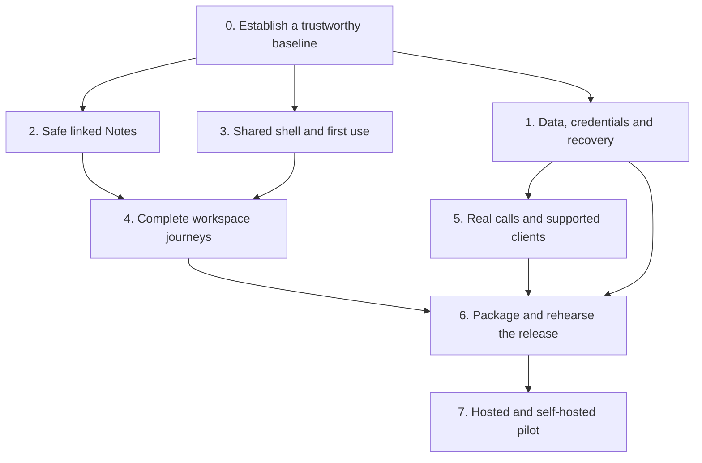

# Wabi — final production-pilot campaign

**Owner:** Ronin, with Codex coordinating implementation and verification

**Started:** 2026-09-15

**Purpose:** finish a coherent, dependable release for hosted testers and independent self-hosters

**Working branch:** `codex/production-finish-20260915`

**Starting commit:** `c11b128b5db0627fbdb15c980b18d0873d2b43cc`

## Remaining work sequence — September 16 checkpoint

This is the task timeline, not an elapsed-time estimate. Implementation evidence below does not accept whole waves.

1. **Close reliability/privacy gaps (current):** bootstrap retention, remaining permission/encrypted-content checks, upload/report/cache deletion boundaries, historical exposure resolution, hosted-copy upgrade/restore/rollback.
2. **Accept complete workspace journeys:** finish Notes/Reader edge cases; exercise every exposed workspace through use, persistence, recovery and permission failure; include pop-outs/account switching/logout.
3. **Complete design and usability:** broad visual hierarchy/forms/states pass, desktop/dock/phone, keyboard/zoom/themes, then measured performance fixes. Preserve channels, center stage, additive stubs and optional right panels.
4. **Verify physical clients/calls:** two-network Linux/Windows/Redmi calling, reconnect/capture ownership, declared capacity and actual package installation/upgrade. Requires available devices/participants.
5. **Prove operator readiness:** clean install, backup/restore/upgrade/rollback, hosted policy/monitoring, independent operator walkthrough.
6. **Publish and deploy one verified candidate:** final checks, artifacts/checksums/build identity, repository kit/screenshots, preserved rollback and live verification. Nothing from this campaign is deployed yet.
7. **Run the invited pilot:** task checklist, hosted and self-hosted feedback, fixes, then expansion decision.

Significant groundwork exists for linked Notes, local storage isolation/recovery, Planner/calendar, authentication, first boot, build identity and release tooling. Whole-workspace acceptance, broad design acceptance, hardware calling and final release rehearsal remain substantial outstanding work.

## The finish line

Someone new can understand Wabi, join or install it, talk with their community, use its workspaces, and return tomorrow without losing their work. An operator can update and recover the instance using the documented procedure. The release accurately states which clients, integrations, and privacy properties have been verified.

The target is a strong **limited production pilot**, followed by a measured expansion. Wabi remains one Authority per community, with independent servers selectable by one client. Existing experimental and optional capabilities retain their boundaries. Completing this campaign does not by itself establish E2EE, federation, HA, or native-mobile certification.

### Required outcomes

1. Reproducible release checks and an identifiable deployed candidate.
2. Reliable persistence, account boundaries, authorization, and recovery.
3. Safe linked local Notes, including migration of existing writing.
4. Consistent, accessible core journeys and an acceptance record for every exposed workspace.
5. Real calling/device evidence for the supported pilot combinations.
6. A clean self-hosting setup, tested restore/upgrade, usable artifacts, and complete handoff documentation.
7. A short pilot with tracked feedback and explicit criteria for broader release.

## Baseline and authorization

The user authorized a large finishing plan, use of wabi.chat, and changes needed to clean up the project. The work takes place in an isolated worktree so the original checkout and presentation artifacts remain intact. Routine repairs and verification continue within that scope. Live data preservation, actual test outcomes, and product boundaries remain mandatory.

The [earlier readiness audit](2026-09-15-first-production-test-readiness.md) used `bbcb5b28`. This campaign starts from newer main `c11b128b`, including shared-media changes and the **complete `visual-polish` branch through `f13dc5f8`**. Branch ancestry was verified after the user's heads-up; no second application of that branch is needed. New upstream changes must be reviewed and integrated between batches, not pulled through an active test/deploy operation.

### Fresh observations

- wabi.chat login rendered in headful Chromium at 1440×1000 and 390×844, with no uncaught page errors or document-width overflow in those samples.
- Direct Privacy and Terms navigation rendered content beneath a persistent “Starting Wabi” overlay. This is a concrete public-route boot bug; its repair is in the opening batch.
- The mobile login's server-switch explanation was visibly truncated. Reproduce on the candidate before attributing it to current source, since live/source identity has not been established.
- Navigation in a disposable guest session showed the selected Notes workspace competing with a channel sidebar, an empty People panel, a separate scratchpad and an icon rail. On a 390px resize, People occupied the screen and Notes disappeared. The mobile takeover is under active diagnosis; the broader composition needs a deliberate U02/N03 redesign.
- The public entry leads with a very large brand image and a sign-in form, giving a new visitor little explanation of the product. The public-entry redesign is now part of this opening batch, following the user's explicit request for a firmer design standard.
- The live Authority reported `ready`; its running binary was fingerprinted privately. It was not changed by reconnaissance and is not yet certified as this branch's build.
- Plain programmatic public requests returned 403 from this client path while headful browsing worked. Treat this as a monitoring/ingress acceptance question, not evidence that the Authority is down.
- The prior pinned WabiDB suite passed 915 tests. That is useful baseline evidence, not a current-candidate restore certificate.

Anonymous public-page evidence is under `/tmp/wabi-finish-live-recon-20260915/`; navigation-only guest evidence is under `/tmp/wabi-finish-guest-recon-20260915/`. No messages or uploads were sent. These local snapshots are observations of the deployed build, whose source identity remains unverified. Exact candidate build/test logs are listed in the execution ledger below.

## Execution map

### How the work is run

- One coordinator owns integration, source/build identity, the campaign ledger, and deployment evidence.
- Up to three independent workers handle bounded, non-overlapping files: backend/trust, Notes/storage, and interface/release work as appropriate.
- Each batch contains 2–4 related changes. Read current source, reproduce the issue, implement, run relevant regression checks, review the diff, then validate the real interaction when UI/runtime behavior changed.
- Each card is **planned → implementing → checked → accepted**. “Checked” means its stated automated checks pass. “Accepted” also requires its named browser, device, operational, or human evidence. Deployment has a separate record.
- Do not mark an entire screen finished because its component compiles. Do not rerun expensive broad suites without a new change or unresolved concern. Final candidate checks are a separate required integration pass.
- Keep root runtime data, uploads, credentials, existing local writing, and operator configuration out of source changes. Build and test against disposable state; restoration experiments use copies.
- Use existing architecture and semantic theme tokens. When removing duplicate UI, migrate its data and preserve reachable capabilities first.

## Wave 0 — make the baseline trustworthy

**Exit gate:** one candidate can be built and tested from committed dependencies; the test results are meaningful; public pages boot correctly; new runtime state cannot be accidentally committed.

| Card | Implementation | Dependencies | Acceptance |
| --- | --- | --- | --- |
| B01 — Isolate test mocks | Move the E2EE message-store fixture's global module mocks into a subprocess, following existing payment fixtures. Preserve all assertions. | None | Offending suite and victim suites pass together, in isolation, and in the full pinned frontend run. |
| B02 — Align build/check contracts | Keep Node/Bun/Rust versions aligned across CI, Docker and docs; use committed lockfiles; replace CI's unsupported numeric check threshold; identify skipped coverage explicitly. | None | Clean source install, typecheck, static build with `index.html`, Cargo check/tests; no lockfile drift. Docker build validated separately. |
| B03 — Protect generated state | Ignore `data/wabi-server/`; verify the actual default key, secret, lock and database paths. Add a small repository-hygiene gate covering the supported defaults. | None | A disposable first boot leaves no community state or secret eligible for accidental staging; no existing user data removed. |
| B04 — Repair standalone boot | Keep root app bootstrap ownership; dismiss the boot overlay after public/standalone routes and errors have mounted. | None | Direct `/privacy`, `/terms`, error and root navigation work; delayed authenticated root startup retains its loading state until ready. Headful verification required. |
| B05 — Correct immediate setup/recovery instructions | Install frontend dependencies before bare-Cargo build; preserve addon instructions; require a stopped writer before stale-lock recovery; remove blanket advice to clear all browser data. | None | Documentation follows the actual build; local writing is explicitly preserved during session troubleshooting. |

## Wave 1 — earn trust in stored data and access

**Exit gate:** no known data-loss or access-boundary defect in the supported core flow; remaining privacy claims are explicit; real restore evidence exists before live cutover.

| Card | Implementation | Dependencies | Acceptance |
| --- | --- | --- | --- |
| T01 — Credential parity | Use the account-access allowlist and step-up exclusion in Socket.IO handshake/fallback; route node and standby admin gates through the shared account authenticator. Preserve helper-secret authentication. | B02 | Legitimate owner/admin credentials work; refresh, scoped-tool, step-up, revoked, malformed and unauthorized account cases fail as intended. Existing expiry/call-continuity rules remain intact. |
| T02 — Resource permission matrix | Extend existing channel, membership-revocation, Lore and call tests across REST, Socket.IO and raw WebSocket. Include guest/member/moderator/owner/removed member and two independent servers. | T01 | Discovery, content read/write, uploads under the accepted capability policy, and privileged mutations agree across transports; revocation clears access and sensitive displays. |
| T03 — Browser-document upgrade safety | Inspect Reader's delete/recreate upgrade callback; introduce additive/versioned migration and recovery handling before another schema bump. Keep old bytes through successful migration. | B02 | Existing Reader data survives upgrade; interrupted/blocked/malformed upgrades preserve recoverable content. Real IndexedDB tests, not helper-only tests. |
| T04 — Resolve encryption claims | Reconcile `api/privacy.rs`, E2EE paths, attachments, UI labels, PROJECT_STATUS and PRIVACY_STANCE. Preserve existing encrypted content. Prove the complete claimed path or retain an explicitly experimental status. | T02 | One truthful capability contract; no automatic downgrade; reachable encrypted attachment/download paths are tested, including issue #214 if still applicable. Existing source does not automatically establish E2EE certification. |
| T05 — Historical secret exposure | Inventory historical secret paths without printing values; assess whether deployed credentials were affected; prepare coordinated remediation and recovery evidence. | B03, T07 before key-related operations | Recorded exposure decision and necessary credential remediation; old database/key compatibility preserved. No casual root-key replacement or history rewrite. |
| T06 — Deletion and retention truth | Trace messages, projections, uploads, local stores, logs and backups using canary data. Distinguish logical deletion, expiry, retained event records and secure erasure in docs/UI. | T02 | Documented retention matches observed behavior; deletion does not leave misleading UI guarantees or silently destroy referenced files. |
| T07 — Restore and upgrade rehearsal | Build a disposable-state drill, then rehearse on an isolated hosted-data copy: stop, backup keys/state/uploads/config, restore elsewhere, verify old and new writes, restart again. | B02, T01 | Clean-host result, timings, exact versions, artifact identity, compatibility and rollback recorded. Never merge unrelated data directories. |
| T08 — Hosted operating policy | Record registration/guest admission, ownership/recovery, request/upload limits, rate-limit/proxy settings, retention, backups, optional services, moderation and readiness monitoring. | T02, T06 | Actual deployed values match the pilot brief; readiness, disk, backup failures and restart loops are actionable. Public-path monitoring is verified despite observed 403s for some clients. |

**Standby boundary:** current standby receive/status routes are not a production recovery guarantee; export/import/promotion remain fail-closed where unimplemented. Preserve those limits while repairing authentication. Network replication's explicit experimental gate is separate.

## Wave 2 — finish safe linked local Notes

Detailed design: [Linked local notebook](2026-09-15-linked-local-notebook.md).

**Product decision:** one device-local notebook per server/account, with contextual DM views. Profile annotations remain separately owned personal metadata. Existing ambiguous local storage requires an explicit recovery/import choice; repeated numeric account IDs cannot establish ownership.

**Storage decision:** transactional IndexedDB, individual note records, revision-checked writes, a shared service across views, and cross-tab notifications. Use existing identity/session primitives. Do not build this on the browser WabiDB facade's currently empty CRUD scaffolds or an unsafe localStorage fallback.

| Card | Implementation | Dependencies | Acceptance |
| --- | --- | --- | --- |
| N01 — Notebook persistence | Scope, schema, transactional note CRUD/trash, revision conflicts, per-editor drafts, commit acknowledgements and cross-tab refresh. | B02 | Quota/abort/blocked storage preserves drafts; two editors cannot erase each other's work; same-note conflicts are recoverable; account switch never redirects saves. |
| N02 — Migration and recovery | Preserve raw legacy Notes/scratchpad/profile-note values; validate records; explicit destination selection; idempotent migration receipts; JSON backup/import/export and trash. | N01 | Ambiguous ownership, wrong-shape data, partial corruption, interrupted/repeated imports and export round trips preserve writing; old keys remain until verified cleanup. |
| N03 — One editing experience | Bind center, dock, DM context and scratchpad to the same service; Full opens the exact scratchpad record; retire unused editor paths only after reference checks. | N01, N02 before rollout | Create in one surface, edit in another, close/reopen/reload, and retain identity, selection, draft and saved content. |
| N04 — Links and discovery | Titles/search; `[[Title]]` and `[[Title|label]]`; CodeMirror completion; stable note IDs; transactional rename/incoming-link updates; backlinks and missing-target handling. | N01, N03 | Code and escapes are excluded; Unicode/duplicate handling, rename, trash/restore, aliases and concurrent edits are correct. Keyboard insertion/follow/back works. |
| N05 — Reader bridge and polish | Label handoff “Open a copy in Reader”; stable source identity and return-to-note; Markdown export mapping; compact toolbar, persistent local-only and save status. | N02–N04 | Reader edits cannot silently overwrite the original; exported links reopen; local-only status remains visible; desktop, dock, phone, keyboard and failed-save journeys pass. |

Graph view, filesystem vault watching, block embeds, plugins, cloud sync and collaboration are later work. They do not block a useful linked notebook.

## Wave 3 — make the shared interface coherent

**Design direction:** make Wabi feel like a complete product, with a clear purpose, calm working surfaces and confident hierarchy. The user explicitly authorized substantial redesign where the current result feels underwhelming. Preserve expressive themes, community branding and capabilities, while replacing weak compositions and confusing controls.

### The design acceptance bar

1. **The purpose is obvious.** A new visitor understands what Wabi offers and which community they are joining. Each workspace presents a meaningful title, current context and one clear primary action.
2. **Preserve the layout contract.** Channels anchor location/context. Center stage owns the primary task. Stubs are additive only, and right panels are exclusively for optional multitasking alongside center stage. Improve density and legibility while preserving the channel anchor, stub system and deliberately opened panels.
3. **Make each action's role understandable.** Distinguish opening center stage from adding a multitasking panel. Shared data does not make these two views redundant: preserve simultaneous use and independent drafts. Notes and scratchpad can share persistence without collapsing their distinct viewing roles.
4. **Hierarchy survives every theme.** Use semantic tokens, readable text, consistent icon weight and visible selected/focus states. Artwork supports the composition; controls and reading surfaces stay legible. Preserve operator-selected branding and user theme preferences.
5. **Phone layouts are designed as phone layouts.** Show the selected destination, preserve a visible return path, provide usable touch targets and make room for the on-screen keyboard. Resizing must never strand the user in an unrelated panel.
6. **The interface tells the truth.** Empty, loading, denied, failed, local draft and saved states are distinct. No dead placeholder controls, false save confirmation or ambiguous ownership labels.
7. **Acceptance is visual and behavioral.** Review desktop, phone and constrained dock renders; use keyboard and 200% zoom; check reduced motion and contrasting themes. Compile success alone cannot accept a design card.

Do not accept a screen while a HIGH finding makes a task inaccessible or misleading. Clear MEDIUM hierarchy/consistency findings before calling that screen polished. Optional integrations still need coherent unavailable states.

| Card | Implementation | Dependencies | Acceptance |
| --- | --- | --- | --- |
| U01 — First five minutes | Recompose public entry around product purpose, community identity and a clear authentication card; make public reading/error pages readable. Review login/register/guest policy, first-owner wizard, server selection, home choice and help links. | B04; T08 for policy acceptance | New visitor understands the next action and the server they are joining; first operator completes setup; failed/closed/offline states are actionable; branding variants and mobile controls remain usable. |
| U02 — Shell and navigation contract | Preserve channels as the location anchor, center stage as the primary workspace, additive stubs and optional multitasking right panels. Clarify open/add/return behavior, headers, overflow and saved layout. Fix unintended mobile panel takeover without deleting the panel/stub system or deliberately saved desktop arrangements. | B02 | Adding a stub/panel preserves center-stage selection and channel context; the same content can be used in both surfaces with independent drafts. Every destination stays reachable; closing/previewing/resizing preserves the user's workspace and saved desktop layout. |
| U03 — People and conversations | Recognizable identities, unavailable/deleted-person state, one obvious message path, correct recipient/context; reconcile #184 by actual capability/diff rather than merging blindly. | T02, U02 | Find person → correct DM/group → send/reply/upload → reload/reconnect; accepted messages appear once; no misleading retry. |
| U04 — Forms and feedback | Shared save/pending/error/empty patterns, visible focus, modal focus containment, useful validation, upload/cancel/retry and clear draft-versus-published labels. | U02 | Failure does not masquerade as success; keyboard can complete and escape each interaction; sensitive drafts retire with their scope. |
| U05 — Responsive and accessibility pass | 1440px desktop, constrained dock, 390px phone, 200% text zoom, keyboard, reduced motion, default and contrasting theme. Check actual touch targets and on-screen keyboard behavior. | U01–U04, N03 | Controls and content are reachable without overlap/clipping; labels and states are exposed; contrast/zoom and reduced motion are reviewed in rendering. |
| U06 — Performance and assets | Measure cold entry and authenticated workspace load; inspect chunk/cache behavior, large lists, large notes, media and theme/effects cost. Optimize measured bottlenecks. | U02, N04 | Record representative device/network timings and resource use; no uncaught initialization errors or stale-chunk reset ritual; effects-light mode stays usable. |

## Wave 4 — complete each exposed workspace

Use a common acceptance record: **entry → create/import → edit/use → save/share → reopen/reload → export/delete/recover where applicable**. Include permission denial, missing data/dependency, empty state and failure recovery. Fix the broken path or clearly state its actual supported boundary; do not silently remove a workspace to make a checklist green.

| Card | Surfaces | Concrete completion work |
| --- | --- | --- |
| W01 | Planner / calendar / business | Verify personal versus shared state, create/edit/reorder, timezone/date behavior, cross-view consistency, permissions and reload; consolidate duplicate headings/controls only where still present after visual-polish. |
| W02 | Reader | Import, save/reopen, search/outline/bookmarks, working-copy/source ownership, migration, export and narrow reading; do not advertise unshipped PDF/EPUB support. |
| W03 | Whiteboard / Wiki / Forum / Gallery / Incidents | One real content lifecycle for each exposed kind, second permitted account where shared, persistence after restart, and honest missing/deleted/denied states. |
| W04 | Files / Transfers / Media | Progress/cancel/retry, large upload limits, download/open, unsupported format and unavailable-peer behavior, dependency-aware cleanup and actual URL access policy. |
| W05 | CAD / 3D | DXF, optional DWG conversion, 3MF, STEP/IGES through existing viewers; stable original identity through conversion, coordinate-anchored review, useful parser/converter errors and realistic model size. |
| W06 | Project / Lore | Missing external dependency, connection/auth failure, local detection/staging, history/review, interrupted transfer, concurrent change, permission loss and clear draft/published/review state. |
| W07 | Map / People / Settings / Admin | First-use and configured states; meaningful settings consumers; admin acknowledgement, operation history, storage references, role changes, scope retirement and useful unavailable metrics. |
| W08 | Pop-outs / detached windows / PWA | Correct server/account/channel targeting, credential handoff without URL secrets, logout propagation, draft ownership, saved layout, deep links, update/cache behavior and notification entry. |

**Exit gate:** every exposed surface has recorded accepted scope or a named unresolved card. A passing test of one representative component is not whole-workspace acceptance.

## Wave 5 — verify calls and the clients actually offered

| Card | Implementation / exercise | Acceptance |
| --- | --- | --- |
| C01 — Two real network paths | Two real clients on different networks using the advertised default transport; explicit optional TURN/SFU fallback test where offered. | Microphone/output, mute/deafen, camera, screen share and supported sound capture work; transport/fallback labels match actual behavior. |
| C02 — Failure and ownership | Disconnect/reconnect, network change, capture permission denial/cancellation, leave/rejoin, kick/removal, logout and concurrent call surfaces. | No unauthorized audience, resurrected session or lingering capture; controls affect the displayed session; recovery stays understandable. |
| C03 — Pilot room capacity | Agree a small declared room size, initially test six participants on representative equipment; measure CPU, memory, latency and quality. | Publish only the size/combinations actually verified; larger media goals remain separate. |
| C04 — Desktop distribution | First pilot: install and upgrade Linux/Windows packages; notifications, local file access, sidecars and detached windows. Apple platforms are outside this pilot's acceptance target; existing capabilities remain intact. | Real installation and lifecycle evidence for each advertised platform; compiled artifacts alone do not certify native behavior. |
| C05 — Mobile boundary | Accept mobile web/PWA as a distinct surface. Offer native Android/iOS only after build, install, device/network/audio/background tests pass. | The supported-client table distinguishes mobile web from native certification; no shrunken desktop-only interaction path. |

Physical microphones, Bluetooth routes, external phones/networks and independent human use require actual devices and participants. Keep these cards open until evidence exists; automation is not a substitute.

### Available pilot hardware (user-confirmed, September 15)

| Device | Available coverage | Evidence still needed |
| --- | --- | --- |
| Two Bazzite computers | Linux desktop/browser | Installed browser versions, audio/camera equipment and actual call results |
| ironin Mint computer | Microphone and camera; read-only SSH access succeeded, reporting Linux Mint 22.3 | Browser session, capture permissions, actual audio/video and screen sharing |
| Tim Mint computer | Additional Linux host; preserve its existing hosting role | Suitability for a separate client test without disrupting hosted Wabi |
| Tim's Windows 10 and partner's Windows 10/11 access | Windows browser/native pilot candidates | Actual installed clients and lifecycle/calling results |
| Redmi A7 | Mobile web/PWA candidate | Android/browser versions, touch/layout, capture and background/reconnect results |
| Void's computer | Possible Windows 11, unconfirmed and unavailable until return | Availability and OS confirmation |

A second network/participant has not yet been confirmed. Redmi cellular data may provide a separate route if available; SSH connectivity alone does not prove independent public calling paths. Device access is not a hardware acceptance result. No OS reinstall is planned, and connection addresses are intentionally kept out of repository documentation.

## Wave 6 — make release and self-hosting repeatable

| Card | Implementation | Dependencies | Acceptance |
| --- | --- | --- | --- |
| R01 — Build identity | Embed source SHA/build identity in a small public metadata contract and artifact manifest; avoid secrets/host paths. | B02 | UI/about or diagnostic metadata, manifest, container/binary and deployed asset identity agree. |
| R02 — Clean install gate | Boot the real Compose image in an isolated CI environment; first owner/member, representative content/upload, restart and readiness. Test Podman separately if claimed. | B02, T01 | README succeeds on a clean host with no private configuration or undocumented mount/build step. |
| R03 — Release artifacts | Choose coherent pilot version, supported architectures, server archive/container and desktop packages; checksums and update instructions. Repair unreachable tag publishing and avoid conflicting release jobs. | R01, C04 for native assets | A tagged candidate produces the intended artifacts; installation follows their instructions; no unsupported package is presented as certified. |
| R04 — Operator handoff | Consolidate Fresh Install, backups/recovery, upgrades, diagnostics, logs, limits and optional helpers; document browser-local versus server-backed data. | T07, T08, R02 | A second operator completes setup and recovery without undocumented intervention. |
| R05 — Public repository kit | CONTRIBUTING, private security-reporting process, bug templates, supported platform table, known limits, license notices, fresh screenshots and accurate feature claims. | T04, W01–W08 scope decisions | New contributor/tester has a clear path; no invented contact address, misleading privacy promise or open-PR-as-shipped claim. |
| R06 — Candidate rehearsal and deployment | Run final locked checks and embedded browser smoke; preserve prior artifact plus compatible backup; preflight actual host/runtime/addons; deploy the accepted candidate and verify origin/public assets and behavior. | All required gates above | Exact candidate identity, readiness, auth denial, addon presence, asset/cache consistency, real user-path login and rollback evidence recorded. |

The deploy runbook must be reconciled with actual live image/mounts and current source. Some skill references contain obsolete STDB, runtime-only Docker, key and lock assumptions. Do not execute those stale instructions blindly.

## Wave 7 — pilot, feedback, and expansion

Suggested pilot: 5–10 hosted users and 1–2 independent self-hosters for roughly a week. This is a proposed test shape, not a capacity guarantee. Provide a short checklist of real tasks and a single feedback destination.

- **P01 — Invitation kit:** candidate identifier, supported scope/platforms, how to join/install, local-data and backup expectations, known limits, how to report a problem.
- **P02 — Feedback triage:** reproduce, assign severity, attach version/device/network context, fix in bounded batches, link acceptance evidence. No daily status noise without meaningful changes.
- **P03 — Expansion decision:** no unresolved data-loss or unauthorized-access defect; core journeys complete; independent setup succeeds; update/restore and declared call limits remain verified; remaining issues are classified and communicated.

Pause expansion if a new data-loss, credential-boundary, unrecoverable upgrade or serious call-audience issue is confirmed. Preserve evidence and the prior working release.

## Final acceptance checklist

- [ ] Required foundation/trust/Notes cards accepted.
- [ ] All exposed workspaces have a completed acceptance record and truthful availability labels.
- [ ] Core flows pass on the final candidate in the embedded build and intended public deployment.
- [ ] Supported call/device matrix is recorded with real hardware evidence.
- [ ] Clean Docker install and advertised alternative install paths pass.
- [ ] Restore, upgrade and rollback are proven with compatible keys/data/uploads.
- [ ] Historical-secret exposure has an explicit resolution.
- [ ] Source SHA, release manifest, checksums and deployed build agree.
- [ ] Supported artifacts, docs, reporting process and known limits are published together.
- [ ] Pilot feedback has been evaluated before broader production claims.

## Opening-batch execution ledger

Only this section records implementation status; planned cards above do not imply completion.

| Card / change | Status | Evidence / remaining gate |
| --- | --- | --- |
| B01 test isolation | Checked on final opening source | Full pinned frontend suite: **760 passed, 3 pre-existing skips, 0 failed** across 104 files. The three browser-storage crypto cases still require browser evidence. Latest log `/tmp/wabi-finish-final-frontend-tests-20260915.log`. |
| B03 runtime ignore rule | Checked locally | Default database/root-key/JWT/lock paths are ignored; no live files modified. A disposable first-boot hygiene job remains planned. |
| B05 setup and recovery instructions | Edited | README now installs locked frontend dependencies; lock and browser-reset advice preserves data. Full clean-host rehearsal remains planned. |
| T01 Socket.IO | Checked | **18 targeted Rust tests passed** (five new credential cases plus four existing cases compiled through two module paths). Log `/tmp/wabi-finish-socket-auth-tests.log`. |
| T01 node/standby admin parity | Checked | Shared account authenticator now enforces token class, expiry, revocation and current administrator role. **4 HTTP contract tests passed**, covering nine privileged routes and preserved helper-secret behavior. Log `/tmp/wabi-finish-helper-admin-auth-tests.log`. |
| B04 public-route boot | Checked in headful browser | Direct public/error pages, navigation, anonymous root and deliberately delayed authenticated root startup pass. Script `frontend/scripts/public-route-boot-smoke.mjs`; latest evidence `/tmp/wabi-public-route-boot-SE8wcr`. |
| U01 public reading/error pages | Checked in headful browser | Readable default/light/high-contrast layouts; body/navigation contrast ≥4.5:1, targets ≥44px, keyboard skip/focus, policy navigation, real scroll/back-to-top and no horizontal overflow. Root inspected default/light Privacy and default 404 renders. Policy prose unchanged except the relocated effective-date reference. |
| U01 public entry | Checked in headful browser | Ten entry variants passed: desktop, phone, short phone, tablet, light, custom, neutral, configured launch, owner wizard and closed registration. Password/remember/error/register/guest/language/server-selection interactions and wheel-to-footer passed. Primary contrast ≥14.98:1; refined secondary copy ≥5.58:1 across measured default/light/neutral states; mobile targets ≥44px. Script `frontend/scripts/login-entry-browser-smoke.mjs`; full evidence `/tmp/wabi-login-entry-JaAdbL`, final affected variants `/tmp/wabi-login-entry-ZmdNgq`. Root visually reviewed default/light/neutral/phone/custom renders. |
| U02 mobile selected-workspace visibility | Checked in headful browser | Reproduced before repair. At 390/360px Notes retains text and receives pointer input; explicit People open/search/close and picker final-row access work; saved open/closed desktop docks survive resize and cold mobile navigation. Interrupted swipe state resets. Fixed panel persistence, transform reactivity and picker stacking. Script `frontend/scripts/mobile-panel-resize-smoke.mjs`; final evidence `/tmp/wabi-mobile-panel-resize-Q7BKM4`, log `/tmp/wabi-finish-mobile-panel-after.log`. |
| B02 frontend check contract | Edited | CI uses supported `bun run check`; removed numeric `--threshold 1`, which is not a valid svelte-check severity. Existing warnings remain visible. |
| Locale-key consistency | Checked | `npm run check:i18n` passed for the English/Spanish server-switch label. |
| Combined frontend typecheck | Checked on final opening source | **0 errors, 168 existing warnings**. Log `/tmp/wabi-finish-combined-check-20260915.log`. Warnings remain visible and are not treated as completed accessibility cleanup. |
| Candidate frontend static build | Checked on final opening source | `npm run build:static` passed and produced the embedded SPA output. Log `/tmp/wabi-finish-combined-static-build-20260915.log`. Full embedded-runtime/candidate deployment acceptance remains R06. |
| Deployment | Pending | Live reconnaissance and a disposable guest navigation session only. No candidate deployment, messages, uploads or operator configuration changes performed in this batch. |

Independent review found no new backend credential-boundary regression. A separate mobile review identified interrupted-swipe cleanup; that repair and its browser regression are included above. Source changes were frozen before the final combined frontend checks. Browser checks used a real headful rendering environment, fixture APIs for entry/public pages and a disposable local Authority for the mobile shell. They are not physical-device calling or deployed-build certification.

## Linked Notes implementation batch

The campaign has moved into implementation. This batch is local to `codex/production-finish-20260915`; no push, merge or deployment is implied.

| Card / change | Status | Evidence / remaining gate |
| --- | --- | --- |
| N01 persistence / ownership | Core implemented and checked | Dedicated additive IndexedDB schema, per-note revisions, independent drafts, committed-save acknowledgements, scoped notifications, trash/recovery. Real-browser tests cover competing writes, abort/retry, blocked upgrade, upgrade preservation, reload recovery, typing during self-link rename, server/account/path boundaries, logout, guest hashing and explicit offline storage failure. |
| N02 recovery / backup | Partial | Explicit legacy destination, exact raw source preservation, partial-row validation, idempotent receipts and detached conversation IDs. JSON import remaps colliding IDs/titles/references atomically; export/import share a 20 MB UTF-8 / 10,000-note / 100,000-reference limit. Unsupported exports fail before creating a file. Portable Markdown archives are implemented. Legacy profile mapping and multipart backups remain open. |
| N03 shared surfaces | Primary journeys checked | Center/docked Notes and scratchpad share storage with independent drafts. Full opens the same UUID. DM is wired as a contextual view; dedicated DM acceptance remains. Removed only unreferenced legacy editor code; additive stubs and panels remain. |
| N04 discovery / links | Partial | Titles, search, wiki links/backlinks, atomic incoming-link rename, aliases and deleted UUID identity implemented. Keyboard completion, rendered reading view, missing-target creation and explicit reconnect pass the headful workspace fixture. Full compact/device acceptance remains open. |
| N05 composition / Reader copy | Partial | Full-height editor, title-led list, visible local save status and one mobile secondary-action menu. Reader handoff is labeled as a copy with stable source identity. Scoped Reader return and portable Markdown archives pass browser journeys; exported archives are independently readable. Full zoom/device acceptance remains open. |
| Profile annotation safety | Implemented and checked | Owner/stable-subject scope, transactional revisions, clear tombstones, awaited saves, retained drafts/download. Actual popout save/reopen/clear, aborted save, total read failure and missing identity pass. Evidence `/tmp/wabi-profile-popout-zsZ2G7`; logs `/tmp/wabi-profile-popout-smoke.log` and `/tmp/wabi-profile-notes-smoke.log`. |
| Independent concurrency review | Findings fixed | Delayed trash cannot follow a changed selection; runtime drafts remain downloadable after reopening during a storage outage; typing during self-link rename cannot overwrite rewritten links; exports cannot exceed import support. |
| Frontend validation | Passed | **790 pass, 3 existing skips, 0 fail** across 107 files (`/tmp/wabi-notes-final-unit-20260915.log`); **0 type errors, 167 warnings** (`/tmp/wabi-notes-final-check-20260915.log`); static SPA build passes (`/tmp/wabi-notes-final-build-20260915.log`). This is not final embedded-binary acceptance. |
| Rendered Notes acceptance | Tested journeys pass | Disposable Authority + current Vite frontend, headful Chromium: create/save, links/backlinks/alias rename, editor height, trash/restore/search, delayed-action selection regression, shared scratchpad Full and dark/light mobile. `notes-workspace-browser-smoke.mjs`; `/tmp/wabi-notes-final-ui-20260915.log`. |
| Storage / scope acceptance | Passed | Real IndexedDB windows/contexts, no live data. `notes-storage-browser-smoke.mjs` (`/tmp/wabi-notes-final-storage-20260915.log`) and `notes-scope-browser-smoke.mjs` (`/tmp/wabi-notes-scope-smoke.log`). |
| U02 closed mobile sheet shadow | Checked in dark/light browser renders | Offscreen sheets no longer cast a shadow over center stage. Open/swipe-preview styles remain. Final notebook screenshots `/tmp/wabi-notebook-ui-NJUogD`; mobile dock/resize/picker/cold-load/swipe regression log `/tmp/wabi-notes-final-mobile-panels-20260915.log`, evidence `/tmp/wabi-mobile-panel-resize-fIWuRA`. |

Behavior and limits are in [Local Notes](../features/LOCAL_NOTES.md). Remaining N02–N05 acceptance, full workspace acceptance, clean-host install/restore, physical-device calling and both pilot cohorts still gate release. No writing was migrated on wabi.chat.

## Notes writing and Reader upgrade batch

- **T03 implemented and checked:** Reader DB v3 preserves old stores; safely scoped v2 rows copy atomically, unassigned legacy rows remain explicit recovery sources. Failed/blocked storage retains drafts and supports retry. Recovery filters known other accounts and rejects owner changes. Real IndexedDB fixture: `frontend/scripts/reader-storage-upgrade-browser-smoke.mjs`.
- **N04–N05 implemented journeys:** prose CodeMirror editor with keyboard completion, sanitized reading view, local link navigation, missing-target creation, explicit deleted-link reconnect, scoped Reader return, portable `.tar` archive with relative Markdown links and a complete JSON backup. Existing code-editor defaults remain intact. No implicit Reader write-back.
- **Validation:** 799 frontend tests pass, 3 existing skips; 0 type errors and 167 warnings. Static SPA build passes with `build/index.html`. Logs `/tmp/wabi-notes-reader-final-unit.log`, `/tmp/wabi-notes-reader-final-check.log`, `/tmp/wabi-notes-reader-final-build.log`. Workspace completion/read/reconnect/Reader/archive/mobile checks pass in a real headful browser: `/tmp/wabi-notes-reader-final-ui.log`, screenshots `/tmp/wabi-notebook-ui-bRK8pk`. Independent Python tar reader verified the downloaded archive and link destinations. Mobile panel regression passes: `/tmp/wabi-notes-reader-final-mobile.log`.
- **Remaining:** explicit legacy profile mapping, multipart backups, dedicated contextual DM and full zoom/physical-device journeys; the other campaign trust, workspace and release gates remain open. No merge, push or deploy is implied.

## Authority restart and restore batch

- **First-boot secret persistence fixed:** JWT resolution previously ran before a missing data directory existed, warned on its failed write, and continued with an unpersisted key. The candidate now creates parents, fails startup on unreadable/invalid/unwritable persisted keys, writes restricted temporary files, flushes them, and publishes complete keys without overwriting a concurrent winner. Existing valid keys and environment precedence remain intact. Root-key read failures no longer trigger replacement attempts.
- **Validation:** 10 focused Rust secret tests pass, including nonexistent parent paths, concurrent first boots, preserved invalid bytes and existing overrides. Pinned `cargo +1.93` candidate binary builds. Logs `/tmp/wabi-first-boot-secrets-tests.log`, `/tmp/wabi-restore-candidate-build.log`.
- **T07 disposable rehearsal passed:** `scripts/authority-backup-restore-smoke.mjs` now runs in CI after building the embedded Authority. Registration and owner identity, original access token, forever-retained messages, completed uploads, key hashes, snapshot isolation and post-restore writes survive stopped copying and subsequent restarts. Final evidence `/tmp/wabi-authority-restore-qlH1TN/report.json`; tested debug binary SHA-256 `57b511a7f4c5978dfb8f013ecbb35108380e76006f569c5b116f08e69f6dfdc6`.
- **Limits:** same-binary disposable data on this host. Hosted-data copy, previous-release upgrade, external-key recovery, independent clean host, final release artifact and optional services remain open. The operator runbook describes these boundaries. No live data was touched.

## Source-built container and fresh install batch

- **B02 / R02 repaired:** container frontend now uses Node 22; Cargo uses the committed lockfile. Environment files are excluded throughout the Docker build context. The core Compose services use standard bind-mount options and a one-shot mount-root owner initializer, then run the Authority as UID/GID 1000. Health checks use readiness. Existing data/upload locations are preserved; optional helper mounts were not rewritten.
- **Launch helper:** targets the current `wabi-server` service instead of retired `backend` / `frontend` services. Global dangling-image cleanup is now explicit opt-in. Shell syntax and canonical Compose parsing pass; this does not certify every legacy launch-helper option/profile.
- **Actual source image built:** `localhost/wabi-production-finish:20260915`, image ID `615e6e0cb2c9c7f553905cb796b1794434c38035cba225c6b1e1993c91a1332d`; log `/tmp/wabi-container-build.log`.
- **Fresh rootless Podman Compose passed:** `scripts/authority-compose-smoke.mjs` derives the real core services in a unique temporary project with no operator environment file. Fresh mount initialization, embedded HTML/assets, first owner, original login token and persistent message survive restart. A headful browser opens the embedded Notes workspace without page errors and waits for boot-shell dismissal. Report `/tmp/wabi-compose-pilot-vZAIis/report.json`; screenshot `/tmp/wabi-compose-pilot-vZAIis/embedded-workspace.png`; log `/tmp/wabi-compose-pilot-final.log`. Fixture containers are removed; disposable state/evidence remain.
- **Docker gate added to CI:** builds the source image and runs the same Compose lifecycle fixture. Local Docker daemon access is denied, so Docker execution remains pending CI; Podman evidence is not relabeled as Docker acceptance. Independent clean-host operation, optional services, migration between container UID mappings and release publication remain open.

## Build identity implementation batch

- **R01 implemented, artifact acceptance in progress:** compile-time server identity is available through public no-store diagnostics and a `--build-info` command that runs before logging/data initialization. The client embeds its package version/source revision and emits `wabi-client-build.json`; About distinguishes client/server versions and cancels stale server lookups.
- **Release manifest:** reads identity from the real binary, requires a release profile and matching client/server revisions, then hashes binary/frontend bytes. Rejects symbolic links and output/input collisions. CI stamps the actual checkout revision and uploads the manifest with the binary; Compose forwards the optional source argument. Unknown local revisions stay explicitly unavailable.
- **Checks so far:** 801 frontend tests pass with 3 existing skips; focused public metadata Rust handler test passes; four independent manifest-fixture tests pass (matching bytes, wrong server revision/debug profile, mismatched client revision, symlink rejection). Exact stamped build, CLI side effects, actual manifest and rendered About acceptance follow on the committed source.
- Operator contract: [Build identity](../deployment/BUILD_IDENTITY.md). This is not publication, signing or deployment certification.
- **Exact candidate checked:** source `ff714c556a369ea0bb341c1b852650ec95ce5dc0` built successfully as a stamped static frontend and release Authority. The actual binary's build-info command passed the manifest side-effect check; its revision matched all 270 frontend files in the generated manifest. The stopped backup/restore/restart fixture passed using that release binary and expected revision. Local evidence: `/tmp/wabi-ff714c55-release-manifest.json` and `/tmp/wabi-authority-restore-RPn0lm/report.json`. Rendered About and matching container/deployed identity acceptance remain pending.

## Interface-review coverage

Full-mode review is bounded to inspected public pages, the guest Messages/Notes views and the source contracts above. It does not certify the other workspaces or populated/private conversations. Svelte 5, existing plain CSS and semantic tokens remain the styling system.

| Category | Inspected evidence | Result |
| --- | --- | --- |
| Typography | Live desktop/phone login, public pages, guest Messages/Notes | Weak purpose/hierarchy on entry; truncated mobile footer; crowded repeated Notes labels. Entry/public-page repairs underway. Full app text/zoom pass remains U05. |
| Surfaces | Public-page overlay, login controls, guest workspace/picker and Notes at desktop/phone widths | Overlay and mobile People takeover are HIGH findings. Desktop secondary panels compete with the selected content. B04/U01/U02 own repairs. |
| Icons | Public login controls; guest workspace picker and right rail | Repeated unlabeled rail glyphs need a discoverability pass in U02/U05. No blanket asset/icon replacement proposed. |
| Animations | Live boot/loading state; source contract | Route lifecycle defect established; 10%-speed motion review and reduced-motion interaction testing remain U05. |
| Performance | Public pages render without observed uncaught errors in sampled visits | No performance benchmark or call-capacity claim; U06 owns measurement. |

| Severity | Location | Before | After | Why |
| --- | --- | --- | --- | --- |
| HIGH | Global boot shell / standalone routes | Privacy and Terms content stays beneath the startup overlay. | Dismiss after standalone/error page mount while preserving root bootstrap ownership. | Loading feedback must end when that surface is ready. |
| MEDIUM | Live phone login, server-switch footer | Explanation truncates into a short fragment at 390px. | Reproduce and give explanation/control intentional wrapping and available width. | A navigation action needs readable context. |
| MEDIUM | Public entry / login composition | Oversized branding and a form dominate; little explanation of the product or community context. | Clear purpose, compact community identity, focused authentication card and readable supporting navigation. | Strong hierarchy should explain the destination and next action. |
| MEDIUM | Privacy / Terms reading layout | Large glass container consumes scarce mobile reading width; navigation and document context are weak. | Calm reading surface, consistent measure, clear document header and public navigation. Preserve substantive policy text. | Typography and spacing should support sustained reading. |
| MEDIUM | Public error page / brand mark | Dark stock mark disappears against the dark surface. | Use a mark that follows foreground color, with useful error recovery actions. | Brand and controls must remain legible across themes. |
| HIGH | Public direct links / text and scrolling | Default text tokens can be invalid before root theme initialization; the app body suppresses document scrolling. | Give public pages canonical token fallbacks and an owned scroll container. Verify contrast and actual scrolling on a fresh direct link. | A reading page must expose readable content all the way to its end. |
| HIGH | Live Notes / phone resize | An unrelated People panel occupies the screen while Notes is selected. | Preserve selected-workspace visibility and a reachable panel return path through shared shell state. | Responsive behavior must not make the active task inaccessible. |
| HIGH | Mobile People / panel transform and workspace-header stacking | An explicitly opened panel remains offscreen; after its transform updates, the closed workspace picker header intercepts search input. The bottom navigation also covers the picker's last option. | Make transform expressions depend on current panel/gesture state; raise the workspace header above the persistent bottom navigation only while its picker is open. Reset interrupted gesture state on return to desktop. | Visible state, hit targets and gesture cleanup must match the requested action. |
| MEDIUM | Notes / desktop and phone composition | The populated editor uses a shallow area above unused background; color/date controls outrank note identity, and mobile labels the selected Notes surface “Chat.” | Give the editor available height, clarify title/save state and navigation roles, and simplify secondary toolbar actions. Preserve the channel anchor, additive stubs and optional right-panel editing. Share persistence while retaining independent drafts and simultaneous views. | Improve the working surface within the product layout contract. Panels are intentional multitasking; their existence is not a defect. The opening mobile repair restores reachability without finishing the Notes redesign. |

Rejected alternatives: resetting operator branding for a screenshot; a second Notes/shell navigation system; blanket token rewrites based on July findings; calling headful synthetic media a physical-device pass. Each would either lose intended capabilities or overstate the evidence.

**Interface verdict:** the opening public-entry and mobile-navigation repairs have scoped browser evidence. Whole-product release remains blocked by incomplete workspace, migration, recovery and device acceptance. The original Notes ownership/save risks have candidate fixes documented above; those fixes do not certify every remaining migration and recovery case. Full workspace, 200% zoom, physical touch/keyboard, motion-at-10%-speed and performance acceptance remain open; the completed narrow checks do not certify them.

**Campaign verdict:** in progress. The plan covers the finish line; acceptance is earned card by card and again on the final candidate.

## Helper-assisted calendar and pilot checklist batch

- User requested free-model helpers for easy and medium implementation wins, with short bounded prompts and batch review. OpenCode Ling's free endpoint passed a literal-response smoke check. Separate workers owned calendar code and the device checklist; no paid fallback was selected.
- Calendar form dates now use local calendar components, reject invalid dates/times and end-before-start, and explicitly clear recurrence when disabled. Review tightened types and recurrence validation. This does not implement recurrence expansion or repair Planner account/storage/import ownership.
- Validation: 28 targeted tests pass under `TZ=America/Los_Angeles`; frontend check reports zero errors and 167 existing warnings, and the static production build passes. Physical/browser calendar acceptance remains pending.
- [Pilot device checklist](../testing/PILOT_DEVICE_CHECKLIST.md) records planned hardware pairings, capture/reconnect/permission checks and separate native/self-hosted acceptance. All physical results remain untested.
- The calendar provider became unavailable after writing its patch; final repairs and checks were completed locally. No push, merge or deployment occurred.

## Planner data-safety implementation batch

- **W01 partial:** replaced browser-global Planner hydration with server/account-scoped IndexedDB snapshots, revision-checked writes, retained conflict drafts, save errors/retry/export controls and owner-keyed UI mounts. Existing `business_data` remains untouched and requires explicit download/import recovery.
- JSON imports now validate complete backups and add records without replacing existing work; differing ID collisions and unresolved references reject the whole import. Account-scoped channel/Lore references cannot silently bind to a different server/account.
- Removed speculative sync traffic and misleading sync controls: the Authority has no Planner sync protocol. Existing public compatibility methods report unavailable without network access.
- Free Ling workers implemented the import helper and sync cleanup. Review corrected export-envelope compatibility, normalized equality, typing and an unrelated async modifier regression. A browser-fixture worker exceeded its useful repair budget; its fixture was finished and checked locally.
- **Checks:** 873 frontend tests pass, 3 existing skips; frontend check has zero errors and 167 warnings. Real headful IndexedDB checks prove account separation, exactly one winner in competing writes, scoped losing-draft recovery, stale retry protection, reload persistence, transaction abort atomicity and failed-save retry. Rendered Planner checks pass create/save, own-export import, unrelated-JSON rejection and A→B→A account isolation. The final rendered journey also passed after the recovery notice was compacted; screenshots are in `/tmp/wabi-planner-ui-vELkji`. The static production build passes (`/tmp/wabi-planner-final-build.log`).
- [Local Planner](../features/LOCAL_PLANNER.md) documents storage/legacy/recovery boundaries. Recurrence expansion, full Planner accessibility/design, broader workspace acceptance and physical calling remain open. No merge, push or deploy is implied.

## Calendar recurrence and embedded identity acceptance

- Daily/weekly/monthly/yearly occurrences now populate the calendar and upcoming summary. Expansion scans the requested local days instead of replaying years of history; missing monthly/yearly dates are skipped, cancellation dates are respected and multi-day spans preserve local clock times across DST. Clicking an occurrence edits its original series; the editor explains the scope.
- Free-worker drafts exposed faulty DST assumptions and invalid test dates (including June 31). The recurrence algorithm and those tests were corrected locally after the helper's bounded attempt. 33 targeted tests pass under `TZ=America/New_York`; the full frontend suite before the final two targeted additions passed 904 tests with 3 skips; frontend check reports zero errors/167 warnings. Static production build passes. Headful rendered create/import/account-isolation plus repeated occurrence/series-edit journey passes: `/tmp/wabi-planner-ui-0mSWqU`.
- **R01 additional acceptance:** the actual release binary stamped `ff714c556a369ea0bb341c1b852650ec95ce5dc0` serves its embedded SPA and displays matching client/server revisions in Settings → About. Metadata and rendered values agree, with no uncaught browser errors. Evidence: `/tmp/wabi-embedded-identity-vc8SHh/embedded-about.png`; fixture `frontend/scripts/build-identity-browser-smoke.mjs`. This proves that earlier exact candidate; newer source and deployed/container identity still need their own matching-artifact check.
- ironin SSH timed out during this batch; no remote files/services were changed. Physical calling remains untested.

## Release packaging and live preflight follow-through

- **R03 implementation:** one tag-driven draft prerelease workflow packages the already-checked Authority archive and native installers, verifies the server manifest, and emits asset checksums. Backend regression tests now gate the tag build. The older native workflow is manual diagnostics only. Eight release manifest/packaging tests pass; actual tagged CI, signing and physical installation remain open.
- **Native evidence:** the Linux release desktop compiled and Debian/RPM packages were generated locally. RPM OpenSSL dependency names now use the platform library capabilities. This local Fedora build is not proof of Mint compatibility; the Ubuntu CI build and actual device installation remain required. AppImage validation is tracked separately.
- **T05 bounded audit:** historical runtime keys and database material remain reachable in Git history; those files are absent from the current tracked tree. A value-free comparison of the live Authority's configured JWT/root keys against the historical key-file versions found no matches. This does not clear other possible exposures or remove historical community data. No keys were rotated and no history was rewritten.
- **T07 live preflight:** read-only inspection found the existing Authority, proxy, tunnel and TURN services running; origin health and public entry returned HTTP 200. Mount locations were identified without changing live files or services. Upgrade/rollback rehearsal against a preserved hosted-data copy remains open.
- **Final batch checks:** 905 frontend tests pass, three skipped; 60 calendar tests pass under America/New_York. Default test execution no longer requires the developer's timezone to match that zone. AppImage bundling remains incomplete locally: after bypassing the old strip utility, the GTK plugin requires additional librsvg development metadata. No AppImage or native install acceptance is claimed.

- **T05 recurrence prevention:** CI and candidate builds reject tracked runtime state/private environment paths without inspecting values. Three regression tests verify the allowlist, rejection rules, and an actual Git-index rejection that preserves local bytes and does not print the canary secret. Historical exposure remains unresolved.

## Encryption-state and DM interface follow-through (2026-09-16)

- **T04 partial:** malformed, incomplete or unreadable experimental encryption-registry files now fail closed. Sending and registry mutation stop instead of silently interpreting damaged state as an unused registry; the original bytes remain recoverable. Four focused regressions and all 228 server library tests pass. Missing files still mean a fresh registry, and rollback to an older valid file is not detected; neither operator-blind confidentiality nor complete encryption acceptance is claimed.
- Privacy diagnostics distinguish experimental encryption from verified confidentiality. Existing ciphertext and attachment mechanisms remain intact. The public privacy page, recovery runbook and privacy stance describe the limits.
- Removed cosmetic DM Sealed/Private/Open choices: these persisted a local label without controlling message encryption. Existing preferences remain on disk. Device-local Notes are labeled accordingly.
- **U/W communication repairs:** the real-browser journey exposed empty DM menus caused by hidden reactive dependencies, and opening an existing right panel toggling it closed. Menus now rebuild from explicit inputs; opening is idempotent, while the explicit pin toggle retains its behavior. Stubs, center stage and channel location are preserved.
- **Rendered evidence:** headful Chromium with a disposable Authority creates a DM, displays the baseline privacy label, opens the conversation menu, pins it, observes the updated Unpin action, reopens the conversation and shows voice actions in the compact header menu. No browser exceptions. Evidence: `/tmp/wabi-privacy-ui-yzN0CX`. The phone-width screenshot covers the center chat after the optional panel hides; it does not certify physical-device DM use or calling.
- **New issue to resolve:** creating a DM with a registered but offline recipient labels them by stable user ID because the server currently resolves the display name only from connected users. This was reproduced during the rendered journey and remains queued.
- **Batch validation:** frontend check passes with zero errors and 167 warnings; 905 frontend tests pass with three skips; static production build succeeds. Logs for this resumed batch are outside the worktree under `/var/home/Ronin/wabi-production-finish-privacy-*.log`. No deployment, key rotation or live account changes occurred.

## Offline DM identity and retention wording (2026-09-16)

- **U03 repaired:** DM creation takes the recipient name from the validated persisted account, including when that recipient has never connected. Each participant receives the correct other-user identity; the recipient is no longer sent a payload identifying themself as the other participant. Existing account-admission checks and participant-only delivery remain intact.
- **Evidence:** all 24 channel-access contract tests pass, including a new actual Socket.IO journey covering offline display name, each participant's identity and nonexistent-recipient denial. The headful application journey using the newly built debug Authority passes the offline name in both header and conversation list, plus pin/unpin and compact menu actions. Evidence: `/tmp/wabi-privacy-ui-AiMRWq`; logs `/var/home/Ronin/wabi-production-finish-dm-contract.log` and `/var/home/Ronin/wabi-production-finish-channel-contract.log`.
- **T06 wording correction:** source tracing confirms the Authority marks messages deleted and writes a deletion event; its timed reaper calls the same method. Privacy documentation and the admin retention choices no longer imply that timed history prevents permanent event accumulation. This is a source-backed clarification, not proof of full attachment/report/cache/backup erasure or the required canary lifecycle drill.
- Frontend check remains at zero errors and 167 warnings. No live user data or deployment changed.

## Retention canary and real sweep repairs (2026-09-16)

- **T06 concrete failures fixed:** the sweep previously inspected only the newest 1,000 messages, allowing recent traffic to hide expired messages. It also multiplied exact milliseconds by 1,000,000 rather than 1,000, turning five seconds into about 83 minutes. Expiry now selects an eligible time-index range before batching and uses a tested conversion with overflow saturation. The existing once-per-minute/1,000-per-channel cadence remains; this is logical expiry, not an exact erasure deadline.
- **Database evidence:** all 33 message-projection tests pass, including a canary behind 1,001 recent messages, inclusive cutoff, zero limit, edit/delete versions and channel separation. A real adapter/reopen/stopped-copy-backup contract confirms deleted history stays hidden while its body, attachment fixture and earlier backup remain recoverable. Two retention-policy tests pass. No persisted fields, event shapes or indexes changed.
- **Runtime evidence:** the initial real timer drill failed and exposed the conversion bug. After the fix, the newly built debug Authority passes exact five-second policy restoration, actual timed sweep, a second restart without resurrection, independently retained uploaded bytes and canary-free default logs. Report: `/tmp/wabi-retention-runtime-acjpq2/report.json`. CI and the release-binary build now run this disposable drill; those remote executions are not yet claimed.
- [Message retention](../features/MESSAGE_RETENTION.md) records semantics, commands and the upgrade effect: short-duration history will expire sooner once the faulty conversion is corrected. Full report-evidence/client-cache/remote-backup lifecycle, damaged retention-sidecar recovery and secure-erasure certification remain outside these checks. No live data or services changed.

## Exact retention recovery and transport parity (2026-09-16)

- **T06/B04 repair:** malformed, incomplete, unsupported or unreadable `channel_retention.json` now fails startup before WabiDB opens and preserves the original file. Valid labels/timers are initialized before requests, replacing a router-spawned hydration race that could let the first Live message persist. Missing files still represent fresh installations, so accidental deletion remains a recovery concern.
- Running instances retain their last loaded policy if the file is damaged. Privacy lookup returns an error; REST and realtime policy updates reject the damaged file before changing runtime policy. Set/remove no longer synthesize an empty map and overwrite other channels' choices.
- **Realtime parity:** UI `update-channel-settings` previously updated only memory and a coarse day count. It now delegates to the same exact persistence function as REST. Live, five-second and Forever policies persist; unrelated settings patches omit retention/spoiler fields instead of broadcasting null resets.
- **Evidence:** four retention file/unit tests and all 26 channel-access transport contracts pass. New real-router tests cover immediate first-request Live behavior after reopening, REST rejection preserving live mode and damaged bytes, startup refusal and recovery; Socket.IO tests cover exact policy persistence, unrelated patch receipts and damaged-file rejection. A fixture waits for detached delivery handles to release the disposable writer before reopening; no stale locks are removed. Logs: `/var/home/Ronin/wabi-production-finish-retention-recovery-unit.log` and `/var/home/Ronin/wabi-production-finish-retention-recovery-contract.log`.
- Operator/architecture docs now describe recovery. This does not establish cross-store crash atomicity for otherwise valid policy changes, every new-channel default path, or persistence of optional Live TTL/cap controls. No live files, policies or services changed.

## Retention save failures and authoritative selection (2026-09-16)

- **T06 repair:** exact-policy persistence now precedes runtime changes. A shared async lock serializes policy updates and expiry batches; explicit Live/Forever/longer timers override stale whole-day records. Legacy mirror write errors are logged without invalidating a successfully saved exact choice.
- **New REST channels:** damaged defaults reject creation before new state; failure saving the initial exact policy triggers channel cleanup and returns an error. Cleanup failure is logged. This does not establish cross-store crash atomicity or cover every alternate channel-creation path.
- **Evidence:** 30 real-router/Socket.IO channel-access contracts and 231 server unit tests pass. Added denied-directory-write preservation/creation cleanup, concurrent save agreement, malformed/invalid default rejection, and a seeded stale compatibility record overridden by each exact policy. Logs: `/var/home/Ronin/wabi-production-finish-retention-save-contract.log` and `/var/home/Ronin/wabi-production-finish-retention-save-unit.log`.
- **Remaining discovery:** the legacy `channel_retention_upserted` event has no dedicated projection handler; its current adapter write does not populate the index read by `get_channel_retention`. The free Ling helper confirmed the missing handler but incorrectly described unknown events as discarded: source shows the dispatcher stores them in its generic events index. Repair needs compatibility/replay tests; do not infer day-count backup coverage from a successful command. Exact sidecar backup remains required.
- No live deployment, push, or pilot readiness certification was performed in this batch.

## Single authoritative retention path and bootstrap parity (2026-09-16)

- Removed ineffective day-count writes from active REST/realtime policy changes and first-owner setup. The exact policy file remains authoritative; existing readable compatibility records remain fallback-only. This avoids adding a second persistence/migration system for a coarser copy of the same setting. The legacy adapter API itself is not certified or repaired by this change.
- First-owner setup now validates configured defaults before account creation and saves the configured exact policy for starter channels. Failed starter-policy saves log an error and attempt channel cleanup; the owner remains usable. Missing defaults retain the normal 24-hour choice.
- All 30 channel-access contracts and four first-boot contracts pass. Added real-router Live-default setup/reopen and damaged-default rejection proving no owner/account/channel creation. Log: `/var/home/Ronin/wabi-production-finish-retention-bootstrap.log`.
- Added a task-oriented remaining-work sequence near the top of this campaign at the user's request. No deployment or overall acceptance claimed.

## Wiki editing journey — browser reproduction and repairs (2026-09-16)

- **W03/U02/U04:** the initial headful browser journey could not click Create: the viewport-fixed Wiki composer overlapped the existing scratchpad/right-panel surface. New-page composition now fills its own Wiki workspace area, preserving channel context and independent multitasking panels. It no longer installs a page-wide backdrop.
- Refreshing the selected page no longer tears down its active editor. Selection changes still reset revision/edit mode. Save completion records the submitted snapshot and keeps later typing open; failed save status remains visible. Successful mutation clears a previous request error so retry does not hide the saved page.
- New-page creation has a pending guard/status, disabled text inputs and a discard confirmation. Reopening the already-open composer does not reset its draft. The browser double-click check verifies only one request.
- **Actual browser evidence:** disposable Authority and headful Chromium pass create, same-page refresh retaining draft, injected 503 save failure retaining draft, successful retry and page reload. Script: `frontend/scripts/wiki-workspace-browser-smoke.mjs`; log `/var/home/Ronin/wabi-production-finish-wiki-ui.log`; screenshots `/tmp/wabi-wiki-ui-USLNBB/` inspected. No live community data used.
- **Not whole-workspace acceptance:** cross-account/channel async isolation, concurrent editors, second-account shared use, server restart, mobile/zoom/keyboard and complete Wiki revision lifecycle remain open. The global Wiki/Forum stores need further ownership review. Stub overlap with some right-edge content is still visible and belongs to shell acceptance.
- A bounded free Ling review identified Forum submission/draft risks. Root source review confirms the composer clears text without awaiting submit success; its proposed duplicate/stale-state explanations still require precise reproduction. No Forum fix is claimed in this batch.

Frontend validation for the Wiki batch: `bun run check` passes with 0 errors and the existing 167 warnings; no new warning remains.

## Forum submission recovery (2026-09-16)

- **W03/U04:** confirmed that the composer reset text before awaiting the server; failed replies could also unmount the editor through the global error branch. Submission now awaits an explicit success result, preserves title/body/images on failure, shows a local error, and prevents overlapping submissions while pending. Cancel asks before discarding a nonempty draft.
- Successful image uploads are retained in the current composer for retry rather than uploading again. Reuse is scoped by the existing account/server draft realm plus channel; upload continuation checks that scope before posting. Failed/ambiguous acknowledgement tells the user to inspect the thread before retrying rather than promising server-side idempotency.
- **Browser evidence:** disposable Authority/headful Chromium exercises inline thread creation with injected 503 failure, retained title/body, delayed successful retry admitting only one request, reply failure with a real image upload, retained reply, and successful retry reusing that upload. Script: `frontend/scripts/forum-workspace-browser-smoke.mjs`; log `/var/home/Ronin/wabi-production-finish-forum-ui.log`.
- **Next visible blocker:** the rendered Forum reserves 220px for categories plus 380px for threads even when only about 800px remains for center stage. The reading/reply pane becomes cramped and horizontally scrolls. The screenshot also retains the duplicate title header. Fix responsive composition and the separate viewport-fixed draft drawer before accepting Forum design.
- Cross-account/channel store isolation, navigation draft recovery, second-account sharing, restart/permissions and full mobile/keyboard acceptance remain open. This is a submission-recovery fix, not whole-Forum acceptance or a deployment.

Forum batch validation: final headful run passed at `/tmp/wabi-forum-ui-9lAbW6`; type check passed with 0 errors and the existing 167 warnings.

## Forum workspace composition (2026-09-16)

- **W03/U02/U05:** removed the duplicate channel heading and competing Quick/plus creation paths. One New thread action opens the existing composer in the owning Forum surface. Removed the viewport-fixed drawer/backdrop; no channel anchors, stubs or optional right panels were removed.
- Container-width rules replace fixed 220px/380px columns: ample space permits category/list/reading columns, constrained space offers a full-width discussion with Threads/Categories navigation, and phone-width lists use one column. Category editing remains reachable through Categories. Creation gets a full-width editor rather than a narrow drawer or reply-sized textbox.
- Navigating away from a nonempty reply through Threads, category selection, another thread or New thread asks before discarding; pending submission refuses navigation through those controls. This does not yet cover global channel/account navigation or durable draft recovery.
- **Browser evidence:** headful 1440px and 390px viewport checks pass existing submission/retry/image assertions, full-width desktop reading, thread return, category navigation, mobile reading width, and rejecting/accepting the draft-discard prompt. Inspected screenshots from `/tmp/wabi-forum-ui-0yfuGA/` plus the initial phone rendering `/tmp/wabi-forum-ui-kubXG4/`. Log: `/var/home/Ronin/wabi-production-finish-forum-layout.log`.
- Phone viewport evidence is not physical-device/keyboard certification. Full multi-account/store isolation, zoom/themes, wide three-column acceptance and shared lifecycle/restart work remain open. Existing stub overlap with some right-edge field space is a separate shell issue.

Forum layout type check: 0 errors, existing 167 warnings; `/var/home/Ronin/wabi-production-finish-forum-layout-check.log`.

## Forum view isolation and late responses (2026-09-16)

- **T02/W03/U02:** Forum previously used one module-global list, selected thread and response state for all instances. Each mounted Forum now creates its own workspace store and disposes its subscriptions/state on unmount. Existing pure helpers and the compatibility facade remain available.
- Changing channels clears the prior list/replies/selection immediately. Loads and mutations capture a generation plus server/token/channel context; old successes and failures cannot update a replaced or disposed view. Auth-session retirement, account context changes and matching membership revocation clear the store.
- **Real browser evidence:** the existing Forum recovery/mobile navigation journey still passes. Two workspace instances load different real channels independently; a delayed first-channel response cannot replace the newer channel list, disposing one leaves the other intact, and clearing auth immediately removes content while a delayed response cannot restore content/error state. Log `/var/home/Ronin/wabi-production-finish-forum-isolation.log`, report directory `/tmp/wabi-forum-ui-CDBooZ/`.
- These checks exercise independent stores in the browser plus one rendered Forum; they do not yet certify two simultaneously rendered panels, every optimistic concurrent update, durable draft recovery, same-account token-refresh behavior, or full Wiki isolation. Wiki still requires its corresponding ownership repair. No deployment performed.

Forum isolation validation: type check 0 errors / existing 167 warnings; frontend suite 905 pass, 3 skip, 0 fail. Logs `/var/home/Ronin/wabi-production-finish-forum-isolation-check.log` and `/var/home/Ronin/wabi-production-finish-forum-isolation-tests.log`.

## Wiki view isolation, revisions and stub hit targets (2026-09-16)

- **T02/W03/U02:** each mounted Wiki owns its pages/revisions/request lifetime. Channel replacement, auth retirement, account-context changes, matching revocation and disposal clear owned state; request/channel/server/token guards reject stale loads, revisions, mutation results and errors. The compatibility facade/presentation helpers remain available.
- Added an actual Refresh pages toolbar action and moved the editor-refresh test onto that rendered action. Opening History now fetches current revisions and asks before discarding an edited draft; preserving editor state no longer means keeping an old revision list indefinitely.
- **Browser evidence:** actual create/edit/refresh/failed-save/retry/reload and revision-history open/close pass. Two independent Wiki stores use real channels/revisions without overwriting one another; delayed old-channel and logged-out responses cannot restore content. Log `/var/home/Ronin/wabi-production-finish-wiki-isolation.log`, inspected screenshot directory `/tmp/wabi-wiki-ui-XFAW2b/`.
- The real History close click failed because an outward-facing Notes stub covered it. Pinned panels now reserve the existing 48px stub width on their configured side. This preserves tabs, center-stage ownership and optional panel bodies; peek remains an overlay. The close click now succeeds. Existing desktop/mobile resize, picker layering, explicit panels, saved open/closed docks, cold mobile load and interrupted swipe smoke passes; log `/var/home/Ronin/wabi-production-finish-stub-gutter-resize.log`, screenshots `/tmp/wabi-mobile-panel-resize-2455lO`.
- Still open: two simultaneously rendered Wiki instances, complete navigation draft recovery, concurrent shared edits, second-account/restart acceptance, physical mobile keyboard and full theme/zoom coverage. These checks do not certify those broader boundaries or deployment.

Wiki isolation validation: frontend suite 905 pass / 3 skip / 0 fail; final type check 0 errors / existing 167 warnings. Logs `/var/home/Ronin/wabi-production-finish-wiki-isolation-tests.log` and `/var/home/Ronin/wabi-production-finish-wiki-isolation-check.log`.

## Rendered center/panel Wiki and Forum acceptance (2026-09-16)

- **U02/W03 evidence upgrade:** actual Wiki and Forum components now run together in center stage and the real right-panel host during the browser fixtures. Each writes a distinct draft for the same page/thread. Panel refresh (Wiki), declining/accepting discard during panel navigation (Forum), and panel closure preserve the center draft. Panel drafts are explicitly canceled/discarded before closure; durable recovery after closing a dirty panel is not claimed.
- The first fixture selector incorrectly assumed center came first in DOM; it now explicitly targets `.main-content`. Real subsequent failures exposed the **closed** stub rail covering History close, and the narrow Wiki toolbar clipping New Page. Closed desktop strips now reserve their 48px expanded hit area; Wiki's embedded toolbar wraps, with overflow/action-bounds assertions. Stubs and optional panels remain intact.
- **Headful evidence:** `/var/home/Ronin/wabi-production-finish-wiki-two-views.log` passes (screenshots inspected at `/tmp/wabi-wiki-ui-ZVuCpS/`); `/var/home/Ronin/wabi-production-finish-forum-two-views.log` passes (screenshots inspected at `/tmp/wabi-forum-ui-JPLJLy/`). Existing desktop/mobile resize, explicit panels, saved open/closed docks, cold mobile load and interrupted swipe pass again in `/var/home/Ronin/wabi-production-finish-closed-stub-resize.log`.
- This closes the previously missing simultaneous-rendering check for independent drafts in these same-channel scenarios. Different-account shared editing, concurrent-write resolution, dirty-panel closure recovery and broader workspace lifecycle acceptance remain separate open work. No deployment occurred.

Two-view batch type check: 0 errors / existing 167 warnings (`/var/home/Ronin/wabi-production-finish-two-views-check.log`).

## Forum session draft recovery (2026-09-16)

- **W03/U02:** Forum composers now use the existing session-memory draft ownership mechanism, keyed by channel, thread/new-thread and center/panel surface. Closing and reopening a panel restores its text, selected files and completed upload receipts without replacing the center draft. Auth retirement, account context changes and membership revocation invalidate retained slots.
- Explicitly accepted discard clears the retained draft and prevents component teardown from saving the discarded input again. A browser regression reproduced that teardown bug before the fix.
- An already-issued successful post can settle its draft transaction after the composer remounts. The retired Forum store returns the acknowledgement without updating its retired view; the draft ownership lease prevents settlement into a different account or revoked slot. The remounted composer stays disabled while the original request is pending.
- **Headful browser evidence:** `/var/home/Ronin/wabi-production-finish-forum-drafts-ui.log` passes; report `/tmp/wabi-forum-ui-D6q7rP`. Tests cover independent center/panel drafts, dirty-panel close/reopen, explicit discard/reopen, and close/reopen during a delayed POST (one request, pending button disabled, draft cleared after acknowledgement), alongside existing failed-post/image-retry, responsive navigation, store isolation and logout cases.
- Final frontend checks: 905 pass, 3 skip, 0 fail; type check 0 errors / existing 167 warnings. Logs `/var/home/Ronin/wabi-production-finish-forum-drafts-tests.log` and `/var/home/Ronin/wabi-production-finish-forum-drafts-check.log`.
- **Boundary:** this is session-memory recovery, not reload/crash persistence or post idempotency. A lost acknowledgement still requires checking the thread before retrying. New-thread panel recovery, upload-in-flight closure, all global-navigation/account-transition combinations and Wiki draft recovery remain additional acceptance work. No deployment occurred.

Forum recovery static frontend build passed (`/var/home/Ronin/wabi-production-finish-forum-drafts-build.log`). This builds frontend assets only; it is not an embedded release binary or deployment.

## Wiki session draft recovery — implementation checkpoint (2026-09-16)

- **W03/U02:** Wiki now retains each channel/surface editor snapshot in the existing session-memory draft mechanism, including edited-page baseline and unfinished new-page fields. Center and panel snapshots remain independent. Explicit navigation/discard leaves editing mode; closing the panel retains its active editor. Auth/context retirement and matching revocation clear visible editor state and retained ownership.
- Save/create transactions span panel remounts. Pending controls remain disabled; accepted saves update the retained baseline without dropping typing added after submission. Active views refresh on acknowledgement so a newly created page is visible even when the request originated from a disposed panel. Retired stores return receipts without mutating retired lists.
- Review found and fixed an old-owner completion writing the new channel's snapshot into its old slot; completion now saves live fields only when the captured owner still owns this component. Revision-restore completion and image insertion also check editor ownership. New-child navigation asks before replacing unfinished work, Wiki breadcrumb navigation respects unsaved edits, and browser-unload protection includes new-page drafts.
- These are session-memory drafts, not reload/crash persistence or concurrent-server-edit conflict resolution. Exact browser/build evidence follows after final verification. Physical mobile keyboard, all account-switch/upload timing combinations and cross-account shared-edit conflict handling remain open; no deployment performed.

Wiki recovery verification: headful fixture passed (`/var/home/Ronin/wabi-production-finish-wiki-drafts-ui.log`, report `/tmp/wabi-wiki-ui-1M8Inc`). It covers dirty edit/new-page close/reopen, independent center content, pending edit remount with later typing retained and one request, and pending create remount with one request and the accepted page visibly rendered. Existing failed-save/retry/reload, independent stores/revisions, delayed responses and logout checks also pass. Frontend suite: 905 pass / 3 skip / 0 fail (`...-wiki-drafts-tests.log`); type check: 0 errors / existing 167 warnings (`...-wiki-drafts-check.log`).

Wiki recovery static build passed (`/var/home/Ronin/wabi-production-finish-wiki-drafts-build.log`). No embedded binary, hosted deployment or physical-device acceptance is claimed.
