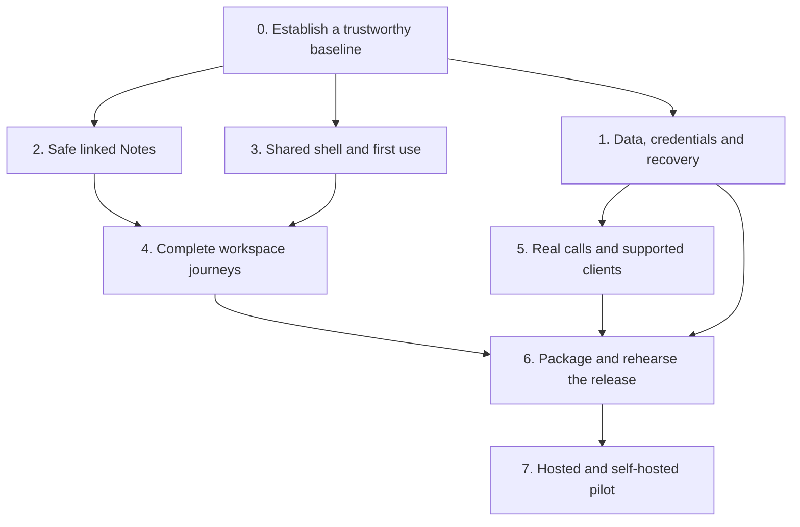

# Wabi — final production-pilot campaign

**Owner:** Ronin, with Codex coordinating implementation and verification

**Started:** 2026-09-15

**Purpose:** finish a coherent, dependable release for hosted testers and independent self-hosters

**Working branch:** `main` (codex/production-finish-20260915 merged 2026-09-16)

**Starting commit:** `c11b128b5db0627fbdb15c980b18d0873d2b43cc`

**Current HEAD:** `d5eba19a` (2026-09-16)

## Remaining work sequence — September 16 checkpoint

This is the task timeline, not an elapsed-time estimate. Implementation evidence below does not accept whole waves.

1. **Close reliability/privacy gaps (current):** bootstrap retention, remaining permission/encrypted-content checks, upload/report/cache deletion boundaries, historical exposure resolution, hosted-copy upgrade/restore/rollback.
2. **Accept complete workspace journeys:** finish Notes/Reader edge cases; exercise every exposed workspace through use, persistence, recovery and permission failure; include pop-outs/account switching/logout.
3. **Complete design and usability:** broad visual hierarchy/forms/states pass, desktop/dock/phone, keyboard/zoom/themes, then measured performance fixes. Preserve channels, center stage, additive stubs and optional right panels.
4. **Verify physical clients/calls:** two-network Linux/Windows/Redmi calling, reconnect/capture ownership, declared capacity and actual package installation/upgrade. Requires available devices/participants.
5. **Prove operator readiness:** clean install, backup/restore/upgrade/rollback, hosted policy/monitoring, independent operator walkthrough.
6. **Publish and deploy one verified candidate:** final checks, artifacts/checksums/build identity, repository kit/screenshots, preserved rollback and live verification. Nothing from this campaign is deployed yet.
7. **Run the invited pilot:** task checklist, hosted and self-hosted feedback, fixes, then expansion decision.

## What's done (September 16)

- Merged `codex/production-finish-20260915` → `main` at `e3c2f282` (pushed to origin/main). Includes Wiki draft recovery, forum draft recovery, multitasking controls, retention policy, calendar/release tooling, authentication hardening, first-boot safeguards, 78 total commits.
- Fixed three wiki draft defects Ampere's review surfaced (`d5eba19a`):
  1. Cross-channel draft corruption — owner ownership guards on all pre-saves
  2. Stale content on remount — page list refreshes after successful save/create
  3. Retirement disabling saves — lease-preserving retire + context-change hardening

## What's not done (September 16)

- Gallery: search/type filters don't control displayed lists; failed album requests silently skipped; shared store lacks late-response protection after channel changes (your ongoing work — see session top)
- Files workspace edge cases
- Whiteboard, Incidents, media/CAD, Lore, Map, Settings, Admin workspace journeys
- Privacy gap closure (upload/cache deletion boundaries, historical credential exposure)
- Design pass (visual hierarchy, forms, keyboard, zoom, themes, performance)
- Device calling tests (Linux/Windows/Redmi)
- Clean install / backup / restore / upgrade proof
- Deployed candidate — nothing deployed to wabi.chat

## The finish line

Someone new can understand Wabi, join or install it, talk with their community, use its workspaces, and return tomorrow without losing their work. An operator can update and recover the instance using the documented procedure. The release accurately states which clients, integrations, and privacy properties have been verified.

The target is a strong **limited production pilot**, followed by a measured expansion. Wabi remains one Authority per community, with independent servers selectable by one client. Existing experimental and optional capabilities retain their boundaries. Completing this campaign does not by itself establish E2EE, federation, HA, or native-mobile certification.

### Required outcomes

1. Reproducible release checks and an identifiable deployed candidate.
2. Reliable persistence, account boundaries, authorization, and recovery.
3. Safe linked local Notes, including migration of existing writing.
4. Consistent, accessible core journeys and an acceptance record for every exposed workspace.
5. Real calling/device evidence for the supported pilot combinations.
6. A clean self-hosting setup, tested restore/upgrade, usable artifacts, and complete handoff documentation.
7. A short pilot with tracked feedback and explicit criteria for broader release.

## Baseline and authorization

The user authorized a large finishing plan, use of wabi.chat, and changes needed to clean up the project. The work takes place in the main checkout. Routine repairs and verification continue within that scope. Live data preservation, actual test outcomes, and product boundaries remain mandatory.

The [earlier readiness audit](2026-09-15-first-production-test-readiness.md) used `bbcb5b28`. The campaign brought `main` to `e3c2f282` + `d5eba19a`. New upstream changes must be reviewed and integrated between batches, not pulled through an active test/deploy operation.

### Fresh observations

- wabi.chat login rendered in headful Chromium at 1440×1000 and 390×844, with no uncaught page errors or document-width overflow in those samples.
- Direct Privacy and Terms navigation rendered content beneath a persistent "Starting Wabi" overlay. This is a concrete public-route boot bug; its repair is in the opening batch.
- The mobile login's server-switch explanation was visibly truncated. Reproduce on the candidate before attributing it to current source, since live/source identity has not been established.
- Navigation in a disposable guest session showed the selected Notes workspace competing with a channel sidebar, an empty People panel, a separate scratchpad and an icon rail. On a 390px resize, People occupied the screen and Notes disappeared. The mobile takeover is under active diagnosis; the broader composition needs a deliberate U02/N03 redesign.
- The public entry leads with a very large brand image and a sign-in form, giving a new visitor little explanation of the product. The public-entry redesign is now part of this opening batch, following the user's explicit request for a firmer design standard.
- The live Authority reported `ready`; its running binary was fingerprinted privately. It was not changed by reconnaissance and is not yet certified as this branch's build.
- Plain programmatic public requests returned 403 from this client path while headful browsing worked. Treat this as a monitoring/ingress acceptance question, not evidence that the Authority is down.
- The prior pinned WabiDB suite passed 915 tests. That is useful baseline evidence, not a current-candidate restore certificate.

Anonymous public-page evidence is under `/tmp/wabi-finish-live-recon-20260915/`; navigation-only guest evidence is under `/tmp/wabi-finish-guest-recon-20260915/`. No messages or uploads were sent. These local snapshots are observations of the deployed build, whose source identity remains unverified. Exact candidate build/test logs are listed in the execution ledger below.

## Execution map

### How the work is run

- One coordinator owns integration, source/build identity, the campaign ledger, and deployment evidence.
