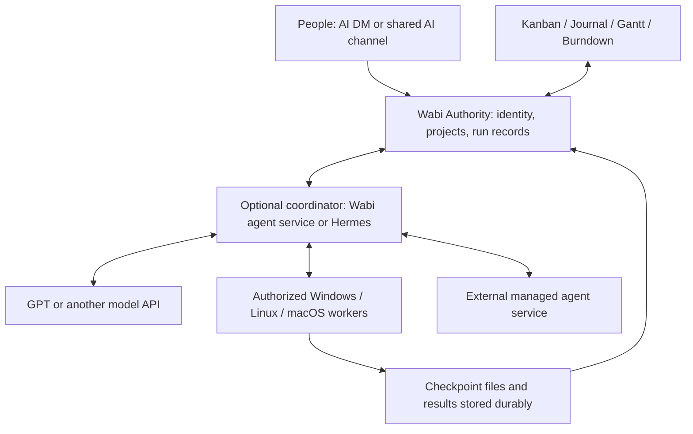

# Wabi as an AI organizing center: conversations, projects and multi-computer agents

**Recorded:** 2026-09-27. **Updated:** 2026-09-28. **Status:** broader organizing-center proposal. Shared Project board/wiki, native Project Assistant and a single bounded Project-tool worker are tested local candidates, including live free-model experiments; they are not deployed. Multi-computer scheduling, ordinary DM/mention connectors and automatic takeover below remain proposed. See [the Project workspace contract](../features/PROJECT_WORKSPACE.md).

## Intent

Let a person DM an AI contact in Wabi, discuss a goal, and authorize it to organize and carry out work across connected computers. The AI can maintain Kanban cards, write project journal entries, link artifacts and report progress while humans follow the work through the same workspace. Shared group management and task tracking are prerequisites, not the full product vision.

The motivating entry point is a Pokee AI DM, either through a direct provider integration or through a Hermes connector that calls Pokee. The broader design is provider-neutral: tools such as Hermes, Claude Code or another agent runtime could participate through adapters to the same Wabi work protocol. The agent runtime may live on an always-on computer and delegate to other authorized computers: a practical “spiderweb” of agents, tools and execution environments. Support API models, local models, parallel tasks and takeover after worker failure through an optional integration contract. These are target behaviors, not claims about existing connectors.

A motivating example is asking Pokee to investigate and fix a bug across platforms. It establishes the project plan, creates tasks, delegates Linux and Windows checks, records findings in the journal and presents a result for review. If one worker loses power, another eligible worker restores its last durable checkpoint and continues. The person can stay in the conversation or open the live project views.

This extends the [optional ecosystem direction](../architecture/WABI_ECOSYSTEM_DIRECTION.md). One Authority remains responsible for community state. Workers are execution helpers, not additional Authorities; independent Wabi servers do not federate. Core communication must remain usable with this feature disabled.

## A shared workplace for humans and agents

The user's “business of AIs and subagents” analogy describes an organization of participants with goals, roles, assigned work, collaboration and review. Wabi provides the common workplace: projects, conversations, Kanban, documentation, permissions and visible outcomes. An agent runtime supplies its own reasoning and execution loop. A model API alone is not an agent runtime; it needs a host to execute tools and manage its session.

Humans and AI use the same task records. Either may create or update cards within their permissions, hand work to another participant, record blockers, attach evidence or request review. Human edits use revision checks; AI changes are attributed. There is no separate AI-only backlog that silently diverges from the team's board.

Represent a durable service identity separately from its runtime, active run and machine. A subagent has a parent run and delegated scope; it does not need a permanent human-style account. Show meaningful subtasks on the board and keep short-lived internal steps in the run log, avoiding one card per tool call. Authority-backed assignment and claims arbitrate competing workers; moving a visual card alone is not a distributed execution lock.

A connector should expose narrow operations to read authorized project context, create/update/claim tasks, delegate within scope, append journal entries, attach artifacts and report run state. An HTTP API with an optional MCP facade is a proposed boundary; actual tool/transport support must be checked per runtime. Providers can implement their own adapter without Wabi hard-coding their orchestration internals. A participant may support task updates without supporting remote execution, cancellation or checkpoint recovery; capability declarations must make those distinctions visible.

The simple collaboration loop is: a person supplies a goal, an agent creates or claims work, its workers execute bounded subtasks, and a human or another authorized agent reviews the result. Roles and project policy determine who can review, accept and publish. Automation depth is configurable rather than assuming every project wants autonomous delegation.

This is the natural product direction independent of any prospective partner. Pokee could use the same interface for its own development or offer an integration to its users; that usefulness follows from the common work protocol rather than a bespoke Pokee edition of Wabi.

## September 28 core implementation

The subsequent [Lore AI workspace direction](../plans/2026-09-28-lore-ai-workspace-direction.md) plans how connected context, proposed file changes, review, saved work bundles and multi-computer collaboration could extend these core slices. It explicitly separates existing Lore capabilities from unimplemented worker integration.

The shared Project candidate has gained a native **Project Assistant** conversation and a **single bounded Project-tool worker**, alongside the shared board/wiki. Cards gained human-only estimates/burndown, notes, checklists, linked cards and human/bot claiming/assignment. The [implementation contract](../features/PROJECT_ASSISTANT.md) explains revision/attempt fencing, the tool budget, explicit model-provider handoff and uncertain-checkpoint review. The [acceptance record](../testing/PROJECT_ASSISTANT_ACCEPTANCE_2026-09-28.md) distinguishes automated, browser and live-provider evidence.

This makes the core of milestones 1–3 concrete in a Project. The broader ordinary-channel mention/DM experience, isolated repository/code execution, journal/playbook/album routing, multi-computer takeover and parallel execution remain extensions of this proposal, not completed claims. Tim deployment remains separate. The initial free Hermes/OpenCode bridge experiments remain their own runtime evidence.

## Current boundary

- [Local Planner](../features/LOCAL_PLANNER.md) stores tasks and related collections per device, server and account. Its channel links do not publish records to other members.
- [`business/sync.ts`](../../frontend/src/lib/business/sync.ts) reports server sync unavailable and performs no network synchronization. [`business/persistence.ts`](../../frontend/src/lib/business/persistence.ts) uses revision-checked IndexedDB snapshots.
- Existing Kanban UI is a starting point for presentation, not a shared queue or machine scheduler. Export/import is a manual bridge, not live collaboration.
- The current worktree provides a channel-scoped Authority-backed shared Project board/wiki, native Project Assistant and durable single-worker run/checkpoint API through normal human/bot permissions. Its optional API worker supports reply-only and bounded card/wiki actions. Machine enrollment, general coding-runtime delegation and automatic multi-computer recovery described below remain proposed.
- [Bot account/token primitives](../../core/crates/wabi-server/src/api/bots.rs) now support explicit owner-granted Project access. Bounded Hermes and OpenCode 1/2 experiments read the board/wiki and created attributed cards through the same API. This does not establish a working Pokee/Hermes DM, encrypted bot participation or automatic mention-triggered replies.
- Existing Planner Project, Diary, [Gantt](../../frontend/src/lib/components/business/GanttChart.svelte) and burn-chart surfaces are UI/data foundations. They do not currently report a shared multi-computer agent run.
- Worker recovery would not establish Authority failover. Replication and standby remain subject to the separate gates in [PROJECT_STATUS](../PROJECT_STATUS.md).

## Runtime priorities for experiments

Ronin's preferred stack is OpenCode, Codex and Hermes. Keep the Wabi interface neutral so all three can use explicitly admitted bot identities and the same revision-checked Project/wiki API; do not make a preferred runtime a core dependency. OpenRouter and Nous Portal are inference-provider options, rather than additional Wabi state authorities. Claude Code and Zhipu/GLM/Zcode are secondary experiments when an existing free or credited account is available; a paywall is not authorization to buy access. On 2026-09-28, the configured OpenRouter free route completed bounded board/wiki tool calls through Hermes, OpenCode 1.18.32 and separately installed OpenCode 2.0.18. These were disposable one-shot tool experiments, not installed autonomous channel connectors. Codex implemented and exercised the workspace in this task; a separate Codex connector run is not claimed.

## Conversation as the entry point

The person opens an identifiable AI contact and can simply chat, attach selected context, or delegate work. A chat answer need not create a project. When the user authorizes execution, create or link the project/run and keep its identity visible in the conversation. Execution may continue while the chat window is closed.

Two proposed routes share the same Wabi project and permission contract:

- **Direct:** Wabi agent service → Pokee model API or Enterprise agent API.
- **Through Hermes:** Wabi contact connector → Hermes runtime → configured Pokee provider, with Hermes using scoped Wabi project tools and authorized execution workers.

The integration configuration must state who owns the agent loop, worker scheduling, retries and provider session. Hermes and the Wabi scheduler must not both act as independent captains for the same run. A provider invocation, an agent session and a worker process are different identities; changing the executor should not create an unrelated user conversation.

Show the service identity, selected project and data destination in the DM. The bot receives only explicitly available conversation/project content. An AI participant is a recipient of that content; an external API receives whatever its connector sends. Preserve the existing room policy: an encrypted conversation requires a correctly enrolled service device and supported key handling, or an explicit server-readable choice under the current per-sender rules. Never silently downgrade the room or assume a bot token can decrypt it. Which bot-DM path is feasible remains an implementation gate.

Delegation uses the user's existing project permissions and configured action policy. Routine card creation, assignment and journal updates within an authorized task should not need repeated confirmation. Publishing, deleting shared material and other consequential actions follow the project's granted scope. A message from another bot, a file or a tool result cannot grant additional permissions or recursively start unlimited work.

## AI-enabled channels

Support AI participation as an optional behavior of an existing text channel. A convenient **Create AI chat** flow can create a room and configure its participant without adding another durable channel kind. A DM is a personal conversation with an agent; an AI-enabled channel is a shared conversation where people can contribute context, see the same answers and turn decisions into project work. Neither requires a Project merely to chat.

Default to **respond when mentioned** in ordinary channels. A dedicated AI room may explicitly enable automatic responses to human messages. Make the participant and response mode visible before people post, including which service receives selected content. Turning off automatic replies must have a separate meaning from removing the agent's access or cancelling active jobs.

Initially designate one responding agent per room. Additional agents respond only when explicitly addressed or delegated a bounded task. Agent messages, progress notices, duplicated deliveries and the connector's own updates must not recursively trigger more replies. Correlate each answer with its initiating message/run, retain speaker attribution and serialize or queue conversation turns so simultaneous human messages do not corrupt a provider session. Independent tasks may run concurrently with separate run context.

Agent configuration is a channel-management permission. Chat participation does not grant project editing or machine execution. Enforce the intersection of the initiating person's authority, the service's grants and the run's scope. Automation rules have an explicit authorizing owner and policy. A powerful bot must not let a member bypass a project's access rules.

Shared answers must use context eligible for that audience. Do not fetch a person's private DM or personal journal into a shared-room session and rely on the model to keep it secret. Private and shared conversations remain separate even when they use the same AI contact; promotion of selected content into a project is an explicit action.

## The AI experience beyond chat

### Connect a participant and understand its role

An authorized operator connects a model/provider or an existing agent runtime, gives the service a clear name and selects where it may participate. Show who manages it, where it runs, what data destination it uses and whether it is available. Keep machine diagnostics behind details.

Offer understandable permission presets such as **Chat only**, **Project collaborator** and **Execution worker**, with their actual grants visible and adjustable. These are configured permissions, not capabilities inferred from a persona prompt. Unsupported capabilities stay unavailable; do not offer a working-looking Resume or remote tool action when the connector cannot provide it. Use existing server/project settings rather than inventing another administration shell.

### See and control context and memory

Provide a compact **Context** view showing the conversation range, selected files, project instructions and saved reference notes available to the run. State whether older channel history is included; do not silently ingest all history when an AI is added. Fetches must recheck current permissions, including after membership changes. Scope sessions, retrieval indexes and caches by Authority, account/project and audience.

Keep conversation context, durable project knowledge and execution checkpoints distinct. People can inspect and correct saved project facts, see their source and revision, and start a fresh conversation without deleting the project. Corrections should supersede earlier facts visibly. “Forget” must explain what Wabi removed and which provider copies/backups have separate retention; never promise erasure beyond the integration's actual controls.

For live/timed conversations, do not create a hidden permanent archive or journal copy as a side effect of chat. Saving selected material as project knowledge or a recoverable task requires an explicit action or a clearly configured policy disclosed to participants. If ephemeral-only context cannot support durable recovery, say so and limit the run accordingly.

### Move naturally from conversation to work

Let an authorized person select an answer or discussion and choose **Make task**, **Save to project journal** or **Attach to project**. Preserve provenance and preview the material being shared when its audience changes. Natural-language delegation may perform the same operations within existing authorization; a button is not required for every step.

Support saved project instructions and repeatable routines once the basic loop works: coding conventions, documentation style and acceptance checks are useful shared context. A routine declares its inputs, tools, permissions, budget and version. Editing an instruction or importing a routine cannot silently enlarge the service's access. File/tool content remains task data rather than a grant of authority.

### Follow, steer and take over

Use plain run states: **Queued**, **Working**, **Waiting for you**, **Blocked**, **Ready for review**, **Completed**, **Failed** and **Cancelled**. “Working” should include the latest confirmed action and update time; it must not imply progress solely because a connection is open. Show a concise action/result history and linked evidence, not a fabricated explanation of hidden model reasoning.

Separate controls for **Stop reply**, **Pause work**, **Cancel task** and **Take over**. Their availability depends on connector support. Pause stops new actions at a safe boundary; cancellation remains pending until acknowledged or reconciled, and does not undo completed external actions. Taking over retires the worker's claim before human edits or reassignment. Keep another member's unrelated run unaffected.

People can correct a goal, answer a question, reprioritize or request another approach. Record the instruction revision and apply it at an acknowledged boundary so old work cannot silently overwrite the new direction. Retrying an answer creates a labeled alternative; retrying an execution attempt must reconcile side effects first. Offer undo for supported reversible Wabi edits through normal revisions, without pretending it can undo arbitrary remote actions.

### Cost, attention and review

Show who pays for a service and provide project/run limits for spending, elapsed time and delegation. Reserve budget across concurrent work; report measured usage separately from estimates or unavailable cost. Pause new work when the configured allowance is exhausted. Already-running provider requests may still accrue charges, so do not promise an exact invoice ceiling without provider support.

Keep detailed tool activity in the run view. Chat and notifications should emphasize questions, blockers, meaningful milestones and reviewable results. Allow digest/mute preferences without losing pending decisions. Surface pending reviews through the existing activity experience. Announce handoffs/provider changes when relevant; avoid repeated unchanged status messages.

Results should identify the agent, run, relevant inputs and evidence. Distinguish a proposal, an attempted action, a confirmed write and a verified outcome. Preserve human edits using revision checks and make disagreements visible. The same review flow should work whether an artifact came from a person, Pokee, Hermes or another connected runtime.

### Later experiences, after the core loop

Voice interaction, scheduled routines, multiple collaborating AI participants and richer machine graphs can build on the same permission/run records. They are not prerequisites for the first AI channel. Automatic listening, unbounded autonomous collaboration, a skill marketplace and self-updating agents are not implied by this proposal. Keep keyboard/mobile access and clear loading, disconnected and unavailable states in the initial experience.

## Wiki playbooks, reusable knowledge and asset routing

The wiki can provide durable, human-editable project knowledge and reusable playbooks. Albums and Files can hold the corresponding source material. The useful “super skill” is a small project guide that points to relevant procedures and collections; the agent loads the needed material on demand rather than receiving the entire wiki, album and conversation on every turn.

### Give each surface a clear purpose

| Surface | Proposed AI use |
|---|---|
| Wiki | Current reference knowledge: architecture, vocabulary, policies, conventions and documented procedures |
| Approved wiki playbook | When to use a procedure, its inputs/steps, permitted tools, expected outputs and acceptance checks |
| Journal | Chronological findings, experiments and decisions that may later be distilled into the wiki |
| Albums / Files | Original images, documents, recordings and generated artifacts, with searchable derived descriptions where supported |
| Project guide | A short map of the relevant pages, playbooks, asset collections and current objective |

“Knowledge” can appear within Project as a view of linked wiki pages, without copying them into another authoritative store. The existing [wiki API](../../core/crates/wabi-server/src/api/wiki.rs) has channel-scoped pages and revision routes; the existing [album API](../../core/crates/wabi-server/src/api/albums.rs) groups attachment records by channel/DM scope. Source also includes a specialized [screenshot routing panel](../../frontend/src/lib/components/media-albums/ScreenshotPipePanel.svelte). These are foundations, not evidence of general AI retrieval, automatic asset routing or provider-ready private asset access.

### How this can save tokens

Keep a concise project guide in the initial context. Search authorized page titles, headings, tags and content when needed; retrieve bounded excerpts with page/section/revision references. Load exact source pages or original assets for details that a summary cannot preserve. Start with structured and lexical lookup; semantic search is an optional improvement, not a prerequisite.

This can reduce repeated input relative to resending the complete project history. It is not free memory: excerpts, tool results and images supplied to the model still consume context, and search, extraction, summarization and indexing have costs. Provider prompt caching is a separate optimization for repeated eligible prefixes; it can reduce processing/cost without removing those tokens from the context window. Official OpenAI documentation describes [retrieval of relevant chunks](https://developers.openai.com/api/docs/guides/retrieval) and [prompt-prefix caching](https://developers.openai.com/api/docs/guides/prompt-caching); provider-specific support must be checked by each adapter.

Reuse extraction by source content hash and extractor version within an authorized scope. Invalidate derived descriptions and indexes on source revision, deletion or access changes. Preserve originals and provenance: a short caption cannot substitute for examining an image when visual detail matters. Do not repeatedly decode every image in an album simply because the album is linked to a task.

Measure representative tasks against a full-context baseline: total input/output tokens, extraction/retrieval cost, cache usage where reported, latency and correctness of citations/results. Do not claim a percentage saving before measuring, and do not discard necessary detail to produce an artificially low token count.

### A wiki page can become a playbook

An authorized project maintainer can mark a specific revision as an approved playbook, with a description, applicability, steps, required capabilities, output destination and completion checks. The connector supplies a small catalog of descriptions and loads a matching playbook only when needed. Plain wiki pages remain reference data; text inside an uploaded document cannot nominate itself as a trusted skill.

Pin the selected revision for a run, show updates, and distinguish drafts from approved procedures. AI may propose improvements, but newly generated text does not automatically replace the active procedure. A playbook cannot grant permissions, add credentials or override project policy. Runtime-specific packaging may be needed; wiki authoring does not imply that every connected agent natively loads the same skill format.

Example playbook: **Prepare a release update** reads the release checklist and relevant completed tasks, selects approved images from the release album, writes a draft document and creates a review card. It reuses stored conventions and assets while keeping publication a separately authorized operation.

### Route generated and submitted material into usable collections

Allow an authorized person to configure a project rule such as: “Images submitted in this project go to References; images generated by this project’s agents go to Generated; deliverables go to Review.” Use Albums for supported media and the existing Files/document surfaces for other material. A user can also ask an authorized agent to create these collections and rules through scoped tools, then inspect or change the configuration in Wabi.

Routing rules declare source scope, file kinds, destination, retention, indexing and provider access. Once configured, matching submissions need no repeated approval. Show the destination in the composer/result and allow correction. Pasted content means content deliberately submitted through Wabi, not global clipboard monitoring or uploading an unsent draft. A watched desktop folder is a separate explicit enrollment with its own scope.

Proposed processing path:

1. Receive an upload or generated artifact in its captured account/channel/project/run scope. Verify the object is durably available before showing it as saved.
2. Apply the configured routing rule and link its stable artifact identity into the collection. Record creator/service, source message or run, timestamp, media type and available generation lineage; never include secret credentials.
3. Optionally derive supported text, OCR, captions or transcripts with declared local/provider processing. Preserve source pointers and mark generated descriptions as derived, not verified facts. Unsupported or failed extraction must remain visible.
4. Index only within the authorized audience. Show **Saved**, **Indexing**, **Ready for AI search**, **Needs review** or **Failed** accurately. Stored successfully and searchable successfully are separate outcomes.
5. A task searches collection metadata and selects relevant excerpts/assets through permission-checked tools. Record which source revisions were used so a person can inspect the answer's basis.

Use stable ingest operation IDs and content hashes to avoid duplicate items/jobs after retries. Routing the same content must not start a new generation or re-trigger the rule indefinitely. Do not deduplicate across private scopes in a way that reveals another person's files. Uncertain classification stays in the scoped Inbox; it must not guess a broader audience.

Storage, indexing, provider disclosure and trusted instructions are separate permissions. “Auto-file images” must not silently mean “send every image to a cloud model” or “follow instructions found in an image.” Recheck permissions before retrieval and before returning an answer to a shared audience. Confidential asset use requires enforceable object access through the provider handoff; an album membership check alone does not make a reusable upload URL private. Do not claim that this access path is already implemented.

Moving material from a DM into a project, retaining live/timed chat attachments or indexing encrypted content must follow the explicit publication and room-policy rules earlier in this proposal. Removing an item must revoke it from search immediately even if index cleanup is asynchronous; document backup/provider retention separately. Preserve existing album/review links rather than moving bytes merely to classify them.

### Acceptance and initial scope

Start with explicit wiki/page references, one scoped asset Inbox, deterministic routing for submitted/generated files, and basic searchable metadata. Add extraction and semantic retrieval only where needed. Test duplicate uploads, retry after partial indexing, edited/deleted pages, revoked membership, wrong-audience routing, hostile document instructions and stale summaries. Verify token/cost measurements and task quality before presenting this as an efficiency feature.

The first knowledge demonstration is: submit a reference image into a configured project, see it saved to the correct album, ask an agent to use that reference with one approved wiki procedure, and receive a linked result without resending the entire album or project history. The agent must be able to explain which sources it used and report when a source could not be read.

## Optional Jev decision layer

The user's suggestion about Jev's “choice rates” is interpreted here as its per-option Choice probabilities. This is an optional integration concept, not an installed dependency, an executed API test or a measured efficiency claim.

TypeSafe's [Choice documentation](https://docs.typesafe.ai/primitives/choice) describes selecting from declared options and returning the choice, a distribution across options and confidence. Its [confidence documentation](https://docs.typesafe.ai/confidence) distinguishes the distribution from a confidence statistic describing its concentration. Neither a high confidence value nor a selected option's probability is an observed success rate for Wabi's workflow. Jev also offers rubric scores and yes/no judgments; see the [official introduction](https://docs.typesafe.ai/introduction).

### Where it could help this design

Use ordinary rules for explicit destinations, file types, access checks and machine compatibility. Consider Jev where a bounded semantic judgment is still needed:

| Decision | Proposed candidates | Result used by Wabi |
|---|---|---|
| Knowledge lookup | Relevant wiki section/playbook, search more, none | Retrieve a small useful context set |
| Asset classification | Eligible album/collection, scoped Inbox | Suggest or apply a reversible route under a configured rule |
| Request handling | Chat answer, knowledge lookup, project task proposal, clarification | Select a handler without assuming permission to execute |
| Agent/model selection | Eligible configured specialists or model tiers, defer | Choose among available authorized runtimes |
| Journal triage | Experiment, decision, reference candidate, unresolved | Organize entries or propose a wiki update |

These are proposed applications of the primitive, not vendor-verified Wabi integrations. A request can need several knowledge sources; do not force all retrieval into a single winning Choice. Keep multiple plausible sections within a context budget, ask separate relevance questions where appropriate, or search more when candidates are weak. For images/audio, use authorized supported extraction or another suitable model; do not assume Jev accepts the original media or that a caption captures every important detail.

### Probability-guided routing with explicit execution rules

First construct the eligible candidate set using Wabi permissions, audience restrictions, availability, connector capabilities and budgets. Give Jev only the permitted task context needed for that question. Include a useful abstention path such as “none applies” or “needs more context.” Validate the returned candidate, then recheck current grants and availability before applying it.

For a reversible album classification, a sufficiently reliable decision may apply an existing auto-routing rule. An ambiguous result can remain in Inbox or be offered as a suggestion. For a task with several plausible procedures, retrieve the relevant alternatives or ask the coordinator to resolve the uncertainty. Do not send every uncertain decision to the user; use the least disruptive authorized fallback that fits the task.

Developers can use the full distribution, top-candidate separation and confidence to design fallback behavior, but must define which measure a threshold uses and evaluate it on representative tasks. Do not hard-code a universal “95% means safe” policy. Probabilities depend on the candidate set and input; they are not interchangeable measures across differently defined decisions. A malformed response, timeout or unavailable Jev service follows an explicit deterministic fallback or deferred state.

Jev's decision is advisory input to application code. It cannot grant access, enroll a machine, approve publication, certify a completed test or expand a run's scope. A high-confidence label from pasted content cannot convert that content into a trusted playbook. Minimize what is disclosed to Jev and include it in the project's provider policy rather than silently adding another recipient of private data.

### Developer extension and validation contract

Each routing extension declares a versioned question/rubric, candidate IDs and descriptions, allowed input fields, fallback behavior, action policy and responsible owner. Keep the decision model replaceable. Persist a scoped decision record with the model/rubric version, input references, returned distribution, applied route, any human correction and eventual outcome. Store only necessary data under the project's retention policy.

Start in suggestion/shadow mode on authorized examples, then enable automatic reversible decisions where measured results justify it. Track wrong-route frequency, abstention/escalation, overrides, task completion quality, latency and total cost including extraction, decision calls, retries and the main model. Corrections can improve the rubric and evaluation set; they do not automatically train Jev or authorize sharing examples outside the project.

The first test should compare rule-only routing with Jev-assisted routing for one bounded problem, such as selecting a wiki playbook or classifying submitted reference documents. Include ambiguous inputs, changed options, malicious embedded instructions, missing context and revoked access. Expand only if it improves the whole workflow. Reducing calls to a larger model is a hypothesis to measure, not a guaranteed token saving, and deterministic work should not acquire an unnecessary AI dependency.

## What the spiderweb means

Use **agent host** for a computer running a coordinator or worker. A Wabi **Anchor** is an ingress/proxy role. The same physical computer could run both services, but installing an Anchor does not install an agent runtime, enroll peers or grant shell access.

The desired network has three separate relationships:

| Relationship | Example | Owner |
|---|---|---|
| Connectivity | An authorized host can reach a peer's registered worker service | Configured transport and service admission |
| Delegation | A coordinator assigns a Linux test and a Windows test to separate workers | Durable run ownership and project policy |
| Work dependencies | Packaging waits for both tests; the journal links their evidence | Shared project/task records |

Hosts may exchange scoped artifacts or invoke registered peer tools directly when authorized, rather than making every byte travel through Wabi. Authority-owned task claims, delegation lineage and accepted results remain canonical. A sub-agent may delegate further only within its inherited scope, remaining budget and allowed depth; delegated rights cannot exceed its parent's rights. Durable operation IDs prevent repeated delegation or callbacks from creating duplicate work.

The MVP needs one coordinator and two workers, not an all-to-all mesh. Later, multiple coordinators can own distinct runs and delegate through the same contract. Coordinating across independent Authorities would require a separate explicit design and is not implied here. No quorum election or automatic Authority promotion is proposed. If the Authority is unavailable, hosts cannot create new canonical claims or privileged actions using expired leases.

The network view should show capabilities, task ownership, connections and last acknowledged progress. An offline host is not proof of failure, and a lost connection is not proof that its external action stopped.

## One project, several human views

A Project is the durable context tying the user's objective to its work: scope, repositories/files, participating people and agents, authorized machines, provider policy, budgets, milestones, dependencies and acceptance criteria. These are proposed extensions to the current Project model, not fields that already exist.

### Product direction: planning belongs inside Project

The user's follow-up questions the separate Planner and Project channel types. The recommended direction is one user-facing **Project** home with planning as a view within it. People should not need to decide whether a goal belongs to a Planner project or a separate Project channel before starting work.

The current split is concrete: [WorkspaceViewBar](../../frontend/src/lib/components/WorkspaceViewBar.svelte) labels the `planner` surface “Planner” and the `lore` surface “Project”; [CreateChannelForm](../../frontend/src/lib/components/sidebar/CreateChannelForm.svelte) separately offers Planning/Planner and Lore/Project, gating the latter on Lore availability. Planner also contains its own Project records. This overloaded naming reflects separate implementations, not a necessary product boundary.

Proposed Project views:

- **Overview:** objective, people/agents, milestones, acceptance criteria and current state.
- **Plan:** Kanban/list, calendar, timeline/Gantt and progress views over the same tasks.
- **Journal:** shared decisions, findings, experiments and documentation.
- **Knowledge:** linked wiki references and approved reusable procedures.
- **Files and review:** relevant assets and optional Lore-backed version/history workflows.
- **AI activity:** active runs, machines, delegation, checkpoints and results.

Conversation remains available in the existing channel shell, with the selected workspace in center stage. These are views/capabilities of one project, not five additional channel types or mandatory tabs for every small project. Expose advanced views only when useful. Preserve existing stubs, simultaneous side views and independent editor drafts.

Project must work without Lore or an AI provider. Lore remains a real optional integration for versioned content, rather than becoming the requirement for having a project. Personal planning, calendars and private journal entries still have a place outside shared projects; an eventual personal/aggregate planning view should reuse the same underlying records and access rules rather than create another project database. Do not force every personal reminder into a team project.

Treat user-facing unification and stored channel-type migration as separate implementation steps. Keep existing channel IDs, links, memberships, data and capabilities valid. Do not renumber or casually collapse the durable Planning/Lore enum variants. A future implementation needs an explicit mapping/migration design, legacy routing compatibility, replay coverage and confirmation of what is actually shared. Joining a Project must not expose unrelated DM context, local Planner records or private diary entries. Group management should establish who can view, edit, delegate and review in this project, with existing channel membership remaining authoritative where applicable.

This is a product recommendation for discussion, not authorization to rewrite channel persistence or evidence that the surfaces have been merged.

| Surface | What people see | What the authorized AI can maintain |
|---|---|---|
| DM / project conversation | Goals, questions, decisions, progress and requests for review | Explain its plan, ask for missing information and link results |
| Kanban | Actionable tasks, owners, blockers and review state | Create, update, split, assign and archive cards within scope |
| Project journal | Dated findings, decisions, experiments and handoff notes | Append attributed entries with task/run IDs and evidence links |
| Project overview | Milestones, dependencies, acceptance criteria and resource use | Maintain the plan and flag changes to scope or estimates |
| Gantt / burndown | Planned timing, actual progress, remaining work and scope changes | Supply structured events and estimates from recorded work |
| Machine/run view | Where work is executing, available capabilities and recovery status | Report worker progress and eligible reassignment |

Project journal entries must be a separate explicitly shared collection or mode; never repurpose a person's private diary as agent memory. Identify the service author and initiating user, link source evidence, and retain revisions. AI-generated documentation is a report of observed work, not independent proof that a test passed. Keep machine checkpoints separate from readable journal summaries.

“Take down a card” normally means close, cancel or archive it reversibly. The agent must not remove a failure from the record, erase a human's edits or turn cancellation into completion. Actual deletion follows the project's explicit permission and retention policy.

Charts should derive from durable task events rather than an LLM's progress narrative. Record scope added/removed, estimate changes, completion, reopening and cancellation so a new estimate does not rewrite old progress. Label estimated versus measured work; if estimates are absent, use task counts rather than invented hours. Gantt planned dates and dependencies are distinct from actual run intervals. Burndown shows remaining accepted scope, with removals distinguished from completed work. Do not infer a reliable completion percentage from tokens spent or worker uptime.

The existing burn chart reconstructs values from current local todos and timestamps in [business/store.ts](../../frontend/src/lib/business/store.ts); it is not that durable history. Shared live charts need an Authority-backed event model and reconnect catch-up before they can claim to reflect team execution.

## Proposed responsibilities

| Component | Proposed responsibility |
|---|---|
| Authority | Authenticate people/services; authorize boards; durably serialize task ownership, revisions and run outcomes |
| AI contact / connector | Connect the conversation to an explicitly configured runtime, project scope and data destination |
| Optional agent service | Run the agent loop; select compatible workers/providers; enforce budgets; reconcile interrupted requests |
| Worker | Execute scoped tools, builds or tests; report progress; upload checkpoints and artifacts |
| Model provider | Generate answers and tool requests using the supplied context |
| External agent service | Own its remote execution environment; expose documented session/result controls through an adapter |
| Planner and project journal | Show shared task state, decisions, attempts, blockers, charts, review evidence and results |

One always-on machine can run multiple API-backed agents. Additional computers add environment coverage, tool capacity and worker redundancy; they do not automatically make an individual model response faster or enlarge provider quotas. Splitting a local model across GPUs is a separate inference infrastructure project.

## Human task detail and assignment

Use **notes** for context, decisions and handoff information, and a **checklist** for small steps inside a card. Promote a step to a separate linked card when it needs its own owner, status or review. Both people and admitted bots may assign a current Project member, or claim unassigned unfinished work. Claiming must use the authenticated identity and a revision check so two claimants cannot silently replace each other. In-progress assignment is shown as “X is working on this”; it records responsibility, not continuous presence.

Human time estimates belong exclusively to human planning. Exclude the estimate field from bot API responses and model tools, refuse bot setters/clears, and retain it when bots update other fields. Burndown must derive from recorded revisions, represent scope additions and reopening, and distinguish unestimated work. An estimate is not an AI promise, timer or model-cost budget.

## Kanban as the human work surface

Add an explicitly shared, Authority-backed board mode within Planner. Keep existing personal boards local unless the user explicitly publishes selected content. Never silently upload a device's Planner snapshot.

Suggested default columns are **Backlog → Ready → Running → Review → Done**, with Blocked available. Store execution state separately from configurable column names: moving a card to Done must not fabricate a successful run, and renaming a column must not start jobs.

Each shared card should expose its instructions, acceptance criteria, authorized project scope, human owner, optional agent assignment, environment needs, current attempt, latest durable checkpoint, budget, output links and review outcome. One card can have several attempts or independent subtasks. People remain able to manage cards without enabling AI execution.

Starting work requires a user instruction delegating the task in the AI conversation, an explicit Run action, or an automation rule configured by an authorized person. Ordinary discussion and incidental card edits must not start work. Workers report proposed results; completion requires the configured acceptance checks and any required human review. Pause/cancel must show whether execution has actually stopped or cancellation is still pending remotely.

Before editing repository code, workers must check In progress work and active reservations, claim the intended task/scope, and coordinate overlapping human or agent work. The [Lore pre-edit rule](../plans/2026-09-28-lore-ai-workspace-direction.md#collision-prevention) requires an atomic scope reservation after the check, with rechecks on scope expansion, resume and publication. A board lookup by itself is not a concurrency lock.

Keep channels as context and center stage as the primary board. Preserve stubs and optional right panels for simultaneous work and independent drafts. Use the existing Planner entry path, not another navigation architecture.

Scoped board/task CRUD, revision conflict handling and durable Project-tool runs now exist in the candidate; see [the implemented subset](../features/PROJECT_ASSISTANT.md). The wider execution system still needs machine enrollment, capability registration, host execution/recovery and delegation contracts. An optional MCP facade could expose a narrow subset to external agents, backed by the same permissions and durable handlers. These wider operations remain proposed.

## Help, review and AI coordination conversations

Keep one accountable owner on the main card. When work needs help or review, create a linked request rather than treating every participant as a second owner. Its brief should include the requested outcome, current state, relevant artifacts/scripts, exact reproduction/run instructions, what has been tried, blockers and acceptance/review criteria. Refer to versioned wiki context or artifacts where possible instead of copying entire transcripts.

Show distinct activity: **offered help**, **accepted/claimed a part**, **working**, **submitted for review**, **reviewed**. A model name alone is insufficient attribution: use the participant/worker identity and its session/run ID, with model/provider as additional information. Do not show a helper as active merely because it generated a message. Independent help work gets its own linked card/assignee/run; checklist steps remain within the original card when separate ownership is unnecessary. The current candidate provides linked cards, notes and assignment/claiming; offers, multiple helper roles, review signoff and a dedicated request button are proposed follow-ups.

A shared card discussion is the default home for human/AI coordination: questions, concise handoffs, decisions and review outcomes. It does not require a separate dispute channel. Keep notes as the maintained task brief, reusable procedures/context in wiki pages and detailed execution traces in run records. Multi-card overlaps link to one canonical discussion instead of duplicating messages. Comments inherit the card's Project access; links do not grant access to other private discussions. Do not build an unbounded agent transcript dump: it costs tokens, buries decisions and can accidentally mix audiences. Agents should respond to explicit requests or targeted handoffs; prevent self-replies, bot reply loops and uncontrolled conversation fan-out. Card comments remain a proposed addition to the current notes/linked-card implementation.

The proposed [coordination/dispute flow](../plans/2026-09-28-lore-ai-workspace-direction.md#coordination-conversations-and-disputes) gives each collision a linked thread with a bounded exchange and explicit wait/split/handoff/branch/escalate outcomes. Conversation does not itself transfer ownership: the Authority validates and records the resulting control/reservation change, and the UI distinguishes a requested pause from an acknowledged stop.

Multiple chats with the same AI are separate sessions, not additional authority for the same bot. Each keeps its own selected context, objective, run ID, attempt and budget, and links to a shared card when collaborating on one goal. A coordinator can hand off a scoped summary and artifact references; do not inherit every other session's private history. Humans should be able to inspect who requested each helper, its permissions and the last accepted checkpoint. Parallel helpers require the later conflict/quota/delegation gates, not just several chat windows.

## Checkpoints and safe takeover

1. The Authority atomically assigns a run attempt with a lease and monotonically increasing ownership generation. Renewal and completion must validate both the worker identity and generation.
2. Before invoking a tool or provider, record its logical operation ID and intended request. Save request identifiers as soon as returned; preserve provider-specific continuation data without treating it as a universal format.
3. A checkpoint includes instructions and revisions, completed steps, relevant conversation/tool items, pending operations, repository base commit, saved changes, artifact hashes, environment requirements and provider references. Secrets remain separate credential references.
4. Upload and verify checkpoint artifacts before acknowledging their manifest as durable. Files that exist only on the failed worker are not recoverable checkpoints.
5. On lease expiry, reconcile in-flight provider/tool work before assigning a replacement. The new worker restores into an isolated checkout and resumes from acknowledged state. OS-specific work requires an eligible environment.
6. Reject stale worker reports after reassignment. Disconnected workers stop acquiring new work and stop privileged actions when their lease expires. After an Authority restart, reconcile persisted attempts and advance ownership generations before permitting new actions.

An Authority fence alone cannot stop an old process from calling an external service. Side effects need a controlled execution gateway or an external operation identifier that supports deduplication/reconciliation. If a deployment, payment, message or other action may have completed but its outcome is unknown, mark it unresolved and check the destination or request review; never blindly repeat it.

Resume means recovery from saved state, not live migration of a process or guaranteed recovery of unsaved edits. Keep separate directories for parallel workers and collect patches/artifacts for review. A conflict must remain visible rather than silently overwriting another worker's changes.

## GPT and other API models

OpenAI documents durable conversation identifiers across devices/jobs and background response polling. These can help an authorized replacement recover provider state, while Wabi still owns task checkpoints and tool outcomes. See [conversation state](https://developers.openai.com/api/docs/guides/conversation-state) and [background mode](https://developers.openai.com/api/docs/guides/background).

Each adapter must explicitly declare supported tools, continuation, polling, cancellation, request deduplication, retention and usage reporting. API compatibility does not establish identical behavior. Preserve complete required provider output items, not just displayed assistant text. Save useful results in Wabi within the provider's retention window.

Provider fallback requires an allowed destination, compatible tools and a portable checkpoint. It is a new model invocation using saved context, not transfer of identical internal model state. Never send project data to another provider merely because the first is unavailable. Enforce per-project/provider budgets and concurrency limits across workers; closing the browser should not cancel an authorized server-run task.

## Could Pokee developers use it?

**The primary use case Ronin means here is Pokee's engineers using Wabi to build PokeeAI.** They can use whichever AI development tools they prefer through supported adapters; using Pokee itself as the assistant is optional. The [developer-workflow plan](../plans/2026-09-28-pokee-developer-workflow.md) focuses on shared context, coordinated changes, reproducible failures and reviewable results. It is a hypothesis to validate with their team, not a partnership or compatibility claim.

The intended development loop connects a reported issue, authorized reproduction, assigned work, proposed fix, test evidence and accepted revision. Human-reviewed failures can become regression cases for their product. Wabi supplies the collaborative interface and shared record, connected runtimes supply AI assistance, and optional Lore/execution integrations preserve artifacts and run checks. General multi-computer execution remains proposed. This does not imply automatic model training, autonomous production self-modification or unreviewed promotion of changes. Customer projects must not become training/evaluation material without explicit authorization.

Separately, Pokee execution could eventually be connected as a Wabi provider through the public integration paths below. That product integration is not a prerequisite for the developer-team use case.

### Relationship context and scope

The user reports an upcoming Tuesday conversation and positive feedback from Pokee's team, but explicitly prefers that they ask about possible involvement. Do not turn this design work into an outreach pitch, solicit a partnership or assume a joint pilot. Develop the general Wabi direction on its own merits; Pokee's potential benefit is a natural consequence. No contact, meeting message, account setup or provider-side change has been performed as part of this proposal.

Public documentation reviewed on 2026-09-27 identifies two distinct integration paths:

| Path | Verified public surface | Proposed Wabi connection |
|---|---|---|
| Pokee-Isaac model API | OpenAI-compatible Chat Completions with a Pokee-specific background extension | Wabi agent service calls the model; authorized workers execute tools |
| Pokee Enterprise agent API | Tenant sessions, persistent sandbox workspace, messages and file operations | Wabi adapter submits work and collects progress/results; Pokee owns remote execution |

The [Isaac API docs](https://console.pokee.ai/docs) describe polling, stream resumption, cancellation and idempotency keys. Background generation and terminal-result retention are each bounded to roughly ten minutes. Bodies above 16 MiB require live SSE and do not support background mode or idempotency keys. Treat those requests as a separate recovery case. This extension is not OpenAI's Responses API.

The [Enterprise overview](https://docs.pokee.ai/docs) documents the session/file API. It does not by itself establish migration of a live sandbox to a Wabi computer. The [deployment page](https://pokee.ai/deployment) offers managed and customer-VPC arrangements; actual access and capabilities require confirmation for the selected deployment.

For an adapter pilot, confirm tool execution location, credential scope, concurrent session rules, cancellation acknowledgement, resume/expiry behavior and exportable checkpoints. Do not let both Wabi and Pokee independently retry the same external action. A Pokee outage can only be recovered locally if a portable checkpoint and compatible tools are actually available.

The main homepage timed out during this review; linked official API/deployment documentation was accessible. No authenticated account, paid request, provider integration or Pokee-side Kanban was tested. Here “site Kanban” means Wabi's Planner board.

## Access, privacy and persistence

Enroll workers explicitly with project, directory, tool and resource limits. Worker credentials must not imply Authority administration or machine root. Recheck membership/service revocation on every privileged operation. Connectivity through Tailcat or another transport does not grant execution permission.

Keep provider credentials in the optional trusted service or worker credential store, never browser bundles, cards or task logs. Describe exactly which project material leaves the server and which provider receives it. Authority-backed board/checkpoint content is server-readable unless a separately designed and verified encryption path says otherwise; existing DM encryption does not automatically cover agent execution.

Document artifact retention, deletion and backup behavior, including external-provider copies. Use new versioned durable records/events with engine registration and replay tests; do not modify postcard layouts casually. Explicitly saved project checkpoints have their own disclosed lifecycle; chat timers must not silently govern project retention. Conversely, a checkpoint must not become an undisclosed archive of live/timed chat. Apply the context-promotion rules above before creating durable work from ephemeral material.

## Engineering gaps to resolve before broader rollout

The [AI connection readiness roadmap](../plans/2026-09-28-ai-connection-readiness.md) consolidates these gaps with the Lore plan into proposed contracts, ordered phases and explicit completion tests. It defines “AI-handshakeable” without implying universal connector compatibility or completion of the wider work from the tested card/wiki slice.

The product map is sufficient to begin a narrow implementation; it is not a complete executable specification. The following contracts must be made concrete as the corresponding capabilities are added:

| Contract | Required direction | Gate |
|---|---|---|
| Worker process isolation | State the actual OS/container restrictions, filesystem mounts, network access, resource limits and secret delivery. A claimed directory scope in a prompt is not isolation. Trusted operator code must be labeled as such. | Before remote shell/tool execution |
| Connector compatibility | Version requests/events; negotiate capabilities; authenticate enrollment and callbacks; tolerate duplicate/out-of-order delivery; reject unsupported required features. Test upgrades against an older connector. | Before accepting an external runtime |
| Service ownership and removal | Give every AI contact a responsible owner and explicit project grants. Removing a person/service or disabling an integration invalidates grants and prevents new actions. Ownership transfer must be explicit; active jobs are reconciled and their records remain attributable. | Before shared-agent availability |
| Queue fairness and limits | Bound concurrent jobs, event/output size, storage and retry/delegation depth per project/service. Prevent one run from starving chat or other projects; use backpressure, visible queued state and deadlines rather than infinite retries. | Before parallel/background operation |
| Operator stop and recovery | An authorized operator can disable dispatch, revoke a worker and reconcile active external operations. Distinguish stopped scheduling from a confirmed stopped process. Restarts preserve this state and do not replay uncertain actions blindly. | Before unattended execution |
| Portability and removal | Export project tasks, knowledge, artifact manifests and readable run outcomes in documented formats with secrets excluded. Distinguish portable context from provider-specific opaque session state. Disabling AI leaves the human project usable. | Before claiming a reusable multi-provider workspace |

Make record ownership explicit: shared Project/task/journal/run state is Authority-owned; provider sessions reference that state; local Planner data stays local until published. Initially use an existing channel as the collaboration/access boundary with an explicit Project association. If multiple channels later share one Project, define access deliberately rather than inheriting the union of all memberships.

Agent roles describe actual capabilities and grants, not a claim of competence. A reviewer may be a person or service under project policy, but an agent-generated “passed” statement cannot replace an actual test result. For higher-impact workflows, define whether independent review is required and ensure a child agent cannot impersonate that independent reviewer.

Acceptance needs a small stable scenario set: normal answer, ambiguous instruction, denied context, malicious file instructions, human edits during execution, missing provider, interruption and recovery. Track task success and human corrections as well as cost/latency. A model, rubric or connector update must not silently change the permissions or successful-completion rules. No current evidence establishes universal connector compatibility, full isolation, token savings or production availability.

## Implementation sequence and acceptance gates

For a bounded first implementation, start with the [implementation handoff](../plans/2026-09-27-ai-workspace-first-slice.md). The immediate priority is a shared Project board and wiki access so people and an authorized agent can experiment with the same workspace. It narrows the first milestone without replacing the broader product direction here.

1. **Shared Project board and wiki:** make planning a view within Project, retaining compatibility for existing Planner/Lore surfaces and optional Lore capability. Store a channel-scoped Kanban board on the Authority and expose the same permission-checked card operations to the UI and authorized bots. Give bots the existing channel-scoped wiki read/write operations, with revision checks for competing edits. Verify that two people and a bot see the same cards and pages across reconnect and server restart, that membership revocation blocks further access, and that personal Planner data is never silently uploaded. This stage needs no AI provider or worker execution.
2. **One usable AI conversation:** one configured contact, one supported connector, DM and mention-only text-channel participation where the room's policy is supported. Show audience/context scope, availability, bounded usage and reply-stop behavior. Test two simultaneous human messages, duplicate delivery, no bot reply loop, provider outage and no private-to-shared context leakage. A delegated instruction creates a traceable run/card; ordinary chat creates neither. Stage approved playbooks and retrieval/indexing behind the knowledge acceptance gates above.
3. **One worker:** scoped enrollment, durable attempts, isolated workspaces, checkpoints and one API adapter. Verify restart/replay, acknowledged pause/cancel, human takeover, steering revisions and budget enforcement. The agent maintains cards and attributed journal entries through the same permission-checked operations as the UI.
4. **Takeover:** stop computer A after a checkpoint; computer B finishes from saved files. Reconnect A and prove stale writes/actions are rejected. Also test failure before an API ID is saved, after an external action completes, and during checkpoint upload.
5. **Parallel environments and live project views:** independent subtasks on different computers, capability matching, conflict review, bounded delegation and shared quota accounting. Derive Gantt/burndown from recorded changes, including added scope, reopened tasks and cancellations.
6. **Pokee pilot:** validate the chosen API path with an authorized test account, expiry/disconnect behavior and artifact recovery. Add a separate adapter where its protocol differs. This provider may be selected for the initial connector; its advanced integration is not required to ship a basic AI conversation.

Release acceptance also requires real browser rendering of board state, physical two-computer recovery, Authority outage with no unsafe reassignment, unauthorized-worker denial, credential revocation, duplicate callback handling and backup/restore of tasks plus checkpoint artifacts. A successful happy-path API request is insufficient.

**First shared-work demonstration:** two people edit a Project board and wiki page; a bot account with ordinary channel access edits a card and page through the same server permissions. Everyone sees the updates after reconnect, and revoking the bot stops its access.

**First conversation demonstration:** two people mention the configured AI in a shared room, receive an attributed answer based only on allowed context, and see clear stop/error behavior. No task is created merely by chatting.

**End-to-end work demonstration:** DM Pokee “investigate and fix this bug, test it on Linux and Windows, and keep the project updated.” Within the authorized scope it creates the tasks, delegates checks, writes linked journal notes and updates the project views. Disconnect one worker after a checkpoint; another eligible worker completes that work. The person sees one reviewable result, attributed evidence and truthful progress, with no lost acknowledged edits or duplicate external action.
