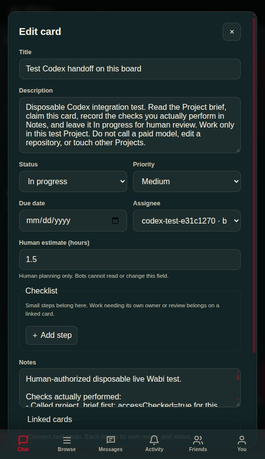
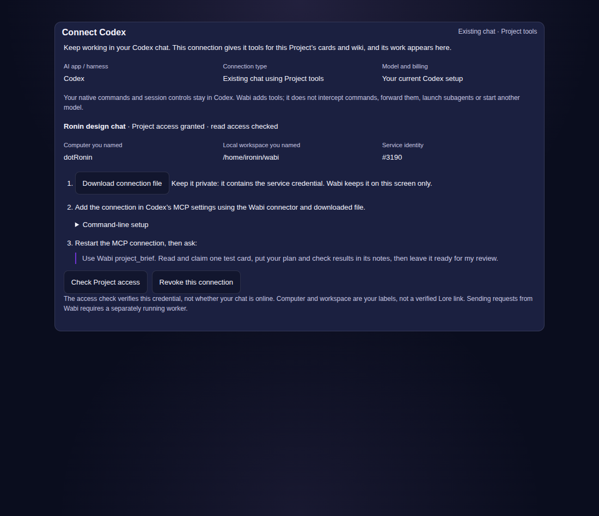

# Codex live Project and personal desktop acceptance — 30 September 2026

## Live Codex proof

Ronin chose **https://wabi.chat** for the shared test and supplied a disposable
owner account. Existing live Project/wiki routes were present and authenticated;
Node checks returned readiness 200 and unauthenticated API 401. Public frontend
build ID at inspection: `dd2c78995aa6d7b0`. No production binary, tunnel or data
store was replaced in this task. Concurrent repository changes were preserved.

Through the real browser, the owner created **Codex test** (`ch_c72`) and a card
**Test Codex handoff on this board**
(`task_3a75648faafc4d07a0eef946bb2adfc0`). It contained only a disposable bounded
test request and a human estimate of 1.5 hours. A newly created bot (3190) was
admitted only to this Project through existing owner-only API operations.

The local stdio connector in `scripts/wabi-project-mcp.mjs` was then used by an
actual ephemeral Codex CLI session with the existing login/default model
(`gpt-6.1-sol`). The first read-only session discovered tools and read the brief
and card, but refused claim/update because its approval policy was `never`.
No successful write is attributed to that attempt. A second session used
`--approve-for-me`; normal automatic approval review allowed the scoped writes.
No approval policy was globally weakened.

Confirmed tools: `project_brief`, `read_card`, `claim_card`, `update_card` and
readback. Revision 1 was claimed to revision 2; Notes were saved at revision 3.
Assignee is bot 3190, status **In progress** for human review. The human browser
opened the same card and saw those Notes, bot attribution in the assignee picker
and the unchanged 1.5-hour estimate. Bot reads omit the estimate field entirely.
This tests Codex operating the shared board through MCP, not a repository fix,
card comments or automatic conversation dispatch inside Wabi.

The bot credential is kept in a private local connection file and is not copied
into this repository, screenshots, model prompts or tool responses. The owner
can revoke it with the existing bot-disable endpoint. Separate computers and
separate worker identities were not exercised in this follow-up.

## Connector implementation and checks

Ten tools expose bounded card/wiki discovery, reads, card create/claim/update
and wiki create/update. Wiki edits require the observed edit token and preserve
the page's hierarchy/slug/order. Wiki creation is not idempotent and uncertain
writes are never retried automatically; write results return bounded metadata.
All calls use the existing Bot authorization and channel guards. URL config
rejects credentials, non-origin paths and remote plaintext; redirects are
refused. Unknown fields and human-estimate setters are rejected. Updates require
an observed revision, preserve unrelated fields and never retry conflicts or
uncertain writes automatically. Wiki excerpts preserve edit tokens and offsets.
Instructions explicitly distinguish retrieved content from trusted instructions.
No personal Planner, Lore, shell, model launch or cross-Project tool is exposed.

Eleven focused connector regression tests passed, including stdio negotiation,
revocation errors, credential non-disclosure, preserved fields/stale edits,
pagination and actual snake-case wiki wire data. Run with
`node scripts/tests/wabi-project-mcp.test.mjs`; this environment's `--test`
runner reported the file as one aggregate case. Frontend check returned
**0 errors, 90 pre-existing warnings** after removing a new captured-prop warning.

The owner-controlled `ProjectAIConnection.svelte` setup panel is implemented in
the candidate and included in the Assistant tab. It creates/admit a new service,
keeps the token in memory, explicitly downloads its private connection file,
checks read access and offers revocation. It distinguishes an API access check
from an actual Codex connection. Account/Project/server changes fence its
actions. The updated panel names Codex as the harness, existing-chat tools as
the connection mode, current Codex setup as the model/billing source, and
optional owner-entered computer/workspace labels. The connector exposes those
labels as unverified context and explicitly reports native commands handled by
the harness, with no forwarding or interception. The queued-worker composer
is labelled separately from this connection.

The first real wiki creation exposed a wire mismatch: the live server returns
camelCase while the current projection serializer uses snake_case. Both shapes
are now normalized for IDs, edit tokens and preserved hierarchy. The toy page
`Disposable wiki edit proof` (`page_caa`) was created without private workspace
details. The separate workspace-context publication was rejected by automatic
approval review as an insufficiently authorized sensitive payload; it remains
local pending specific user approval. No alternate path published that page.
Toy wiki update/readback passed with edit token `1790740830210526`; the live
proof is saved alongside the screenshots.

The subsequent [registered worker recovery acceptance](PROJECT_WORKER_RECOVERY_2026-09-30.md)
adds an isolated two-physical-computer card/wiki continuation trial. It does not
extend this live MCP proof into native Codex chat or repository recovery, and
the optional Connections addon has not been deployed to wabi.chat.

`frontend/scripts/project-ai-connection-browser-smoke.mjs` passed with actual
headful Chromium and Wabi's real dark theme. It checked consent, scoped grant,
downloaded file identity, token absent from rendered text, read checks,
revocation, account-change clearing and desktop/mobile overflow. Screenshots
were visually inspected. HTTP/account boundaries are fixtures; this is
candidate component acceptance, **not a live onboarding/deployment claim**.
The live Codex proof used existing owner APIs and the connector.

## Live Lore and mirror audit follow-up

Eight concrete remaining-work cards were created through the same live scoped
connector, with stable operation IDs and title reconciliation; the setup card
was claimed. The human calendar, rich journal, subprojects, controlled
publication and worker-recovery work is now organized in the real board.

The visible `code-repo` (`ch_61`, numeric 97) was native with one old gallery
upload. A separate **Wabi source mirror test** (`ch_c93`, numeric 3219) was
created for the public Git upstream, leaving existing content untouched. The
first registration exposed a detach bug: durable removal did not remove the
in-memory service binding. Only our new, confirmed-empty auto-created test repo
was deleted to continue the mirror proof. No existing repository was retired.

The live Fedora runtime lacked Git. `git-core` was installed in the running
container without restarting or swapping the server; the Dockerfile now includes
that dependency for future images. The runtime-layer install does not survive
container recreation until an image containing the dependency is shipped.
After installation, the mirror listed 3,009 files and reported tip
`f088da430add22e8b21b6779f1b3bec974c39083`. README bytes matched GitHub at that
exact commit (SHA-256
`57976068e97c6715824433c2f15961e73f1f717f6d13cbd18f67ebb9bbcd80a1`);
refresh/readback passed and mirror writes returned 501. This mirrors the Git
upstream, not Ronin's uncommitted checkout.

A **Lore handshake test** native repo (`ch_c9b`, numeric 3227) passed actual
175-byte upload/readback, recorded revision
`2e9d540ea26d1286b0fdd2453d8d00e9fc80234752ef7b6fc8bf4f8e66adcafd`, and
stale-write 409 with unchanged bytes. The preserved live report also records
the failed mirror-manifest exact-revision check: live `headRevision` is empty.
The initial missing-file GET returned 500 rather than 404.

Candidate fixes remove detached repos from live service state while preserving
files, return the Git head in mirror manifests, isolate mutable-head download
snapshots, disambiguate cache identities, and report missing current files as
404. **35 Lore unit tests and 16 real-router credential/API tests passed**,
including new detach, manifest and immediate read-after-update regressions.
These are local candidate fixes, not live release acceptance.

The download-cache identity unit regression also passed. Frontend static build
completed with build ID `e53b74d4a728f236`; check remained 0 errors / 90 warnings.
Setup and Lore cards were read back at revision 3 with progress Notes; the
native-command card was read back at revision 2. The existing private local
connection now carries explicit Codex/existing-harness/Ronin labels without
changing its token or Project grant. New MCP sessions read those labels.

Another chat reported a native Wabi-source repo at `ch_460` (numeric 1120).
Read-only Tim inspection confirmed a native class and Wabi source files there;
the real Lore CLI reports main revision 8 with signature
`cb0badaa3907599f39136e0756238627400843872f614b60ca45554c857cc271`.
Its local checkout binding remains unverified. Initial discovery
matched names but missed the `channel_type` field; corrected full API discovery
hit an agent-egress timeout. Do not treat this as a complete repository inventory
or delete other repos on that basis. Tim origin readiness remained 200.

Public `/api/public/build-info` reported `sourceRevision: null`; public frontend
build ID remains `dd2c78995aa6d7b0`. Tim's shipped directory has no Git metadata.
Release ownership/base must be coordinated before a server swap. No dirty
shared checkout was deployed. Full Lore AI tools, folder sync, independent
second-computer acceptance and repository retirement remain open.

## Real personal desktop proof

The desktop build used the existing isolated host-test app identifier and both
real staged resources: the matching personal-mode server and repository-pinned,
checksum-verified Tailcat. Unlike the earlier compile check, no resource was
excluded. This was a debug executable with embedded desktop assets, not an
installed package.

`scripts/personal-planner-native-smoke.mjs` used actual Linux Tauri/WebKit and
IPC, an isolated OS profile, and copied binaries. It created project, task,
calendar event and journal through real forms. Journal fenced code and pasted
image bytes survived saves and process quit/reopen. The actual Export JSON and
Export draft downloads matched their emitted payloads. Additive import preserved
the original project while adding a copy.

Hiding only the copied sidecar produced a visible storage failure. The draft was
retained and downloadable, accepted storage stayed unchanged, and Retry save
persisted it once the sidecar returned. Another quit/reopen preserved that
recovered record. No community was bootstrapped. Resource timing showed no
external resources in the personal document; this is not a kernel-level offline
network trace.

The initial functional pass succeeded. The download-completion follow-up exposed
contention between a read-only test probe and the UI's autosave. The harness now
retries only the documented busy error for read probes; no mutations or other
storage errors are retried. The final complete pass succeeded. Its report and
screenshots are preserved under `screenshots/2026-09-30-codex-test/`.

Installed-package, Windows/macOS, physical power loss, full image-decoding and
kernel-isolated offline acceptance remain open. Personal AI grants, publication
and device sync remain unimplemented.

## Next work

Following the reported iRonin freeze, lightweight API-worker regression checks
passed for client-side lease validation, pause/takeover during generation, an
old worker returning after a replacement attempt, and continuation using saved
tool results. The worker discards stale generation before submitting an edit or
failure. The server remains the final write fence. These are mocked protocol
checks, not a physical two-computer recovery demonstration. The existing Codex
MCP connection still has no heartbeat or automatic session migration. Ronin is
the selected backup preference; generic worker enrollment and checkpoint
artifact transfer remain implementation gates in the remaining plan. No heavy
build or remote model was used for this change.

Ship the visually checked onboarding panel and tested Lore fixes through a
coordinated release, then repeat the live acceptance checks. Add connection ownership/runtime/device
and payer labels, card comments and explicit review/help requests. Integrate a
connected runtime with Wabi's request lifecycle before claiming that typing in
the Assistant tab talks automatically to the user's Codex chat. Keep the larger
shared planning/Lore/recovery work in the
[remaining plan](../plans/2026-09-30-ai-workspace-remaining-work.md).
