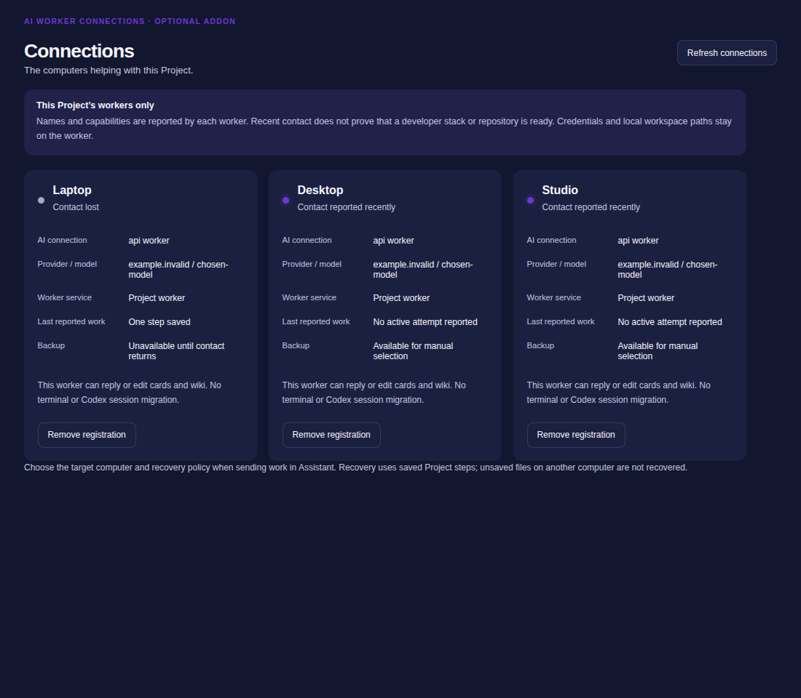
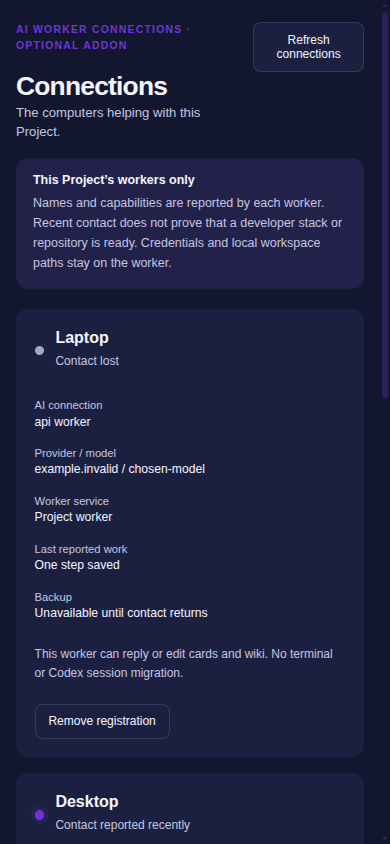

# Optional Connections and worker recovery acceptance — 30 September 2026

This is an isolated development candidate, not a wabi.chat/Tim deployment.
The product contract is [Project Connections](../features/PROJECT_CONNECTIONS.md).
Concurrent changes in the shared checkout were preserved; these focused checks
are not acceptance of every other uncommitted change.

## Two physical computers

The primary bounded worker ran on dotRonin/iRonin. The standby worker and a
disposable real Authority ran in an isolated source/test directory on bazzite
(the user's stronger Ronin). The existing Ronin checkout, Codex installation and
live community data were not changed. Source and builds went to the isolated
directory; no live data or operator credentials were copied into the repository.

`scripts/two-computer-project-recovery.mjs` accepts an SSH destination, isolated
source directory and report directory as parameters. SSH and a loopback tunnel
are test transports, not product prerequisites. No user network is hardcoded.
The ignored `two_computer_recovery_fixture` server test is driven explicitly by
this harness. It uses real authenticated Project routes and disposable WabiDB.
Temporary test credentials are private files, omitted from reports and removed
by the harness.

The trial passed:

1. Primary created exactly one card and saved its tool result.
2. The harness terminated only its primary worker process during the next turn.
3. The standby waited for actual lease and contact expiry, without editing
   stored timestamps to accelerate this physical trial.
4. The selected backup claimed a new attempt and continued from the saved result.
5. The Authority retained one card, two recorded steps and one recovery.
6. A returning primary submitted a new edit using its old attempt; the Authority
   rejected it with 409 and no duplicate card appeared.

[Machine-readable report](screenshots/2026-09-30-worker-recovery/two-computer-report.json)
records both physical hosts and the proof boundaries. The provider was a
deterministic stub, so no model, paid session or external provider was invoked.
This is process-interruption acceptance, not physical power-loss acceptance,
native Codex session migration or recovery of repository/uncommitted code.

## Behavioral and persistence checks

The final focused checks passed:

| Check | Result |
|---|---|
| `wabi-server` integration test `project_assistant_contract` | 11 passed; physical fixture intentionally ignored in the ordinary run |
| `wabidb` real engine `workspace_admission_tests` | 4 passed, including durable admission and replay |
| `wabidb` projection `workspace_writes` catalog/payload checks | 4 passed |
| Old ProjectRun JSON compatibility | 1 passed; absent new fields decode as manual/unregistered |
| Server addon inventory/switch metadata | 6 passed; bundled Connections remains off until enabled |
| `scripts/tests/wabi-project-worker.test.mjs` | 11 passed |
| Existing `scripts/tests/wabi-project-mcp.test.mjs` | 11 passed |
| Svelte check | 0 errors; 90 existing warnings across 47 files |
| Static frontend build on Ronin | Passed with the matched pinned dependency snapshot |

Server tests cover opt-in enrollment, addon-off refusal, recently reporting
backup selection, manual transfer, removed registrations, ordinary member
removal denial, bot/human access revocation, independent backup bot services,
pinned model matching, pending-edit rejection, stale competing claims and
exhausted recovery allowance. Existing card/wiki scope, estimate protection,
tool budget, idempotency, restart and attempt fencing checks still pass.
Runner tests cover pause/transfer during generation, expired lease, discarded
late responses, recorded-result continuation, explicit recovery consent and
addon-off refusal before a fresh provider call. Fixture model names do not prove
real provider availability. A monetary ceiling or native launch budget is not
implemented by the recovery counter.

Heavy compilation ran on Ronin with two build jobs. The initial isolated static
build lacked the root `shared/` source modules; copying those source modules
resolved the packaging omission. The product frontend did not need a workaround.
No global install, toolchain substitution, model change or Codex upgrade occurred.

## Real rendered UI

`frontend/scripts/project-worker-recovery-browser-smoke.mjs` ran actual headful
Chromium using candidate Svelte components and Wabi's real dark theme. Its
account/HTTP boundaries are fixtures. It passed Project-scoped roster rendering,
contact-loss wording, reported harness/model, explicit resume target, automatic
recovery off by default, selected backup/one-recovery request, account-change
clearing and desktop/phone overflow checks. Screenshots were visually inspected.
It does not establish live deployment or native harness onboarding.

[Assistant desktop](screenshots/2026-09-30-worker-recovery/assistant-recovery-desktop.png),
[Assistant phone](screenshots/2026-09-30-worker-recovery/assistant-recovery-mobile.png)
and [browser report](screenshots/2026-09-30-worker-recovery/browser-report.json)
are saved alongside these images.

## Remaining acceptance

Native Codex/OpenCode/Hermes execution needs its own adapter and verified
repository/artifact checkpoints before code can transfer. Missing developer
stacks, unavailable models, Authority loss and actual machine power loss need
native-runner trials. One-click setup, resource claims, launch/cost controls and
coordinated live release are still pending. Lore mirror/pull/push verification
is separate; this card/wiki proof does not establish it. WabiDB replication and
Authority failover remain experimental and were not exercised by this trial.
