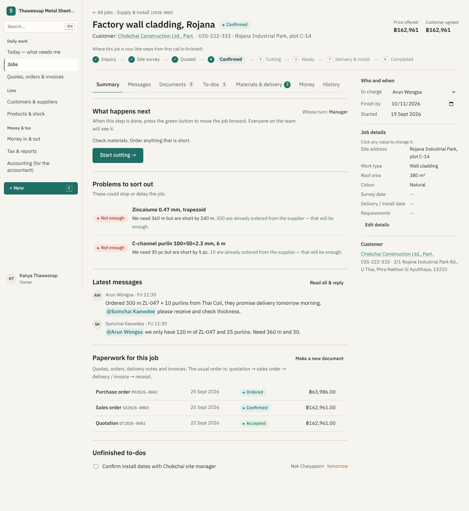

# Sabi

Sabi is free, self-hosted work management and ERP software for small businesses. Quotations, orders, jobs, stock, purchasing, invoices, payments and tax reports all live around the **business object**. Each job or document is a workspace with its own discussion, files, tasks and timeline.

The core is general-purpose. The business is **configuration**: a *pack* declares parties, items, document types, job workflows, roles, fields and approvals. Tax rules live in a *jurisdiction adapter*. The first pack is a Thai metal-sheet and roofing supplier (`packages/pack-sheet-metal`), and the first adapter is Thailand (`packages/jurisdiction-th`: VAT, withholding tax, tax-invoice fields, baht text, PromptPay).

> Sabi is **not certified** by the Thai Revenue Department or any auditor. It helps you keep correct, auditable records. Check filings with your accountant.



## Run it

Requires Node.js ≥ 22.13. There is no external database, since SQLite is built into Node.

```sh
cd sabi
npm install
npm run build          # builds the web app
npm run demo           # http://localhost:8080 with a demo workspace (password demo1234: owner, arun, nok, pim, somchai, dang)
npm start              # empty workspace; the first visit creates the owner account
```

Docker (provided, not yet tested in CI): `docker compose up -d`. Data is kept in the `sabi-data` volume.

Environment variables: `PORT` (8080), `HOST` (0.0.0.0), `SABI_DATA` (./data), `SABI_DEMO=1`, `SABI_SECURE_COOKIE=1` (force Secure cookies when not behind an HTTPS proxy that sets `X-Forwarded-Proto`).

## Command line

```sh
npm run sabi -- verify                # check the journal hash chain and replay equivalence
npm run sabi -- backup ./backups      # consistent SQLite copy + JSONL journal
npm run sabi -- export > journal.jsonl
npm run sabi -- serve --port 8080 [--demo]
```

Your data is one SQLite file plus a `files/` folder. The journal is plain JSON lines, so you can read it without Sabi.

## Architecture

```
packages/core              types, workflow engine, formulas, totals, conversion, accounting postings (no I/O)
packages/jurisdiction-th   Thai tax adapter (VAT by date, WHT, tax-ID check, tax-invoice rules, CoA, PromptPay)
packages/pack-sheet-metal  the only business-specific code: configuration + demo seed
apps/server                node:http + node:sqlite: hash-chained event journal → projections, commands, queries, auth, SSE, files, CLI
apps/web                   SvelteKit static SPA (Svelte 5), hand-written CSS
```

Every change is a command that appends an event and updates projections in the same transaction. Operational records (documents, stock moves), accounting (double-entry postings) and jurisdiction rules are kept separate.

## Tests

```sh
npm test                                  # unit + HTTP end-to-end workflow
node scripts/smoke-api.mjs http://localhost:8080
```

Browser screenshots and a UI flow test: see `scripts/browser/`.

## Documents

1. [Audit of the Wabi donor repository](docs/01-audit.md)
2. [Domain model](docs/02-domain-model.md)
3. [ERP coverage and Thai SME research](docs/03-research.md)
4. [Information architecture and workflows](docs/04-information-architecture.md)
5. [Implementation plan](docs/05-implementation-plan.md)
6. [Architecture decisions (ADRs)](docs/06-decisions.md)
7. [Status and what remains](docs/07-status-and-remaining.md)

## Licence and dependencies

Sabi's runtime dependencies are Node.js and, for building the web app, SvelteKit/Vite. There are no proprietary services, telemetry or paid tiers. It inherits the repository licence.
